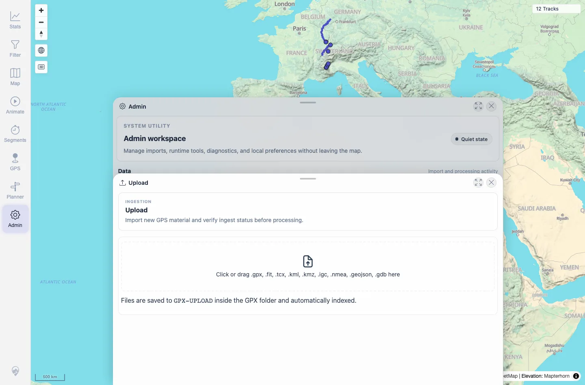
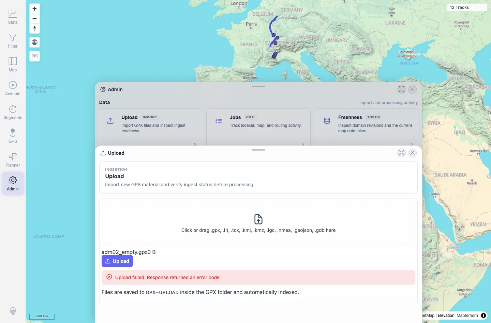
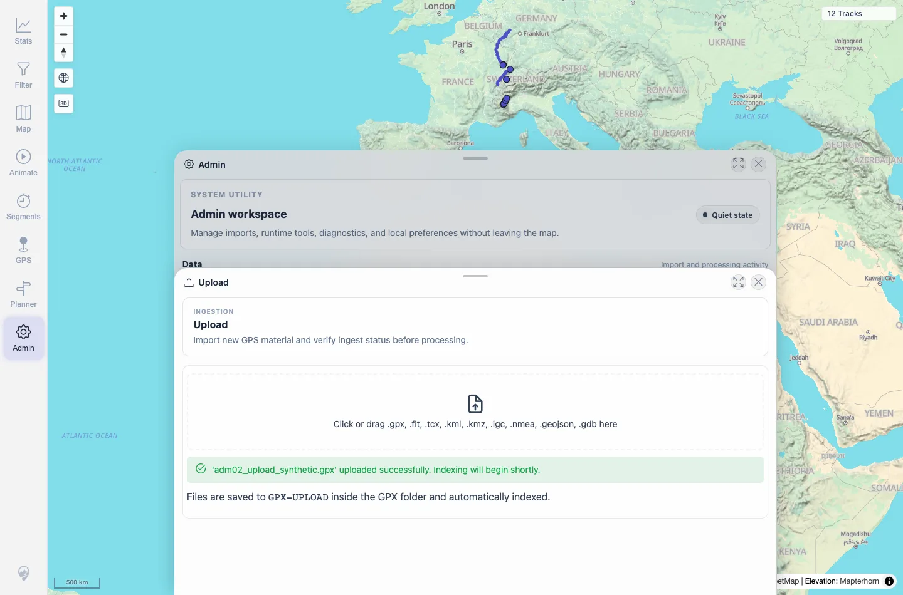

# Packet: ADM_02

## Scope

- Coverage source: `documentation/testing/frontend-regression-test-plan.md`
- Coverage ID or run packet: ADM_02
- In scope: Track file upload availability, accepted formats, progress/result feedback, unsupported-format error, empty-file error, and success feedback.
- Out of scope: Long-term imported-track behavior after upload; upload cleanup restored the run to 12 tracks.

## Prerequisites

- Required previous coverage IDs or run packets: ADM_01.
- Required app/data state: Authenticated Admin workspace; GPX-UPLOAD initially disposable.
- Required browser context: Desktop Chromium context.

## Allowed Mutations

- Allowed: Upload synthetic test files through Admin Upload and remove the synthetic uploaded file.
- Not allowed: Leave uploaded synthetic files in `GPX-UPLOAD`; use private GPX data.

## Actions And Results

| Coverage ID | Action | Expected result | Actual result | Status | Evidence |
|---|---|---|---|---|---|
| ADM_02 | Opened Upload, checked accepted extensions, selected unsupported `.txt`, uploaded an empty `.gpx`, then uploaded a synthetic valid GPX and cleaned it up. | Upload availability, accepted formats, progress/success, unsupported-format errors, and empty-file errors are clear. | Upload panel listed `.gpx, .fit, .tcx, .kml, .kmz, .igc, .nmea, .geojson, .gdb`; unsupported `.txt` showed a clear accepted-format error; empty `.gpx` showed `Upload failed`; valid synthetic GPX showed a green success message. The synthetic upload was removed from `GPX-UPLOAD` and the map returned to `12 Tracks`. | PASS | [assets/ADM_02-upload.txt](../assets/ADM_02-upload.txt); [assets/ADM_02-upload-available.webp](../assets/ADM_02-upload-available.webp); [assets/ADM_02-upload-negative.webp](../assets/ADM_02-upload-negative.webp); [assets/ADM_02-upload-results.webp](../assets/ADM_02-upload-results.webp); [assets/ADM_final-state.txt](../assets/ADM_final-state.txt) |

## Issues

| ID | Severity | Summary | Reproduction | Expected | Actual | Evidence | Release impact |
|---|---|---|---|---|---|---|---|

## Evidence Files

| File | Purpose |
|---|---|
| [assets/ADM_02-upload.txt](../assets/ADM_02-upload.txt) | Upload availability, negative cases, success, and cleanup summary. |
| [assets/ADM_02-upload-available.webp](../assets/ADM_02-upload-available.webp) | Upload panel with accepted formats. |
| [assets/ADM_02-upload-negative.webp](../assets/ADM_02-upload-negative.webp) | Unsupported/empty upload error state. |
| [assets/ADM_02-upload-results.webp](../assets/ADM_02-upload-results.webp) | Successful synthetic GPX upload result. |
| [assets/ADM_final-state.txt](../assets/ADM_final-state.txt) | Cleanup verification: upload folder empty and 12 tracks visible. |

## Screenshot Evidence

**Upload panel with accepted formats.**

**Unsupported/empty upload error state.**

**Successful synthetic GPX upload result.**

## Timings

| Step | Timing |
|---|---:|
| Upload positive/negative checks and cleanup | ~5 min |

## Handoff Notes

- Completed: ADM_02 terminal as `PASS`.
- Remaining unfinished coverage: Continue with ADM_03.
- Blocked or not applicable: None.
- State left for the next packet: Synthetic upload removed; visible map count restored to 12 tracks.
