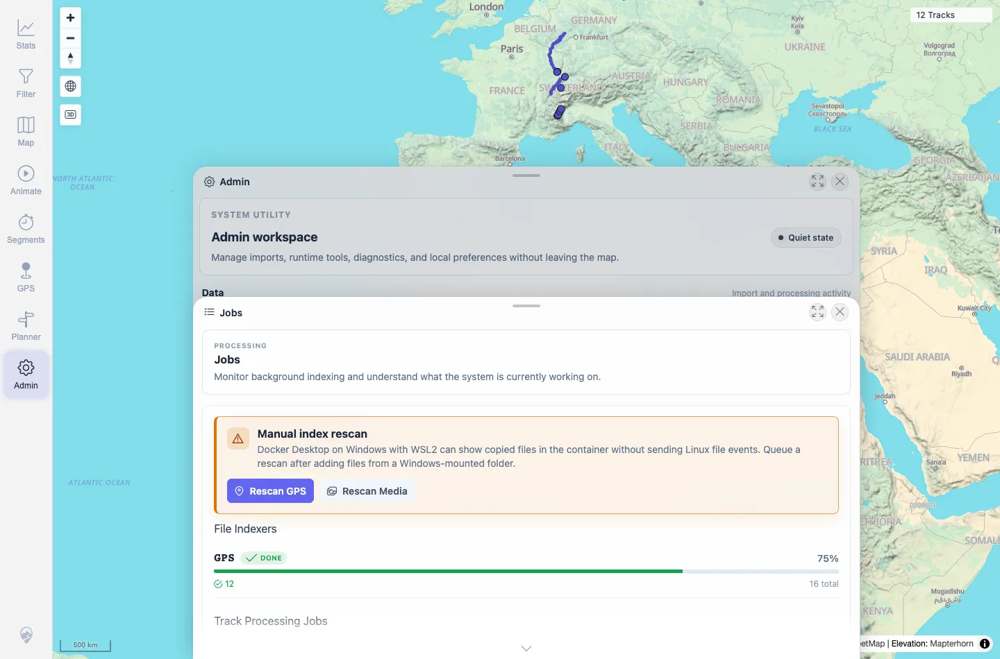

# Packet: ADM_03

## Scope

- Coverage source: `documentation/testing/frontend-regression-test-plan.md`
- Coverage ID or run packet: ADM_03
- In scope: Indexer status display and refresh behavior.
- Out of scope: Manual rescan controls; covered by ADM_04.

## Prerequisites

- Required previous coverage IDs or run packets: ADM_02.
- Required app/data state: Admin workspace available after upload cleanup; no media records in this configured run.
- Required browser context: Desktop Chromium context.

## Allowed Mutations

- Allowed: Open Jobs and click Refresh.
- Not allowed: Add or delete files.

## Actions And Results

| Coverage ID | Action | Expected result | Actual result | Status | Evidence |
|---|---|---|---|---|---|
| ADM_03 | Opened Jobs, checked the File Indexers section and API, then clicked Refresh. | Indexer status shows pending/running/completed/failed/removed state; refresh updates over time. | Jobs showed GPS indexer `DONE`, 12 completed, 16 total, 4 removed, 0 pending, 0 failed, 75% progress. This run has no media index rows because no media records exist. Refresh updated the visible timestamp from `Updated 12:02:11 AM` to `Updated 12:02:15 AM`. | PASS | [assets/ADM_03-jobs-status.webp](../assets/ADM_03-jobs-status.webp); [assets/ADM_03-jobs-refreshed.webp](../assets/ADM_03-jobs-refreshed.webp); [assets/ADM_03_05_06-jobs-operational-status.txt](../assets/ADM_03_05_06-jobs-operational-status.txt) |

## Issues

| ID | Severity | Summary | Reproduction | Expected | Actual | Evidence | Release impact |
|---|---|---|---|---|---|---|---|

## Evidence Files

| File | Purpose |
|---|---|
| [assets/ADM_03-jobs-status.webp](../assets/ADM_03-jobs-status.webp) | Jobs panel indexer status. |
| [assets/ADM_03-jobs-refreshed.webp](../assets/ADM_03-jobs-refreshed.webp) | Jobs panel after Refresh click. |
| [assets/ADM_03_05_06-jobs-operational-status.txt](../assets/ADM_03_05_06-jobs-operational-status.txt) | Indexer API summary and refresh timestamp evidence. |

## Screenshot Evidence

**Jobs panel indexer status.**

**Jobs panel after Refresh click.**

## Timings

| Step | Timing |
|---|---:|
| Indexer status and refresh check | ~30 s |

## Handoff Notes

- Completed: ADM_03 terminal as `PASS`.
- Remaining unfinished coverage: Continue with ADM_04.
- Blocked or not applicable: Separate media index row not present because this run has no indexed media.
- State left for the next packet: Server data unchanged.
