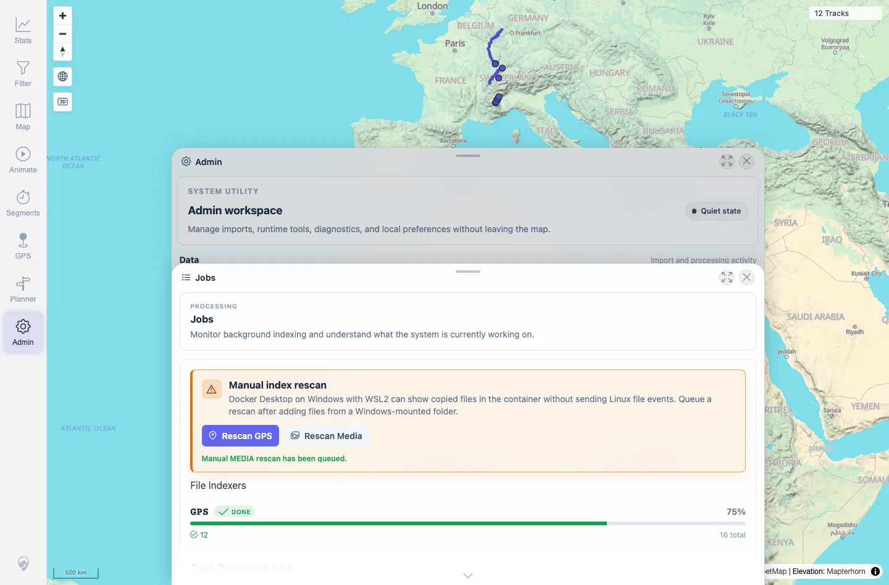
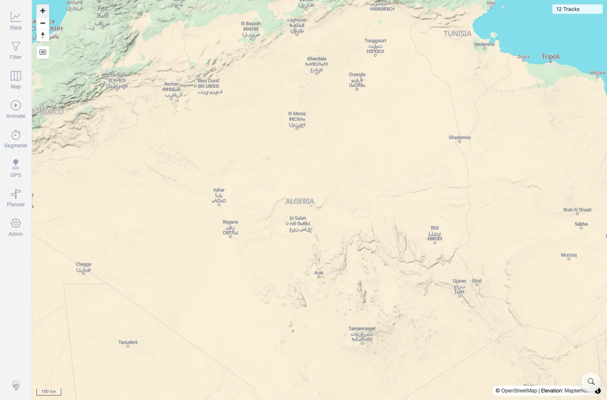

# Packet: ADM_04

## Scope

- Coverage source: `documentation/testing/frontend-regression-test-plan.md`
- Coverage ID or run packet: ADM_04
- In scope: Manual Rescan GPS and Rescan Media controls and post-rescan map interaction.
- Out of scope: Importing new files; already covered by import/upload packets.

## Prerequisites

- Required previous coverage IDs or run packets: ADM_03.
- Required app/data state: Admin Jobs panel available with settled indexer/job state.
- Required browser context: Desktop Chromium context.

## Allowed Mutations

- Allowed: Trigger manual GPS and Media rescans.
- Not allowed: Leave background indexing pending; add/delete user files.

## Actions And Results

| Coverage ID | Action | Expected result | Actual result | Status | Evidence |
|---|---|---|---|---|---|
| ADM_04 | Clicked `Rescan GPS`, waited for settlement, clicked `Rescan Media`, waited again, then tested map zoom controls. | Rescan actions show queued/already-running/not-ready states without breaking map interaction. | GPS showed `Manual GPS rescan has been queued`; Media showed `Manual MEDIA rescan has been queued`. After settlement, indexer pending remained 0 and all jobs were 100%. Map zoom controls remained responsive after rescans, changing scale from 500 km to 100 km with 12 tracks visible. | PASS | [assets/ADM_04-rescan-results.txt](../assets/ADM_04-rescan-results.txt); [assets/ADM_04-rescan-results.webp](../assets/ADM_04-rescan-results.webp); [assets/ADM_04-map-interaction-after-rescan.txt](../assets/ADM_04-map-interaction-after-rescan.txt); [assets/ADM_04-map-after-rescan-zoom.webp](../assets/ADM_04-map-after-rescan-zoom.webp) |

## Issues

| ID | Severity | Summary | Reproduction | Expected | Actual | Evidence | Release impact |
|---|---|---|---|---|---|---|---|

## Evidence Files

| File | Purpose |
|---|---|
| [assets/ADM_04-rescan-results.txt](../assets/ADM_04-rescan-results.txt) | UI rescan messages and settled job/indexer status. |
| [assets/ADM_04-rescan-results.webp](../assets/ADM_04-rescan-results.webp) | Jobs panel after rescan actions. |
| [assets/ADM_04-map-interaction-after-rescan.txt](../assets/ADM_04-map-interaction-after-rescan.txt) | Post-rescan map zoom scale change. |
| [assets/ADM_04-map-after-rescan-zoom.webp](../assets/ADM_04-map-after-rescan-zoom.webp) | Map after post-rescan zoom interaction. |

## Screenshot Evidence

**Jobs panel after rescan actions.**

**Map after post-rescan zoom interaction.**

## Timings

| Step | Timing |
|---|---:|
| GPS/media rescans and settlement | ~2 min |
| Post-rescan map interaction | ~10 s |

## Handoff Notes

- Completed: ADM_04 terminal as `PASS`.
- Remaining unfinished coverage: Continue with ADM_05.
- Blocked or not applicable: Already-running/not-ready variants did not occur because the settled rescans completed normally.
- State left for the next packet: Indexer and jobs settled; 12 tracks visible.
