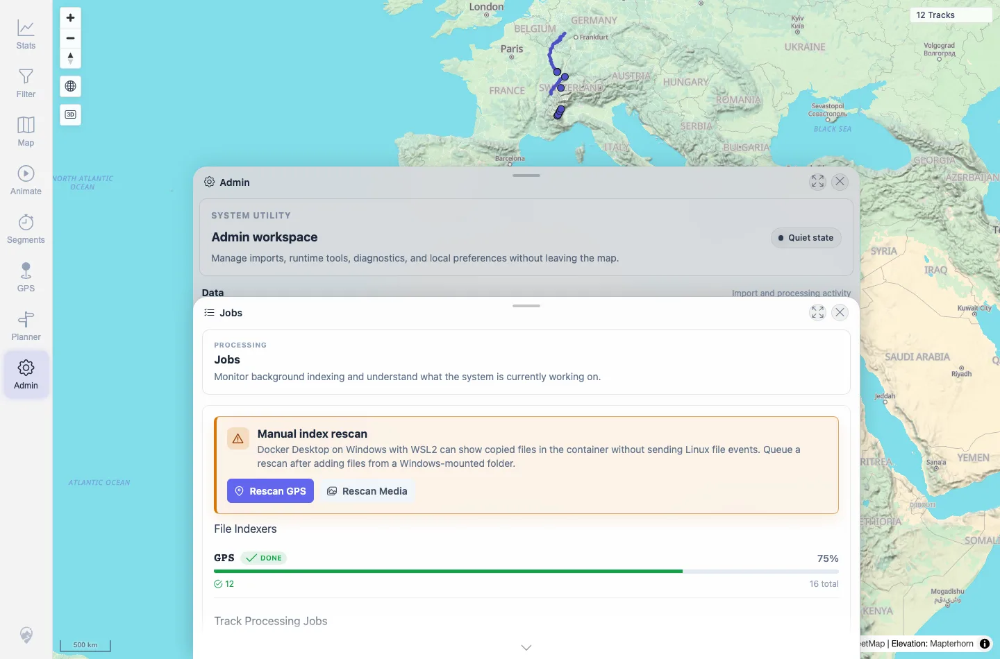
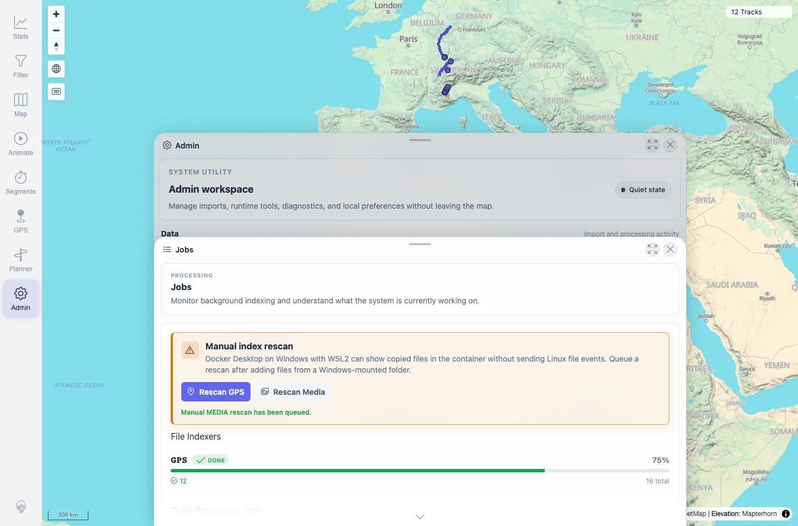

# Packet: ADM_05

## Scope

- Coverage source: `documentation/testing/frontend-regression-test-plan.md`
- Coverage ID or run packet: ADM_05
- In scope: Background job progress visibility for Duplicate Finder and Exploration Score.
- Out of scope: Triggering additional imports solely to create long-running job progress.

## Prerequisites

- Required previous coverage IDs or run packets: ADM_04.
- Required app/data state: Jobs panel available after rescan settlement.
- Required browser context: Desktop Chromium context.

## Allowed Mutations

- Allowed: Read Jobs UI/API.
- Not allowed: Add/delete files.

## Actions And Results

| Coverage ID | Action | Expected result | Actual result | Status | Evidence |
|---|---|---|---|---|---|
| ADM_05 | Reviewed Track Processing Jobs in the Jobs panel and job-status API before/after rescans. | Duplicate Finder and Exploration Score progress is visible and settles after imports. | Duplicate Finder, Activity Classifier, and Exploration Score were visible and settled at `DONE` / 100%, each with 12 done, 0 pending, 12 total. | PASS | [assets/ADM_03-jobs-status.webp](../assets/ADM_03-jobs-status.webp); [assets/ADM_05-jobs-after-rescan.webp](../assets/ADM_05-jobs-after-rescan.webp); [assets/ADM_03_05_06-jobs-operational-status.txt](../assets/ADM_03_05_06-jobs-operational-status.txt) |

## Issues

| ID | Severity | Summary | Reproduction | Expected | Actual | Evidence | Release impact |
|---|---|---|---|---|---|---|---|

## Evidence Files

| File | Purpose |
|---|---|
| [assets/ADM_03-jobs-status.webp](../assets/ADM_03-jobs-status.webp) | Track Processing Jobs at baseline. |
| [assets/ADM_05-jobs-after-rescan.webp](../assets/ADM_05-jobs-after-rescan.webp) | Track Processing Jobs after rescan settlement. |
| [assets/ADM_03_05_06-jobs-operational-status.txt](../assets/ADM_03_05_06-jobs-operational-status.txt) | Job status API summary. |

## Screenshot Evidence

**Track Processing Jobs at baseline.**

**Track Processing Jobs after rescan settlement.**

## Timings

| Step | Timing |
|---|---:|
| Background job status review | ~20 s |

## Handoff Notes

- Completed: ADM_05 terminal as `PASS`.
- Remaining unfinished coverage: Continue with ADM_06.
- Blocked or not applicable: No additional long-running import was forced; current jobs were settled.
- State left for the next packet: Server data unchanged.
