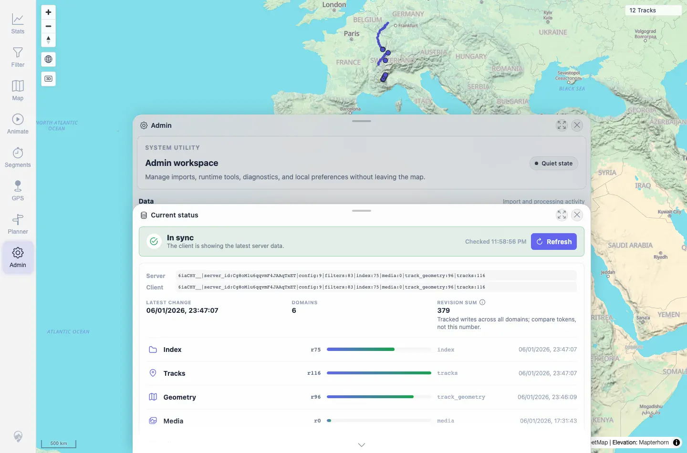

# Packet: ADM_07

## Scope

- Coverage source: `documentation/testing/frontend-regression-test-plan.md`
- Coverage ID or run packet: ADM_07
- In scope: Data freshness panel, latest timestamp/token, and reload affordance.
- Out of scope: Creating a new freshness mismatch; covered later by SYN coverage.

## Prerequisites

- Required previous coverage IDs or run packets: ADM_06.
- Required app/data state: Authenticated Admin workspace after rescan settlement.
- Required browser context: Desktop Chromium context.

## Allowed Mutations

- Allowed: Open Freshness and refresh/read status.
- Not allowed: Add/delete files.

## Actions And Results

| Coverage ID | Action | Expected result | Actual result | Status | Evidence |
|---|---|---|---|---|---|
| ADM_07 | Opened Freshness and captured the panel plus `/api/data-freshness`. | Data freshness shows last-update timestamp and offers reload/refresh. | Panel showed `In sync`, Refresh control, server/client tokens, latest change timestamp, six domains, revision sum, and polling healthy. API returned `freshnessToken`, `changedAt`, and domain items for config, filters, index, media, track_geometry, and tracks. | PASS | [assets/ADM_07-freshness.webp](../assets/ADM_07-freshness.webp); [assets/ADM_07-freshness.txt](../assets/ADM_07-freshness.txt) |

## Issues

| ID | Severity | Summary | Reproduction | Expected | Actual | Evidence | Release impact |
|---|---|---|---|---|---|---|---|

## Evidence Files

| File | Purpose |
|---|---|
| [assets/ADM_07-freshness.webp](../assets/ADM_07-freshness.webp) | Freshness panel state. |
| [assets/ADM_07-freshness.txt](../assets/ADM_07-freshness.txt) | Panel excerpt and data-freshness API response. |

## Screenshot Evidence

**Freshness panel state.**

## Timings

| Step | Timing |
|---|---:|
| Freshness panel/API check | ~20 s |

## Handoff Notes

- Completed: ADM_07 terminal as `PASS`.
- Remaining unfinished coverage: Continue with ADM_08.
- Blocked or not applicable: None.
- State left for the next packet: Server data unchanged.
