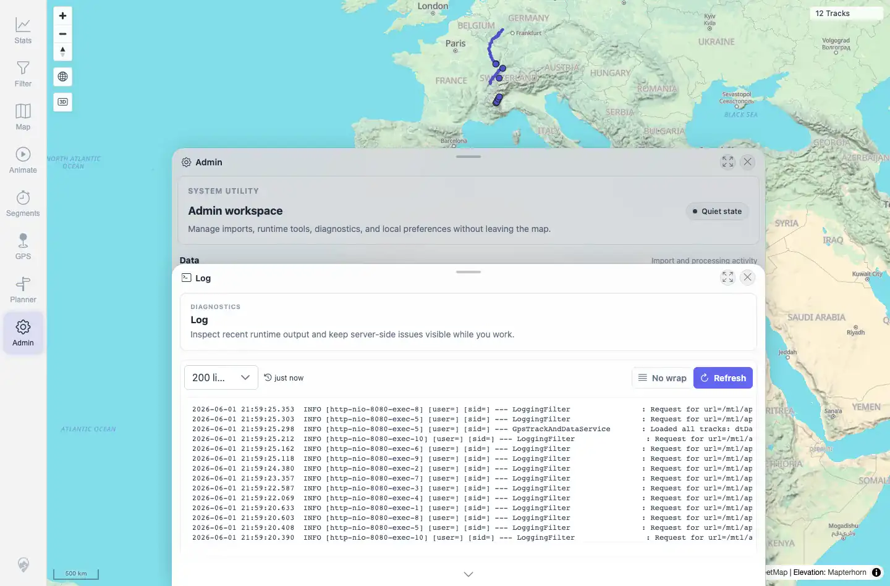

# Packet: ADM_08

## Scope

- Coverage source: `documentation/testing/frontend-regression-test-plan.md`
- Coverage ID or run packet: ADM_08
- In scope: Server log loading and refresh.
- Out of scope: Debugging all log content.

## Prerequisites

- Required previous coverage IDs or run packets: ADM_07.
- Required app/data state: Admin workspace available.
- Required browser context: Desktop Chromium context.

## Allowed Mutations

- Allowed: Open Log and click Refresh.
- Not allowed: Change server data.

## Actions And Results

| Coverage ID | Action | Expected result | Actual result | Status | Evidence |
|---|---|---|---|---|---|
| ADM_08 | Opened Log, clicked Refresh, and read the `/api/admin/server-log?lines=50` endpoint. | Log lines load and refresh. | Log panel loaded 200 visible lines with timestamped server entries and Refresh control. API returned status 200 with 49 non-empty lines; recent entries included track/data-freshness/server-log/map-status requests. | PASS | [assets/ADM_08-server-log.webp](../assets/ADM_08-server-log.webp); [assets/ADM_08-server-log.txt](../assets/ADM_08-server-log.txt) |

## Issues

| ID | Severity | Summary | Reproduction | Expected | Actual | Evidence | Release impact |
|---|---|---|---|---|---|---|---|

## Evidence Files

| File | Purpose |
|---|---|
| [assets/ADM_08-server-log.webp](../assets/ADM_08-server-log.webp) | Server Log panel after refresh. |
| [assets/ADM_08-server-log.txt](../assets/ADM_08-server-log.txt) | Panel excerpt and compact API log summary. |

## Screenshot Evidence

**Server Log panel after refresh.**

## Timings

| Step | Timing |
|---|---:|
| Server log load/refresh check | ~20 s |

## Handoff Notes

- Completed: ADM_08 terminal as `PASS`.
- Remaining unfinished coverage: Continue with ADM_09.
- Blocked or not applicable: None.
- State left for the next packet: Server data unchanged.
