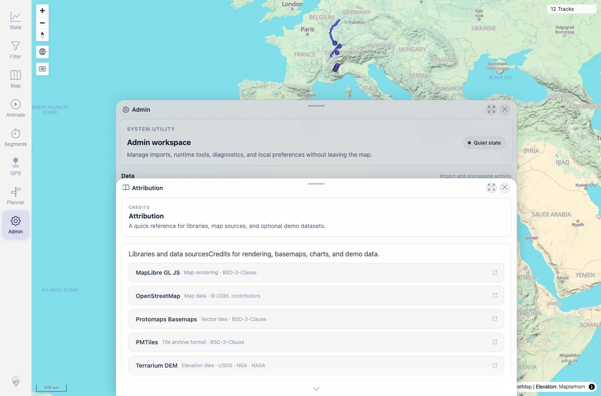

# Packet: ADM_09

## Scope

- Coverage source: `documentation/testing/frontend-regression-test-plan.md`
- Coverage ID or run packet: ADM_09
- In scope: Admin Attribution source list.
- Out of scope: License validation outside the app UI.

## Prerequisites

- Required previous coverage IDs or run packets: ADM_08.
- Required app/data state: Admin workspace available.
- Required browser context: Desktop Chromium context.

## Allowed Mutations

- Allowed: Open Attribution.
- Not allowed: Change server data.

## Actions And Results

| Coverage ID | Action | Expected result | Actual result | Status | Evidence |
|---|---|---|---|---|---|
| ADM_09 | Opened Attribution and captured the listed source entries. | Expected map/data sources are shown. | Attribution listed MapLibre GL JS, OpenStreetMap, Protomaps Basemaps, PMTiles, Terrarium DEM, swisstopo, SchweizMobil, Waymarked Trails, Highcharts, GeoNames, GPSBabel, and BRouter. | PASS | [assets/ADM_09-attribution.webp](../assets/ADM_09-attribution.webp); [assets/ADM_09-attribution.txt](../assets/ADM_09-attribution.txt) |

## Issues

| ID | Severity | Summary | Reproduction | Expected | Actual | Evidence | Release impact |
|---|---|---|---|---|---|---|---|

## Evidence Files

| File | Purpose |
|---|---|
| [assets/ADM_09-attribution.webp](../assets/ADM_09-attribution.webp) | Attribution panel screenshot. |
| [assets/ADM_09-attribution.txt](../assets/ADM_09-attribution.txt) | Extracted attribution entries. |

## Screenshot Evidence

**Attribution panel screenshot.**

## Timings

| Step | Timing |
|---|---:|
| Attribution check | ~15 s |

## Handoff Notes

- Completed: ADM_09 terminal as `PASS`.
- Remaining unfinished coverage: Continue with ADM_10.
- Blocked or not applicable: None.
- State left for the next packet: Server data unchanged.
