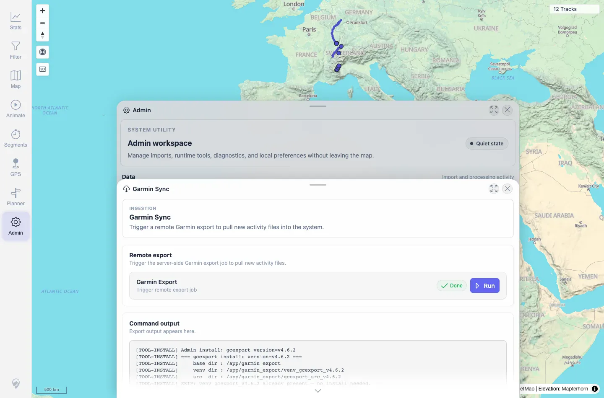

# Packet: ADM_10

## Scope

- Coverage source: `documentation/testing/frontend-regression-test-plan.md`
- Coverage ID or run packet: ADM_10
- In scope: Garmin/helper export tool status and install/update action reporting.
- Out of scope: Running an external Garmin account sync/export.

## Prerequisites

- Required previous coverage IDs or run packets: ADM_09.
- Required app/data state: Admin workspace available.
- Required browser context: Desktop Chromium context.

## Allowed Mutations

- Allowed: Read tool status and run one exposed helper install/update action.
- Not allowed: Enter Garmin credentials or trigger external account sync.

## Actions And Results

| Coverage ID | Action | Expected result | Actual result | Status | Evidence |
|---|---|---|---|---|---|
| ADM_10 | Opened Helpers, checked tool status, clicked the first `Install` action for `gcexport`, then opened Garmin Sync. | Garmin export tools, if present, show installed exporter status; install/update actions report success or error. | Helpers showed `2/2 READY`; API reported both exporter environments present. The `gcexport` install/update action reported the existing venv was already present and updated the active version to `v4.6.2` in DB. Garmin Sync showed the export action surface without entering external credentials. | PASS | [assets/ADM_10-helpers-status.webp](../assets/ADM_10-helpers-status.webp); [assets/ADM_10-helper-install-output.webp](../assets/ADM_10-helper-install-output.webp); [assets/ADM_10-garmin-tools.txt](../assets/ADM_10-garmin-tools.txt); [assets/ADM_10-garmin-sync.webp](../assets/ADM_10-garmin-sync.webp); [assets/ADM_10-garmin-sync.txt](../assets/ADM_10-garmin-sync.txt) |

## Issues

| ID | Severity | Summary | Reproduction | Expected | Actual | Evidence | Release impact |
|---|---|---|---|---|---|---|---|

## Evidence Files

| File | Purpose |
|---|---|
| [assets/ADM_10-helpers-status.webp](../assets/ADM_10-helpers-status.webp) | Helpers tool status before action. |
| [assets/ADM_10-helper-install-output.webp](../assets/ADM_10-helper-install-output.webp) | Helpers after install/update command output. |
| [assets/ADM_10-garmin-tools.txt](../assets/ADM_10-garmin-tools.txt) | Tool-status API response and command output. |
| [assets/ADM_10-garmin-sync.webp](../assets/ADM_10-garmin-sync.webp) | Garmin Sync panel surface. |
| [assets/ADM_10-garmin-sync.txt](../assets/ADM_10-garmin-sync.txt) | Garmin Sync text excerpt. |

## Screenshot Evidence

**Helpers tool status before action.**

**Helpers after install/update command output.**

**Garmin Sync panel surface.**

## Timings

| Step | Timing |
|---|---:|
| Helper status and install/update action | ~2 min |

## Handoff Notes

- Completed: ADM_10 terminal as `PASS`.
- Remaining unfinished coverage: Continue with ADM_11.
- Blocked or not applicable: External Garmin account sync was out of scope.
- State left for the next packet: Helper command output visible in Admin state.
