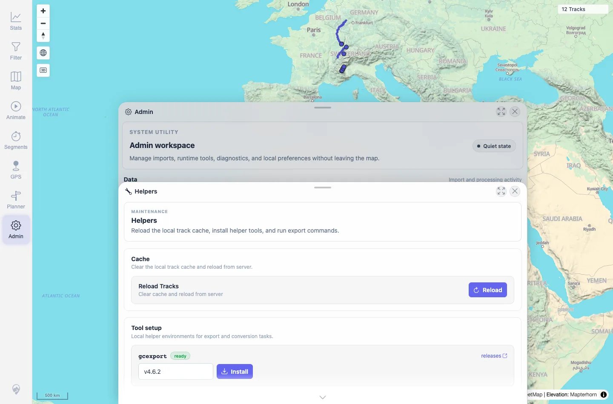

# Packet: ADM_11

## Scope

- Coverage source: `documentation/testing/frontend-regression-test-plan.md`
- Coverage ID or run packet: ADM_11
- In scope: Closing and reopening the Admin dialog while a panel has recent command state.
- Out of scope: Browser reload persistence.

## Prerequisites

- Required previous coverage IDs or run packets: ADM_10.
- Required app/data state: Helpers panel has recent `gcexport` command output.
- Required browser context: Same desktop Chromium context.

## Allowed Mutations

- Allowed: Close and reopen Admin.
- Not allowed: Change server data.

## Actions And Results

| Coverage ID | Action | Expected result | Actual result | Status | Evidence |
|---|---|---|---|---|---|
| ADM_11 | Closed Admin via the navigation tool, then reopened it. | Closing/reopening the dialog does not lose state mid-action. | Admin workspace disappeared after close and returned after reopen. The Helpers panel and recent command output were still present after reopening. | PASS | [assets/ADM_11-reopen-helpers.webp](../assets/ADM_11-reopen-helpers.webp); [assets/ADM_11-close-reopen.txt](../assets/ADM_11-close-reopen.txt) |

## Issues

| ID | Severity | Summary | Reproduction | Expected | Actual | Evidence | Release impact |
|---|---|---|---|---|---|---|---|

## Evidence Files

| File | Purpose |
|---|---|
| [assets/ADM_11-reopen-helpers.webp](../assets/ADM_11-reopen-helpers.webp) | Admin reopened with Helpers panel state. |
| [assets/ADM_11-close-reopen.txt](../assets/ADM_11-close-reopen.txt) | Close/reopen observations. |

## Screenshot Evidence

**Admin reopened with Helpers panel state.**

## Timings

| Step | Timing |
|---|---:|
| Close/reopen Admin | ~15 s |

## Handoff Notes

- Completed: ADM_11 terminal as `PASS`.
- Remaining unfinished coverage: Continue with SYN_01.
- Blocked or not applicable: None.
- State left for the next packet: Server data unchanged; upload folder verified empty; visible map count 12 tracks.
