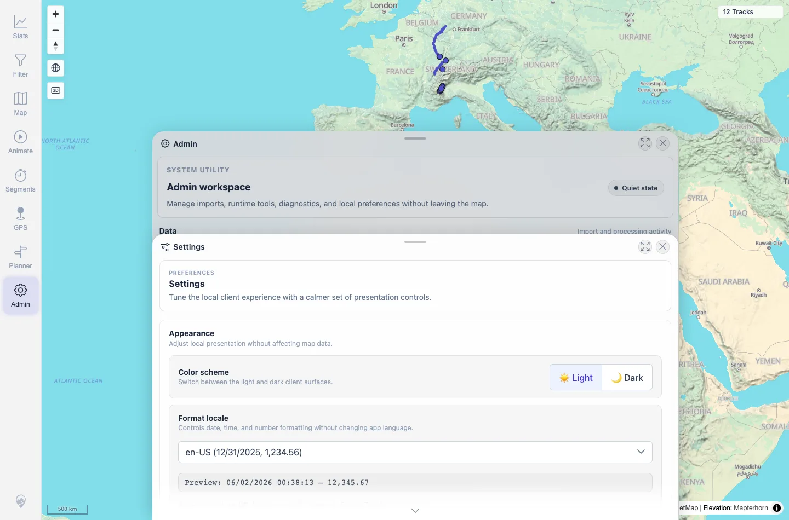
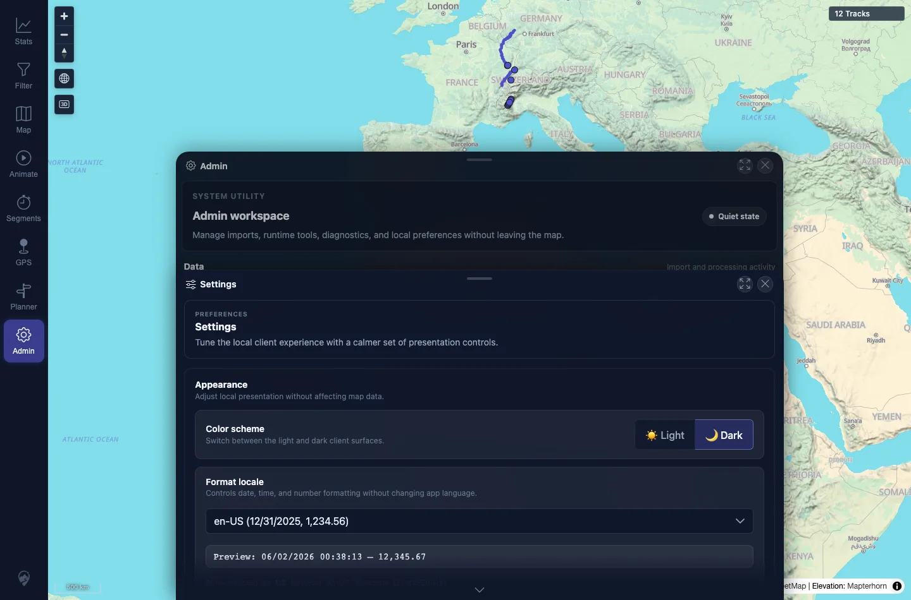

# Packet: APP_02

## Scope

- Coverage source: `documentation/testing/frontend-regression-test-plan.md`
- Coverage ID or run packet: APP_02
- In scope: Readability of sampled UI text in light and dark modes.
- Out of scope: Exhaustive WCAG audit.

## Prerequisites

- Required previous coverage IDs or run packets: APP_01.
- Required app/data state: Admin Settings available.
- Required browser context: Desktop Chromium context.

## Allowed Mutations

- Allowed: Switch local UI theme.
- Not allowed: Change server data.

## Actions And Results

| Coverage ID | Action | Expected result | Actual result | Status | Evidence |
|---|---|---|---|---|---|
| APP_02 | Captured Admin/Settings surfaces in light and dark modes and sampled key text colors. | No text is unreadable, such as white-on-white or black-on-black, in either theme. | Captured Settings/Admin surfaces showed readable nav labels, panel titles, tile labels, action labels, and hints in both modes; sampled computed colors did not show white-on-white or black-on-black text. | PASS | [assets/APP_02-contrast.txt](../assets/APP_02-contrast.txt); [assets/APP_02-light-readable.webp](../assets/APP_02-light-readable.webp); [assets/APP_02-dark-readable.webp](../assets/APP_02-dark-readable.webp) |

## Issues

| ID | Severity | Summary | Reproduction | Expected | Actual | Evidence | Release impact |
|---|---|---|---|---|---|---|---|

## Evidence Files

| File | Purpose |
|---|---|
| [assets/APP_02-contrast.txt](../assets/APP_02-contrast.txt) | Readability/color sample summary. |
| [assets/APP_02-light-readable.webp](../assets/APP_02-light-readable.webp) | Light-mode readable text sample. |
| [assets/APP_02-dark-readable.webp](../assets/APP_02-dark-readable.webp) | Dark-mode readable text sample. |

## Screenshot Evidence

**Light-mode readable text sample.**

**Dark-mode readable text sample.**

## Timings

| Step | Timing |
|---|---:|
| Light/dark readability sampling | ~30 s |

## Handoff Notes

- Completed: APP_02 terminal as `PASS`.
- Remaining unfinished coverage: Continue with APP_03.
- Blocked or not applicable: None.
- State left for the next packet: Theme later restored to light.
