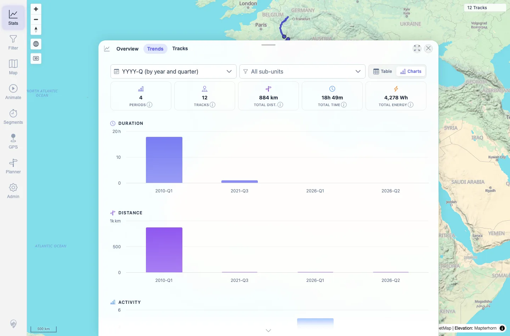
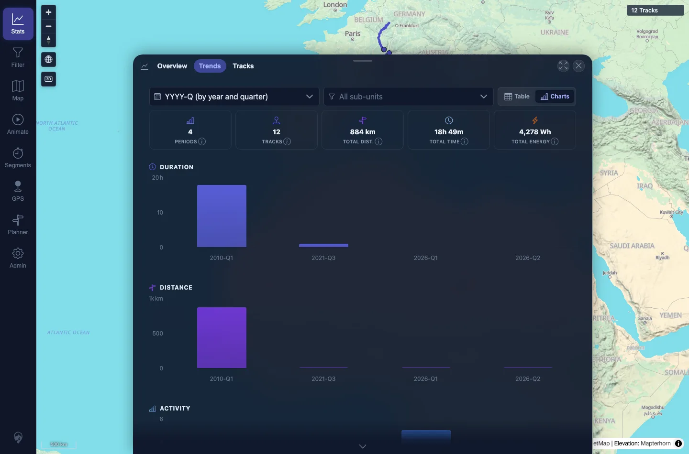

# Packet: APP_03

## Scope

- Coverage source: `documentation/testing/frontend-regression-test-plan.md`
- Coverage ID or run packet: APP_03
- In scope: Statistics chart recoloring after theme switch without browser reload.
- Out of scope: All chart interaction controls; covered by TBS/TRD packets.

## Prerequisites

- Required previous coverage IDs or run packets: APP_02.
- Required app/data state: Stats Trends has chart data.
- Required browser context: Desktop Chromium context.

## Allowed Mutations

- Allowed: Switch local UI theme and reopen Stats Trends without browser reload.
- Not allowed: Change server data.

## Actions And Results

| Coverage ID | Action | Expected result | Actual result | Status | Evidence |
|---|---|---|---|---|---|
| APP_03 | Captured Stats Trends in light mode, switched to dark mode through Settings, then reopened Stats Trends without reloading the browser. | Charts re-color on theme switch without needing a reload. | Highcharts text/axis color samples changed between light and dark contexts, and both chart screenshots rendered readable labels. | PASS | [assets/APP_03-chart-colors.txt](../assets/APP_03-chart-colors.txt); [assets/APP_03-chart-light.webp](../assets/APP_03-chart-light.webp); [assets/APP_03-chart-dark.webp](../assets/APP_03-chart-dark.webp) |

## Issues

| ID | Severity | Summary | Reproduction | Expected | Actual | Evidence | Release impact |
|---|---|---|---|---|---|---|---|

## Evidence Files

| File | Purpose |
|---|---|
| [assets/APP_03-chart-colors.txt](../assets/APP_03-chart-colors.txt) | Light/dark chart color samples. |
| [assets/APP_03-chart-light.webp](../assets/APP_03-chart-light.webp) | Stats Trends chart in light mode. |
| [assets/APP_03-chart-dark.webp](../assets/APP_03-chart-dark.webp) | Stats Trends chart after dark switch without browser reload. |

## Screenshot Evidence

**Stats Trends chart in light mode.**

**Stats Trends chart after dark switch without browser reload.**

## Timings

| Step | Timing |
|---|---:|
| Chart recolor check | ~1 min |

## Handoff Notes

- Completed: APP_03 terminal as `PASS`.
- Remaining unfinished coverage: Continue with APP_04.
- Blocked or not applicable: None.
- State left for the next packet: Theme later restored to light.
