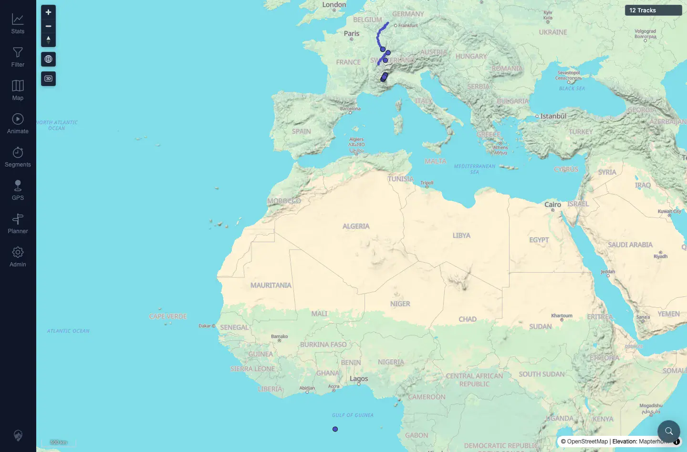
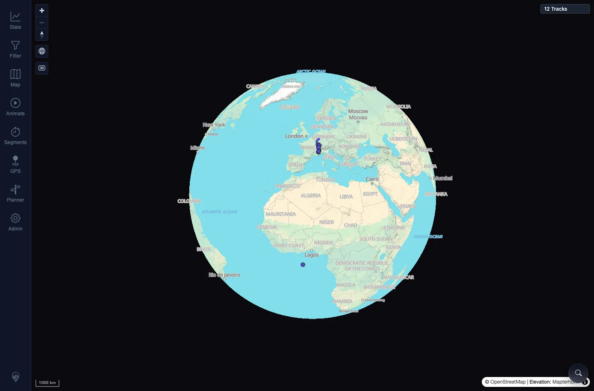

# Packet: APP_04

## Scope

- Coverage source: `documentation/testing/frontend-regression-test-plan.md`
- Coverage ID or run packet: APP_04
- In scope: Theme persistence across reload and login.
- Out of scope: Map style persistence; covered by APP_07.

## Prerequisites

- Required previous coverage IDs or run packets: APP_03.
- Required app/data state: Authenticated app with Dark theme selected.
- Required browser context: Same desktop Chromium context.

## Allowed Mutations

- Allowed: Reload, credentials-only logout, and login.
- Not allowed: Wipe all local app data.

## Actions And Results

| Coverage ID | Action | Expected result | Actual result | Status | Evidence |
|---|---|---|---|---|---|
| APP_04 | Selected Dark theme, hard reloaded, then used credentials-only logout and logged back in. | Selected theme persists across reload and login. | `data-theme` remained `dark` after hard reload and after credentials-only logout/login. | PASS | [assets/APP_04-theme-persistence.txt](../assets/APP_04-theme-persistence.txt); [assets/APP_04-dark-after-reload.webp](../assets/APP_04-dark-after-reload.webp); [assets/APP_04-dark-after-login.webp](../assets/APP_04-dark-after-login.webp) |

## Issues

| ID | Severity | Summary | Reproduction | Expected | Actual | Evidence | Release impact |
|---|---|---|---|---|---|---|---|

## Evidence Files

| File | Purpose |
|---|---|
| [assets/APP_04-theme-persistence.txt](../assets/APP_04-theme-persistence.txt) | Theme value after reload and login. |
| [assets/APP_04-dark-after-reload.webp](../assets/APP_04-dark-after-reload.webp) | Dark theme after hard reload. |
| [assets/APP_04-dark-after-login.webp](../assets/APP_04-dark-after-login.webp) | Dark theme after logout/login. |

## Screenshot Evidence

**Dark theme after hard reload.**

**Dark theme after logout/login.**

## Timings

| Step | Timing |
|---|---:|
| Reload and logout/login persistence | ~2 min |

## Handoff Notes

- Completed: APP_04 terminal as `PASS`.
- Remaining unfinished coverage: Continue with APP_05.
- Blocked or not applicable: None.
- State left for the next packet: Theme later restored to light.
