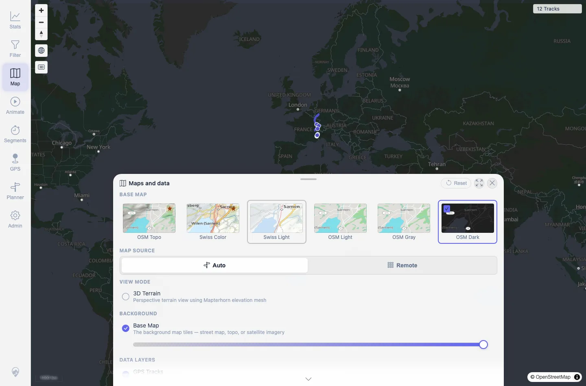
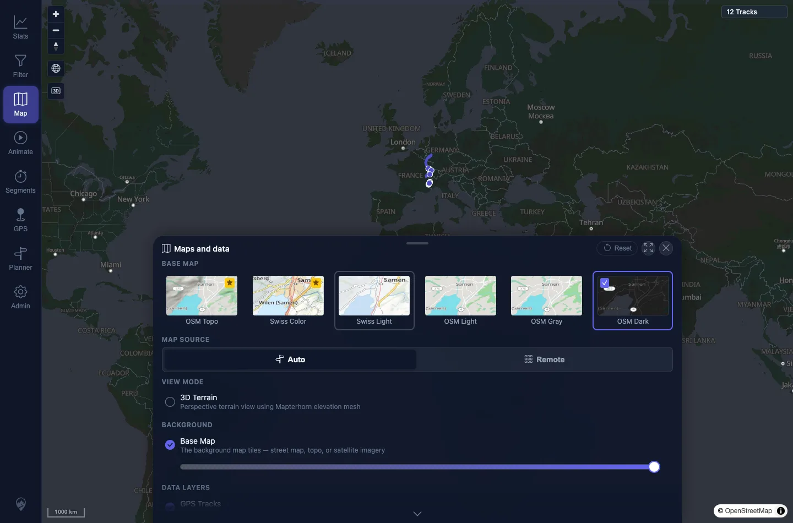

# Packet: APP_06

## Scope

- Coverage source: `documentation/testing/frontend-regression-test-plan.md`
- Coverage ID or run packet: APP_06
- In scope: Map style selection independent from UI theme.
- Out of scope: Remote/local tile fallback already covered by MAP_13 through MAP_15.

## Prerequisites

- Required previous coverage IDs or run packets: APP_05.
- Required app/data state: Map panel available.
- Required browser context: Desktop Chromium context.

## Allowed Mutations

- Allowed: Switch UI theme and map style.
- Not allowed: Change server data.

## Actions And Results

| Coverage ID | Action | Expected result | Actual result | Status | Evidence |
|---|---|---|---|---|---|
| APP_06 | In both light and dark UI themes, selected OSM Topo, Swiss Color, Swiss Light, OSM Light, OSM Gray, and OSM Dark from Maps and data. | Each available map style can be selected with either UI theme. | All six map style tiles became active and persisted the expected `mtl.map.settings.theme` code in both light and dark UI themes; no requested/active mismatches were recorded. | PASS | [assets/APP_06-map-styles.txt](../assets/APP_06-map-styles.txt); [assets/APP_06-map-styles-light.webp](../assets/APP_06-map-styles-light.webp); [assets/APP_06-map-styles-dark.webp](../assets/APP_06-map-styles-dark.webp) |

## Issues

| ID | Severity | Summary | Reproduction | Expected | Actual | Evidence | Release impact |
|---|---|---|---|---|---|---|---|

## Evidence Files

| File | Purpose |
|---|---|
| [assets/APP_06-map-styles.txt](../assets/APP_06-map-styles.txt) | Requested/active/stored map styles across UI themes. |
| [assets/APP_06-map-styles-light.webp](../assets/APP_06-map-styles-light.webp) | Map style panel in light UI theme. |
| [assets/APP_06-map-styles-dark.webp](../assets/APP_06-map-styles-dark.webp) | Map style panel in dark UI theme. |

## Screenshot Evidence

**Map style panel in light UI theme.**

**Map style panel in dark UI theme.**

## Timings

| Step | Timing |
|---|---:|
| Map style matrix | ~3 min |

## Handoff Notes

- Completed: APP_06 terminal as `PASS`.
- Remaining unfinished coverage: Continue with APP_07.
- Blocked or not applicable: None.
- State left for the next packet: Map style later reset to default.
