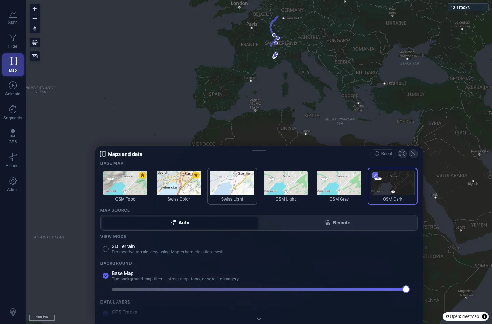

# Packet: APP_07

## Scope

- Coverage source: `documentation/testing/frontend-regression-test-plan.md`
- Coverage ID or run packet: APP_07
- In scope: Map style persistence across reload.
- Out of scope: UI theme persistence; covered by APP_04.

## Prerequisites

- Required previous coverage IDs or run packets: APP_06.
- Required app/data state: Map panel available.
- Required browser context: Desktop Chromium context.

## Allowed Mutations

- Allowed: Select a map style and reload.
- Not allowed: Change server data.

## Actions And Results

| Coverage ID | Action | Expected result | Actual result | Status | Evidence |
|---|---|---|---|---|---|
| APP_07 | Selected OSM Dark, reloaded, reopened Maps and data, and checked the active tile/storage. | Selected map style persists across reload. | OSM Dark remained active after reload and `mtl.map.settings.theme` remained `dark`. | PASS | [assets/APP_07-map-style-persistence.txt](../assets/APP_07-map-style-persistence.txt); [assets/APP_07-map-style-persisted.webp](../assets/APP_07-map-style-persisted.webp) |

## Issues

| ID | Severity | Summary | Reproduction | Expected | Actual | Evidence | Release impact |
|---|---|---|---|---|---|---|---|

## Evidence Files

| File | Purpose |
|---|---|
| [assets/APP_07-map-style-persistence.txt](../assets/APP_07-map-style-persistence.txt) | Active tile and stored settings after reload. |
| [assets/APP_07-map-style-persisted.webp](../assets/APP_07-map-style-persisted.webp) | Map panel after reload with OSM Dark active. |

## Screenshot Evidence

**Map panel after reload with OSM Dark active.**

## Timings

| Step | Timing |
|---|---:|
| Map style persistence check | ~1 min |

## Handoff Notes

- Completed: APP_07 terminal as `PASS`.
- Remaining unfinished coverage: Continue with APP_08.
- Blocked or not applicable: None.
- State left for the next packet: Map style later reset to default.
