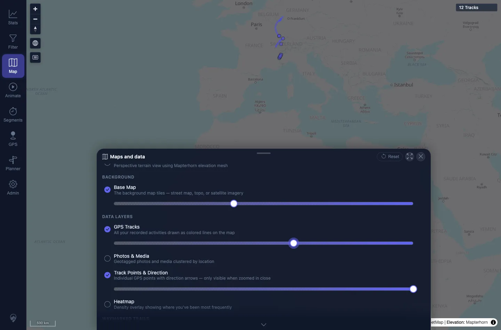
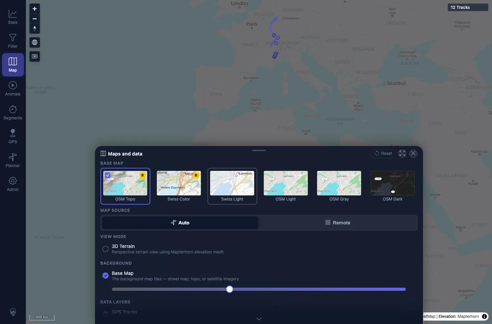
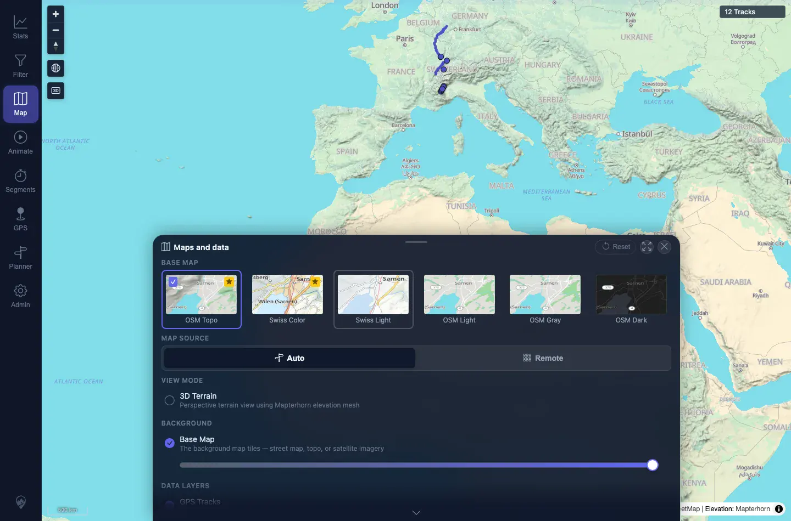

# Packet: APP_08

## Scope

- Coverage source: `documentation/testing/frontend-regression-test-plan.md`
- Coverage ID or run packet: APP_08
- In scope: Layer opacity sliders, basemap dimming, persistence, and reset-to-defaults.
- Out of scope: Overlay-specific opacity checks; covered by HMO_02.

## Prerequisites

- Required previous coverage IDs or run packets: APP_07.
- Required app/data state: Map panel available with default map settings.
- Required browser context: Desktop Chromium context.

## Allowed Mutations

- Allowed: Change local map opacity settings, reload, and reset.
- Not allowed: Change server data.

## Actions And Results

| Coverage ID | Action | Expected result | Actual result | Status | Evidence |
|---|---|---|---|---|---|
| APP_08 | Set Base Map opacity to 40 and GPS Tracks opacity to 60, reloaded, then clicked Reset. | Layer opacity sliders and basemap dimming behave and persist; reset restores defaults. | Slider ARIA values changed to 40 and 60; `mtl.map.settings.layerOpacities` stored those values and still had them after reload. Reset restored `light-topo`, Auto source, and all layer opacities to 100. | PASS | [assets/APP_08-opacity-reset.txt](../assets/APP_08-opacity-reset.txt); [assets/APP_08-opacity-changed.webp](../assets/APP_08-opacity-changed.webp); [assets/APP_08-opacity-persisted.webp](../assets/APP_08-opacity-persisted.webp); [assets/APP_08-reset-defaults.webp](../assets/APP_08-reset-defaults.webp) |

## Issues

| ID | Severity | Summary | Reproduction | Expected | Actual | Evidence | Release impact |
|---|---|---|---|---|---|---|---|

## Evidence Files

| File | Purpose |
|---|---|
| [assets/APP_08-opacity-reset.txt](../assets/APP_08-opacity-reset.txt) | Slider values, stored settings after change/reload/reset. |
| [assets/APP_08-opacity-changed.webp](../assets/APP_08-opacity-changed.webp) | Map panel after opacity changes. |
| [assets/APP_08-opacity-persisted.webp](../assets/APP_08-opacity-persisted.webp) | Map panel after reload with persisted opacity settings. |
| [assets/APP_08-reset-defaults.webp](../assets/APP_08-reset-defaults.webp) | Map panel after Reset restored defaults. |

## Screenshot Evidence

**Map panel after opacity changes.**

**Map panel after reload with persisted opacity settings.**

**Map panel after Reset restored defaults.**

## Timings

| Step | Timing |
|---|---:|
| Opacity persistence and reset | ~2 min |

## Handoff Notes

- Completed: APP_08 terminal as `PASS`.
- Remaining unfinished coverage: Continue with LOC_01.
- Blocked or not applicable: None.
- State left for the next packet: Fresh context verified light theme, default map settings, and 12 visible tracks.
