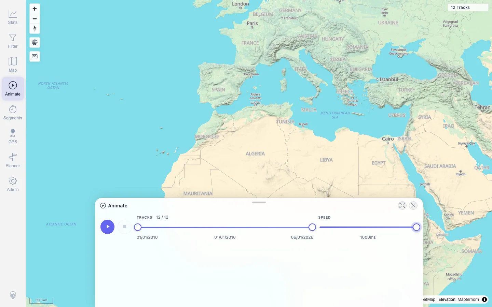
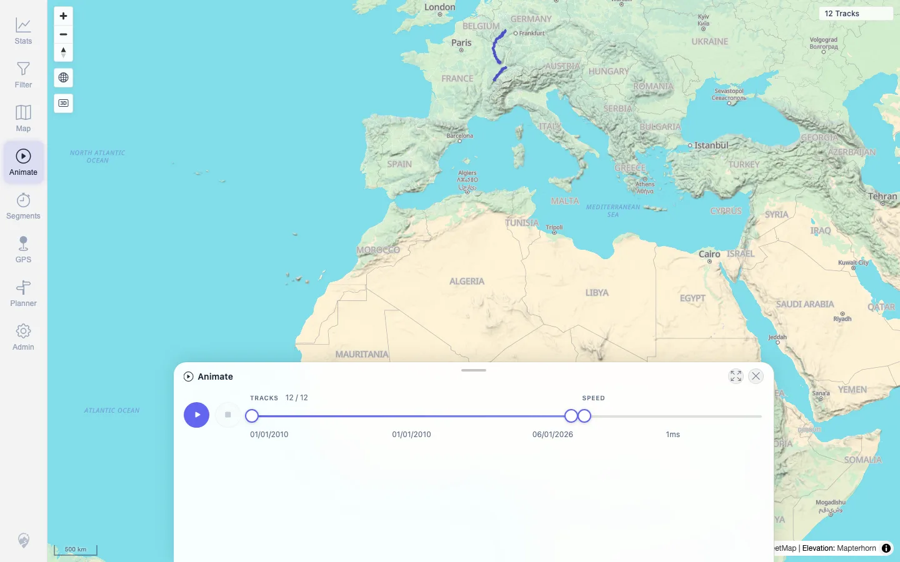

# Packet: AVR_01

## Scope

- Coverage source: `documentation/testing/frontend-regression-test-plan.md`
- Coverage ID or run packet: AVR_01
- In scope: 2D Animate tool playback, pause, stop/reset, and speed control.
- Out of scope: Virtual Race overlay, covered by AVR_02.

## Prerequisites

- Required previous coverage IDs or run packets: MCT_05.
- Required app/data state: 12 visible tracks, no active filter.
- Required browser context: Desktop browser, authenticated as `mtl`.

## Allowed Mutations

- Allowed: Temporary animation/tool/map display state.
- Not allowed: Track, planner, filter, or server data mutations.

## Actions And Results

| Coverage ID | Action | Expected result | Actual result | Status | Evidence |
|---|---|---|---|---|---|
| AVR_01 | Opened Animate, set speed to 1000 ms, started playback, waited for progress, paused, changed speed to 1 ms, then stopped/reset. | Tracks play back smoothly; pause, reset, and speed controls work. | Animate opened with 12/12 tracks. Playback advanced from `1 / 12` to `3 / 12` and playhead moved from `0%` to `18.1818%`. Pause changed the button back to Play and held the playhead stable. Speed changed from `20ms` to `1000ms` and then `1ms`. Stop reset the playhead and disabled Stop. | PASS | [assets/AVR_01-animate-open.webp](../assets/AVR_01-animate-open.webp), [assets/AVR_01-animate-playing.webp](../assets/AVR_01-animate-playing.webp), [assets/AVR_01-animate-paused.webp](../assets/AVR_01-animate-paused.webp), [assets/AVR_01-animate-stopped.webp](../assets/AVR_01-animate-stopped.webp), [assets/AVR_01-animate-controls.txt](../assets/AVR_01-animate-controls.txt) |

## Issues

| ID | Severity | Summary | Reproduction | Expected | Actual | Evidence | Release impact |
|---|---|---|---|---|---|---|---|
|  |  |  |  |  |  |  |  |

## Evidence Files

| File | Purpose |
|---|---|
| [assets/AVR_01-animate-open.webp](../assets/AVR_01-animate-open.webp) | Animate opened and speed set slow. |
| [assets/AVR_01-animate-playing.webp](../assets/AVR_01-animate-playing.webp) | Playback in progress with moved playhead. |
| [assets/AVR_01-animate-paused.webp](../assets/AVR_01-animate-paused.webp) | Paused state after mid-run pause. |
| [assets/AVR_01-animate-stopped.webp](../assets/AVR_01-animate-stopped.webp) | Reset/stopped state. |
| [assets/AVR_01-animate-controls.txt](../assets/AVR_01-animate-controls.txt) | Compact DOM state transitions for play, pause, speed, and stop. |

## Screenshot Evidence

**Animate opened and speed set slow.**

**Playback in progress with moved playhead.**

**Paused state after mid-run pause.**

**Reset/stopped state.**

## Timings

| Step | Timing |
|---|---:|
| Animate control exercise | ~22s |

## Handoff Notes

- Completed: AVR_01 PASS.
- Remaining unfinished coverage: AVR_02 onward.
- Blocked or not applicable: None.
- State left for the next packet: No server data was changed.
