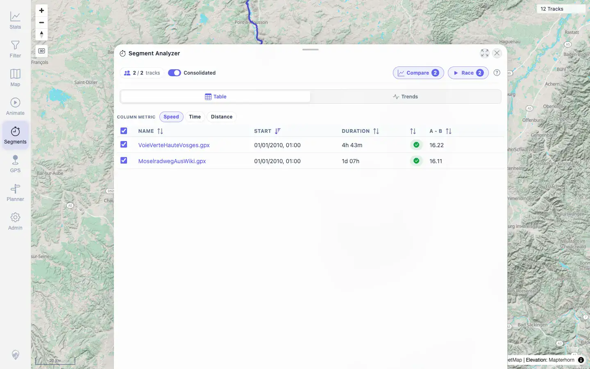
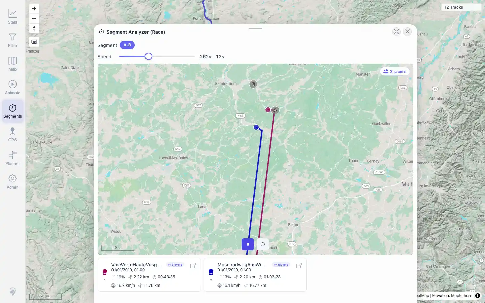
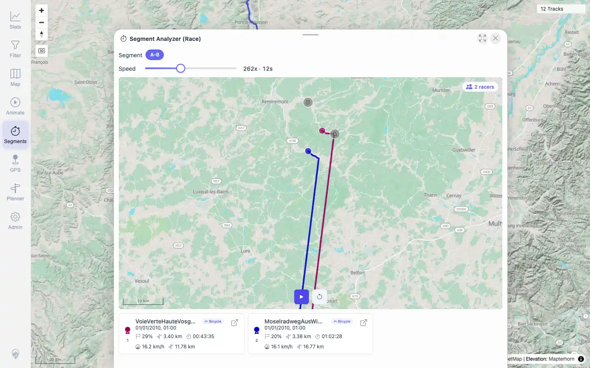
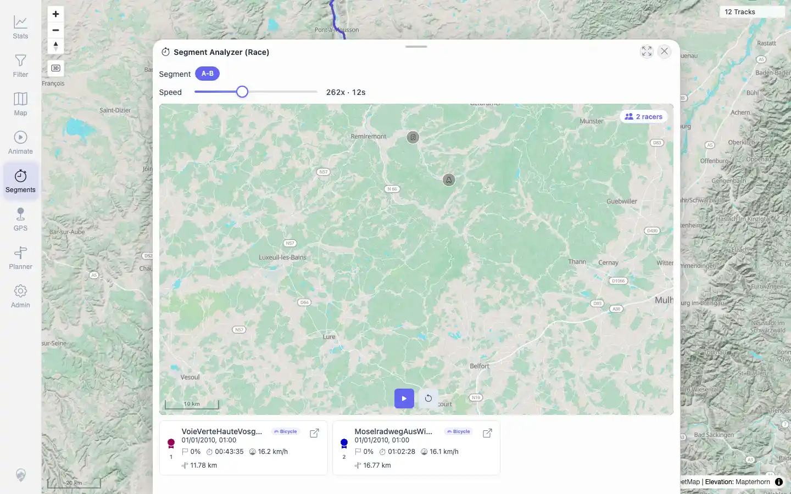

# Packet: AVR_02

## Scope

- Coverage source: `documentation/testing/frontend-regression-test-plan.md`
- Coverage ID or run packet: AVR_02
- In scope: Virtual Race with multiple racers, playback, ranking, and racer-card progress.
- Out of scope: Post-race map/tool cleanup, covered by AVR_03.

## Prerequisites

- Required previous coverage IDs or run packets: AVR_01.
- Required app/data state: 12 visible tracks, no active filter.
- Required browser context: Desktop browser, authenticated as `mtl`.

## Allowed Mutations

- Allowed: Temporary Segment Analyzer/Race overlay and map display state.
- Not allowed: Track, planner, filter, or server data mutations.

## Actions And Results

| Coverage ID | Action | Expected result | Actual result | Status | Evidence |
|---|---|---|---|---|---|
| AVR_02 | Built a two-track Segment Analyzer result for A-B, opened Race, started playback, paused, and reset. | Multiple racers move together; ranking and racer cards update in real time. | Race preview showed `2 racers` with ranks 1/2 for `VoieVerteHauteVosges.gpx` and `MoselradwegAusWiki.gpx`. Playback changed the start icon to Pause and updated cards from `0%` to `22%`/`16%` with distance progress. Pause restored the Play icon while retaining progress, and Reset returned both cards to `0%`. | PASS | [assets/AVR_02-race-result-sheet.webp](../assets/AVR_02-race-result-sheet.webp), [assets/AVR_02-race-ready.webp](../assets/AVR_02-race-ready.webp), [assets/AVR_02-race-running.webp](../assets/AVR_02-race-running.webp), [assets/AVR_02-race-paused.webp](../assets/AVR_02-race-paused.webp), [assets/AVR_02-race-reset.webp](../assets/AVR_02-race-reset.webp), [assets/AVR_02-virtual-race.txt](../assets/AVR_02-virtual-race.txt) |

## Issues

| ID | Severity | Summary | Reproduction | Expected | Actual | Evidence | Release impact |
|---|---|---|---|---|---|---|---|
|  |  |  |  |  |  |  |  |

## Evidence Files

| File | Purpose |
|---|---|
| [assets/AVR_02-race-candidate-scan.txt](../assets/AVR_02-race-candidate-scan.txt) | Compact summary of the selected two-racer trigger pair. |
| [assets/AVR_02-race-result-sheet.webp](../assets/AVR_02-race-result-sheet.webp) | Segment Analyzer result with Race enabled for two tracks. |
| [assets/AVR_02-race-ready.webp](../assets/AVR_02-race-ready.webp) | Race overlay loaded with two racer cards. |
| [assets/AVR_02-race-running.webp](../assets/AVR_02-race-running.webp) | Race playback in progress with card progress. |
| [assets/AVR_02-race-paused.webp](../assets/AVR_02-race-paused.webp) | Race paused after progress. |
| [assets/AVR_02-race-reset.webp](../assets/AVR_02-race-reset.webp) | Race reset to 0%. |
| [assets/AVR_02-virtual-race.txt](../assets/AVR_02-virtual-race.txt) | Compact DOM state and endpoint evidence. |

## Screenshot Evidence

**Segment Analyzer result with Race enabled for two tracks.**

**Race overlay loaded with two racer cards.**

**Race playback in progress with card progress.**

**Race paused after progress.**

**Race reset to 0%.**

## Timings

| Step | Timing |
|---|---:|
| Candidate scan | ~20s |
| UI race exercise | ~32s |

## Handoff Notes

- Completed: AVR_02 PASS.
- Remaining unfinished coverage: AVR_03 onward.
- Blocked or not applicable: None.
- State left for the next packet: No server data was changed.
