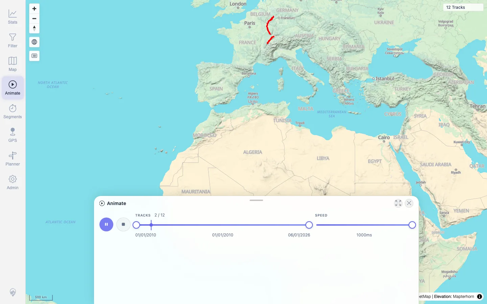
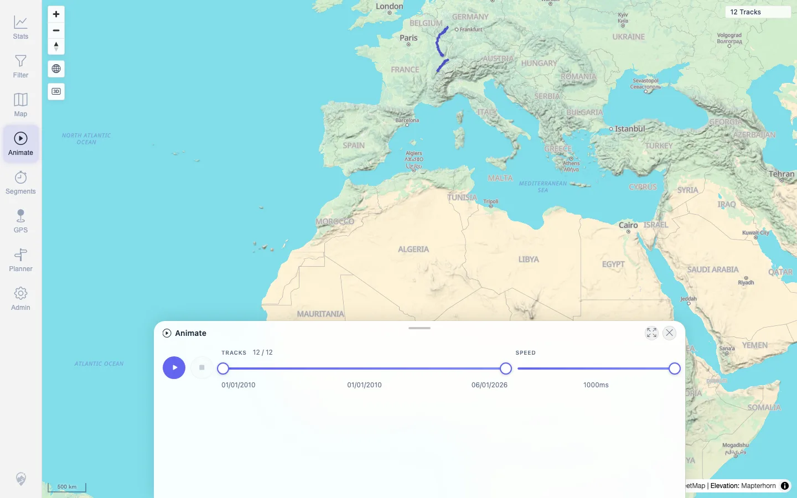
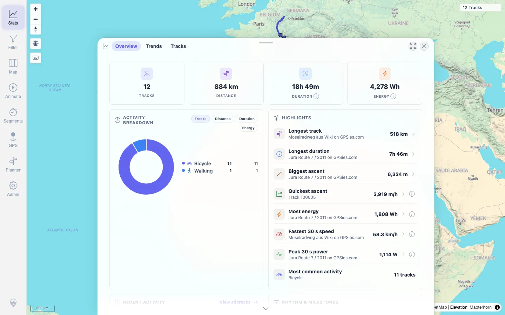

# Packet: AVR_03

## Scope

- Coverage source: `documentation/testing/frontend-regression-test-plan.md`
- Coverage ID or run packet: AVR_03
- In scope: Post-stop animation usability: map zoom and tool switching after stopping playback.
- Out of scope: Media, heatmap, and later overlay tools.

## Prerequisites

- Required previous coverage IDs or run packets: AVR_01, AVR_02.
- Required app/data state: 12 visible tracks, no active filter.
- Required browser context: Desktop browser, authenticated as `mtl`.

## Allowed Mutations

- Allowed: Temporary animation and map viewport state.
- Not allowed: Track, planner, filter, or server data mutations.

## Actions And Results

| Coverage ID | Action | Expected result | Actual result | Status | Evidence |
|---|---|---|---|---|---|
| AVR_03 | Started Animate at 1000 ms, stopped it, used map zoom in/out, then switched to Stats. | Stopping/finishing animation leaves map gestures and tools usable with no stuck state. | Before stop, playhead was `9.09091%` and Stop was enabled. After stop, playhead was gone and Stop was disabled. Map zoom controls still worked: scale changed from `500 km` to `300 km` and back to `500 km`. Stats opened at `/mtl/stats` with overview content. AVR_02 separately verified Race reset returned both racers to `0%`. | PASS | [assets/AVR_03-running-before-stop.webp](../assets/AVR_03-running-before-stop.webp), [assets/AVR_03-stopped.webp](../assets/AVR_03-stopped.webp), [assets/AVR_03-stats-after-stop.webp](../assets/AVR_03-stats-after-stop.webp), [assets/AVR_03-post-stop-usability.txt](../assets/AVR_03-post-stop-usability.txt) |

## Issues

| ID | Severity | Summary | Reproduction | Expected | Actual | Evidence | Release impact |
|---|---|---|---|---|---|---|---|
|  |  |  |  |  |  |  |  |

## Evidence Files

| File | Purpose |
|---|---|
| [assets/AVR_03-running-before-stop.webp](../assets/AVR_03-running-before-stop.webp) | Animate running before stop. |
| [assets/AVR_03-stopped.webp](../assets/AVR_03-stopped.webp) | Animate stopped/reset. |
| [assets/AVR_03-stats-after-stop.webp](../assets/AVR_03-stats-after-stop.webp) | Stats opened after stop and map zoom interaction. |
| [assets/AVR_03-post-stop-usability.txt](../assets/AVR_03-post-stop-usability.txt) | Compact state summary for stop, zoom, and tool switch. |

## Screenshot Evidence

**Animate running before stop.**

**Animate stopped/reset.**

**Stats opened after stop and map zoom interaction.**

## Timings

| Step | Timing |
|---|---:|
| Post-stop usability check | ~13s |

## Handoff Notes

- Completed: AVR_03 PASS.
- Remaining unfinished coverage: MED_01 onward.
- Blocked or not applicable: None.
- State left for the next packet: No server data was changed.
