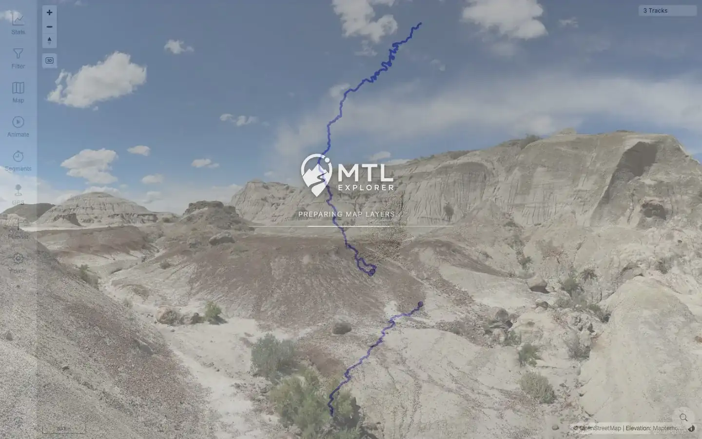
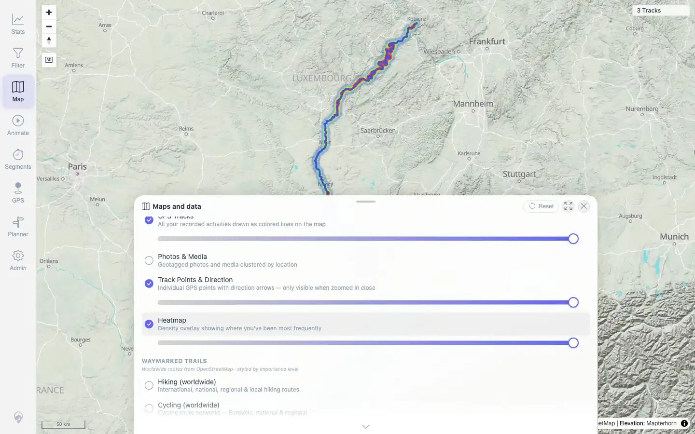

# Packet: DEL_03

## Scope

- Coverage source: `documentation/testing/frontend-regression-test-plan.md`
- Coverage ID or run packet: DEL_03
- In scope: Verify two deleted tracks disappear from user-visible map, track browser/list, filter results, heatmap, related-track lists, and statistics totals.
- Out of scope: Deleted-track stale URL/API probe semantics; explicitly excluded by DEL_05.

## Prerequisites

- Required previous coverage IDs or run packets: DEL_02.
- Required app/data state: Deleted tracks processed; three GPX tracks remain.
- Required browser context: Clean desktop browser.

## Allowed Mutations

- Allowed: Reload UI, open stats/filter/map/heatmap, query related-track API for remaining track.
- Not allowed: Add/delete files or change metadata.

## Actions And Results

| Coverage ID | Action | Expected result | Actual result | Status | Evidence |
|---|---|---|---|---|---|
| DEL_03 | Reloaded clean UI after delete, opened map, Stats → Tracks, Filter, Heatmap, and checked related data for remaining track `100002`. | Deleted tracks no longer appear in map, browser/list, filter results, selection lists, heatmap, related-track lists, or statistics totals. | Clean UI showed `3 Tracks`; Stats → Tracks showed only VoieVerte, JuraRoute, and Moselradweg with `3 tracks · 870 km · 17h 49m`; Filter panel global count remained `3 Tracks`; heatmap rendered over remaining tracks; deleted names `Lannion_Plestin...` and `Vitry...` were absent from map/stats/filter/related evidence; related API for `100002` contained no deleted IDs/names. | PASS | [assets/DEL_03-user-visible-removal.txt](../assets/DEL_03-user-visible-removal.txt), [assets/DEL_03-related-api-after-delete.txt](../assets/DEL_03-related-api-after-delete.txt), [assets/DEL_03-map-3-tracks.webp](../assets/DEL_03-map-3-tracks.webp), [assets/DEL_03-stats-3-tracks.webp](../assets/DEL_03-stats-3-tracks.webp), [assets/DEL_03-filter-3-tracks.webp](../assets/DEL_03-filter-3-tracks.webp), [assets/DEL_03-heatmap-3-tracks.webp](../assets/DEL_03-heatmap-3-tracks.webp) |

## Issues

| ID | Severity | Summary | Reproduction | Expected | Actual | Evidence | Release impact |
|---|---|---|---|---|---|---|---|

## Evidence Files

| File | Purpose |
|---|---|
| [assets/DEL_03-user-visible-removal.txt](../assets/DEL_03-user-visible-removal.txt) | UI text and deleted-name absence across map, stats, filter, heatmap, and attempted related surface. |
| [assets/DEL_03-related-api-after-delete.txt](../assets/DEL_03-related-api-after-delete.txt) | Related-track data for remaining track `100002` with no deleted IDs/names. |
| [assets/DEL_03-map-3-tracks.webp](../assets/DEL_03-map-3-tracks.webp) | Map after delete showing three tracks. |
| [assets/DEL_03-stats-3-tracks.webp](../assets/DEL_03-stats-3-tracks.webp) | Stats track list after delete showing three remaining tracks. |
| [assets/DEL_03-filter-3-tracks.webp](../assets/DEL_03-filter-3-tracks.webp) | Filter panel after delete with global count at three. |
| [assets/DEL_03-heatmap-3-tracks.webp](../assets/DEL_03-heatmap-3-tracks.webp) | Heatmap after delete over remaining tracks. |
| [assets/DEL_03-related-list-after-delete.txt](../assets/DEL_03-related-list-after-delete.txt) | Remaining-track details text with no deleted names. |

## Screenshot Evidence

**Map after delete showing three tracks.**

**Stats track list after delete showing three remaining tracks.**

**Filter panel after delete with global count at three.**

**Heatmap after delete over remaining tracks.**

## Timings

| Step | Timing |
|---|---:|
| User-visible delete verification | ~12 seconds |

## Handoff Notes

- Completed: DEL_03 terminal as `PASS`.
- Remaining unfinished coverage: Continue with `DEL_04` remaining-track open/display checks.
- Blocked or not applicable: None.
- State left for the next packet: Three GPX tracks remain imported.
