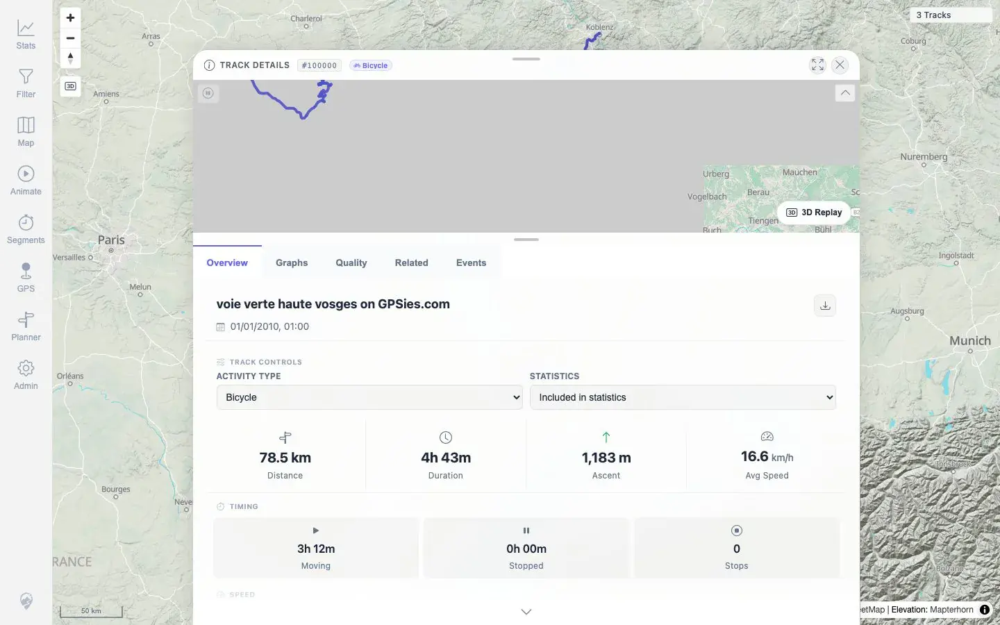
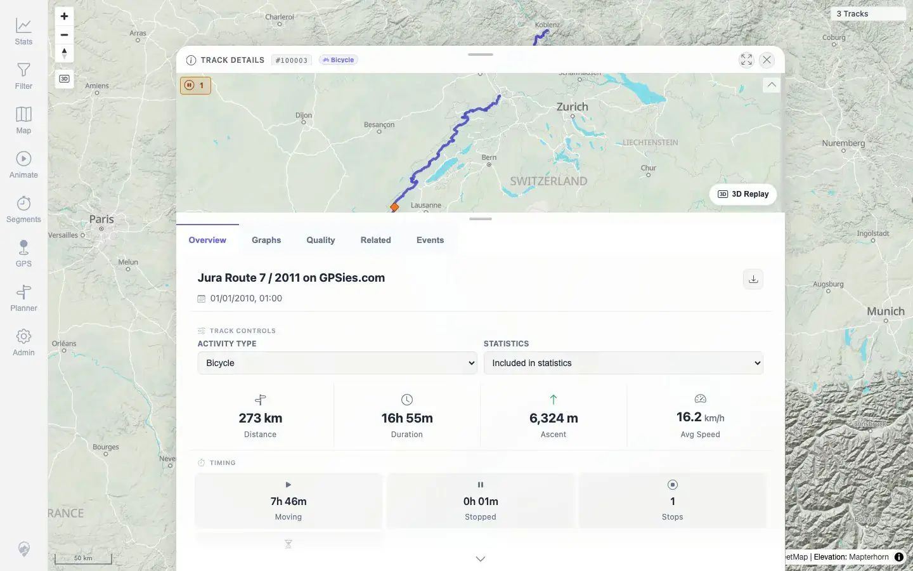
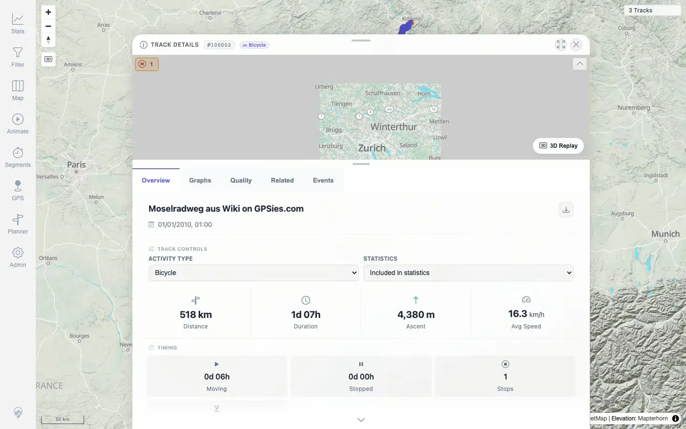

# Packet: DEL_04

## Scope

- Coverage source: `documentation/testing/frontend-regression-test-plan.md`
- Coverage ID or run packet: DEL_04
- In scope: Verify remaining imported tracks still display and open correctly after delete processing.
- Out of scope: Deleted-track URL/API semantics; covered by DEL_05.

## Prerequisites

- Required previous coverage IDs or run packets: DEL_03.
- Required app/data state: Three GPX tracks remain after deletion.
- Required browser context: Clean desktop browser.

## Allowed Mutations

- Allowed: Open Stats → Tracks and remaining track details.
- Not allowed: Add/delete files or change track metadata.

## Actions And Results

| Coverage ID | Action | Expected result | Actual result | Status | Evidence |
|---|---|---|---|---|---|
| DEL_04 | Opened each remaining track from Stats → Tracks after deletion. | Remaining imported tracks still display and open normally. | Remaining tracks `#100000` VoieVerte, `#100003` JuraRoute, and `#100002` Moselradweg all opened details with expected title, activity, distance, duration, ascent, and statistics values. | PASS | [assets/DEL_04-remaining-open-results.txt](../assets/DEL_04-remaining-open-results.txt), [assets/DEL_04-open-100000.webp](../assets/DEL_04-open-100000.webp), [assets/DEL_04-open-100003.webp](../assets/DEL_04-open-100003.webp), [assets/DEL_04-open-100002.webp](../assets/DEL_04-open-100002.webp) |

## Issues

| ID | Severity | Summary | Reproduction | Expected | Actual | Evidence | Release impact |
|---|---|---|---|---|---|---|---|

## Evidence Files

| File | Purpose |
|---|---|
| [assets/DEL_04-remaining-open-results.txt](../assets/DEL_04-remaining-open-results.txt) | Per-track detail-open results after delete. |
| [assets/DEL_04-open-100000.webp](../assets/DEL_04-open-100000.webp) | Remaining VoieVerte track details. |
| [assets/DEL_04-open-100003.webp](../assets/DEL_04-open-100003.webp) | Remaining JuraRoute track details. |
| [assets/DEL_04-open-100002.webp](../assets/DEL_04-open-100002.webp) | Remaining Moselradweg track details. |

## Screenshot Evidence

**Remaining VoieVerte track details.**

**Remaining JuraRoute track details.**

**Remaining Moselradweg track details.**

## Timings

| Step | Timing |
|---|---:|
| Remaining track open pass | ~15 seconds |

## Handoff Notes

- Completed: DEL_04 terminal as `PASS`.
- Remaining unfinished coverage: Continue with `DEL_05` pass/fail scope clarification.
- Blocked or not applicable: None.
- State left for the next packet: Three GPX tracks remain; deleted files are still absent.
