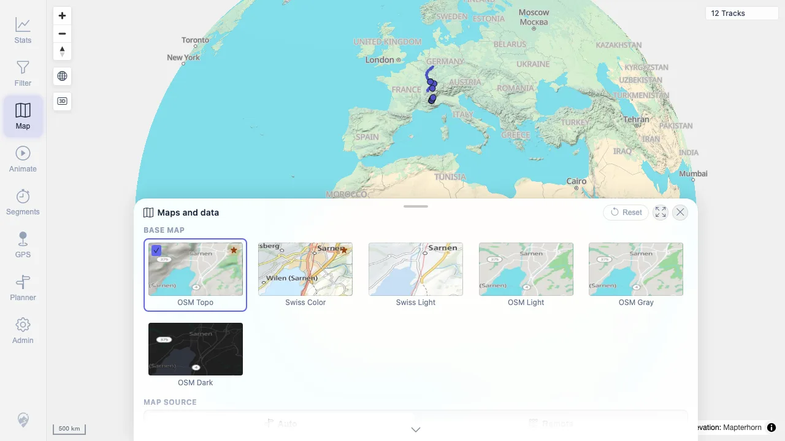

# Packet: ERR_02

## Scope

- Coverage source: `documentation/testing/frontend-regression-test-plan.md`
- Coverage ID or run packet: ERR_02
- In scope: Rapid tool switching and leftover marker/listener/cursor state.
- Out of scope: Individual tool behavior already covered by earlier packets.

## Prerequisites

- Required previous coverage IDs or run packets: ERR_01.
- Required app/data state: Authenticated 12-track map.
- Required browser context: Desktop Chromium context.

## Allowed Mutations

- Allowed: Rapidly switch visible tools and click the map after returning to Map.
- Not allowed: Save routes, filters, or server data.

## Actions And Results

| Coverage ID | Action | Expected result | Actual result | Status | Evidence |
|---|---|---|---|---|---|
| ERR_02 | Rapidly switched through `Stats`, `Filter`, `Planner`, `Map`, `Animate`, `Segments`, `GPS`, `Admin`, and back to `Map`, then clicked the map. | Rapid switching between tools does not leave previous markers, listeners, or cursors behind. | Final URL was `/mtl/map-settings`; only the Map settings sheet remained active. Planner, Segments, Animate, and GPS leftover flags were false before and after the post-switch map click; page width stayed at 1280 px. | PASS | [assets/ERR_02-rapid-tool-switch.txt](../assets/ERR_02-rapid-tool-switch.txt); [assets/ERR_02-rapid-tool-switch.webp](../assets/ERR_02-rapid-tool-switch.webp) |

## Issues

| ID | Severity | Summary | Reproduction | Expected | Actual | Evidence | Release impact |
|---|---|---|---|---|---|---|---|

## Evidence Files

| File | Purpose |
|---|---|
| [assets/ERR_02-rapid-tool-switch.txt](../assets/ERR_02-rapid-tool-switch.txt) | Tool sequence, final state, leftover flags, and console summary. |
| [assets/ERR_02-rapid-tool-switch.webp](../assets/ERR_02-rapid-tool-switch.webp) | Final Map settings state after rapid switching and map click. |

## Screenshot Evidence

**Final Map settings state after rapid switching and map click.**

## Timings

| Step | Timing |
|---|---:|
| Rapid tool switching check | ~2 min |

## Handoff Notes

- Completed: ERR_02 terminal as `PASS`.
- Remaining unfinished coverage: Proceed to finalization gate before RUN_CLEANUP.
- Blocked or not applicable: None.
- State left for the next packet: Isolated browser context closed; server state unchanged.
