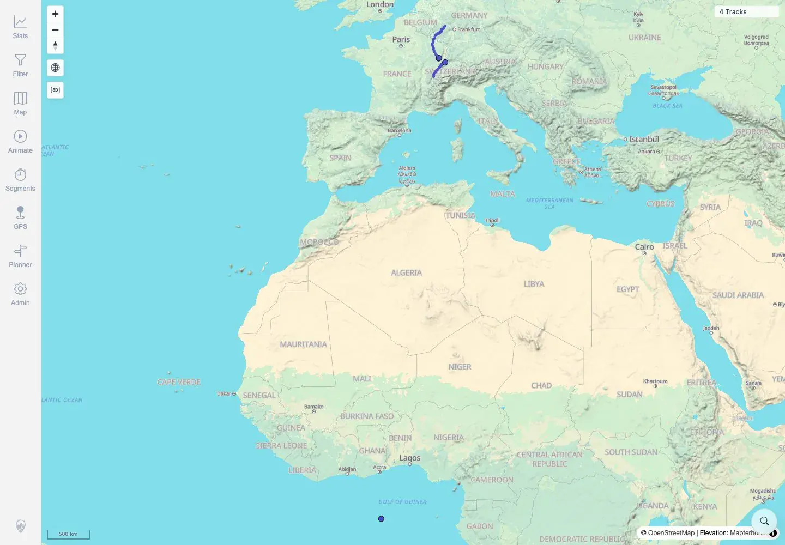
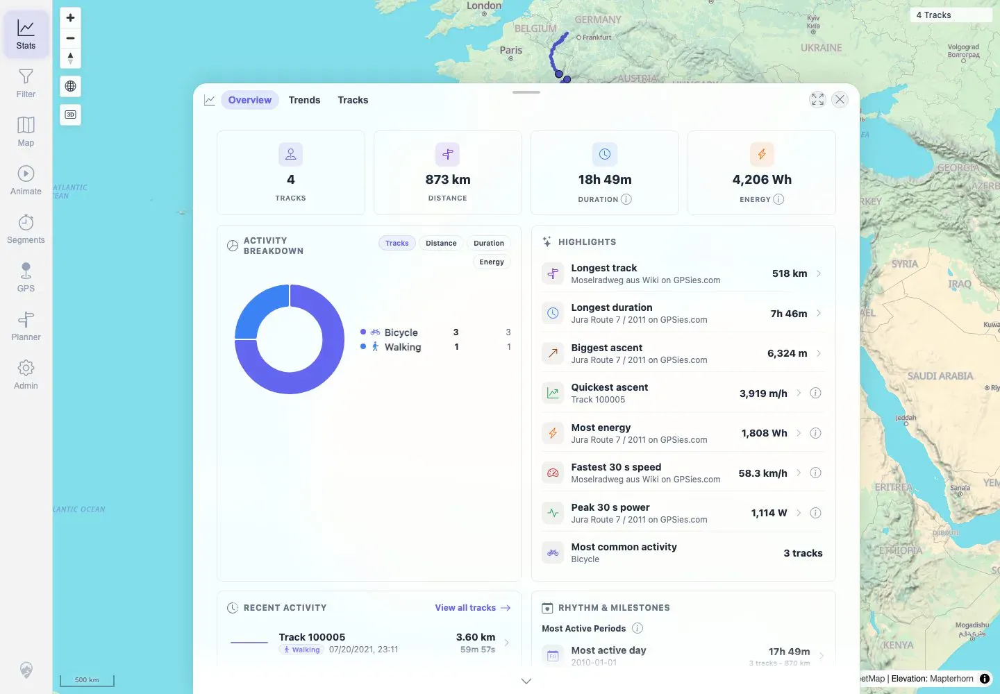
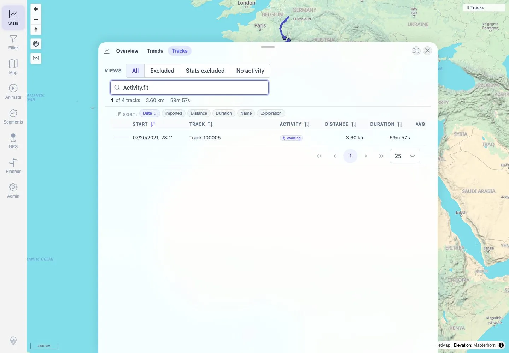

# Packet: FIT_02

## Scope

- Coverage source: `documentation/testing/frontend-regression-test-plan.md`
- Coverage ID or run packet: FIT_02
- In scope: Verify the imported FIT file is accepted by watched-folder import, indexed successfully, displayed on the map, searchable in the track browser, and included in statistics.
- Out of scope: FIT details tabs and download actions; covered by FIT_03-FIT_05.

## Prerequisites

- Required previous coverage IDs or run packets: FIT_01.
- Required app/data state: Three remaining GPX-backed tracks plus `Activity.fit` in the watched import folder.
- Required browser context: Clean authenticated desktop browser context.

## Allowed Mutations

- Allowed: Read index/status APIs, open map and stats surfaces, search track browser.
- Not allowed: Add, delete, or reimport source files.

## Actions And Results

| Coverage ID | Action | Expected result | Actual result | Status | Evidence |
|---|---|---|---|---|---|
| FIT_02 | Waited for watched-folder processing, checked index logs/API status, loaded the map, opened Stats Overview and Stats Tracks, then searched the track browser for `Activity.fit`. | FIT import is accepted and indexed successfully; converted track is displayed on the map, searchable in the browser, and included in statistics. | `Activity.fit` converted through GPSBabel and indexed as track `100005` with `COMPLETED_WITH_SUCCESS` / `SUCCESS`, 3,600 points and 3.60 km. Map showed `4 Tracks`; Stats Overview showed `4 TRACKS`, 873 km, 18h 49m, and Walking 1; Stats Tracks search for `Activity.fit` returned `1 of 4 tracks`, `Track 100005`, Walking, 3.60 km, 59m 57s. | PASS | [assets/FIT_02-fit-index-logs.txt](../assets/FIT_02-fit-index-logs.txt), [assets/FIT_02-post-fit-status-api.txt](../assets/FIT_02-post-fit-status-api.txt), [assets/FIT_02-ui-display-search-stats.txt](../assets/FIT_02-ui-display-search-stats.txt), [assets/FIT_02-map-4-tracks.webp](../assets/FIT_02-map-4-tracks.webp), [assets/FIT_02-stats-overview.webp](../assets/FIT_02-stats-overview.webp), [assets/FIT_02-stats-search-activity-fit.webp](../assets/FIT_02-stats-search-activity-fit.webp) |

## Issues

| ID | Severity | Summary | Reproduction | Expected | Actual | Evidence | Release impact |
|---|---|---|---|---|---|---|---|

## Evidence Files

| File | Purpose |
|---|---|
| [assets/FIT_02-fit-index-logs.txt](../assets/FIT_02-fit-index-logs.txt) | Cropped app log showing live watcher detection, FIT-to-GPX conversion, and successful ingest for `Activity.fit`. |
| [assets/FIT_02-post-fit-status-api.txt](../assets/FIT_02-post-fit-status-api.txt) | Authenticated freshness, indexer, jobs, and simplified-track API summary after FIT import. |
| [assets/FIT_02-ui-display-search-stats.txt](../assets/FIT_02-ui-display-search-stats.txt) | Compact Playwright text summary and assertions for map, Stats Overview, and track-browser search. |
| [assets/FIT_02-map-4-tracks.webp](../assets/FIT_02-map-4-tracks.webp) | Desktop map screenshot after FIT import showing four tracks. |
| [assets/FIT_02-stats-overview.webp](../assets/FIT_02-stats-overview.webp) | Stats Overview screenshot after FIT import. |
| [assets/FIT_02-stats-search-activity-fit.webp](../assets/FIT_02-stats-search-activity-fit.webp) | Stats Tracks search screenshot for `Activity.fit`. |

## Screenshot Evidence

**Desktop map screenshot after FIT import showing four tracks.**

**Stats Overview screenshot after FIT import.**

**Stats Tracks search screenshot for Activity.fit.**

## Timings

| Step | Timing |
|---|---:|
| FIT live watcher detection to successful ingest | 11.3 seconds |
| FIT UI verification | ~12 seconds |

## Handoff Notes

- Completed: FIT_02 terminal as `PASS`.
- Remaining unfinished coverage: Continue with `FIT_03` details overview, graphs, quality, events, related tracks, mini-map, and point popups for FIT-backed track `100005`.
- Blocked or not applicable: None.
- State left for the next packet: Four visible tracks remain: three GPX-backed tracks plus FIT-backed `Track 100005`.
