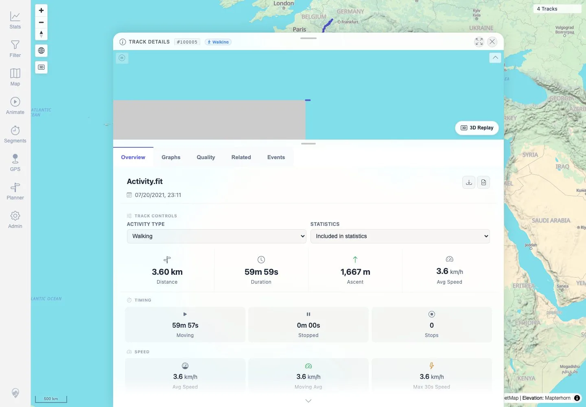
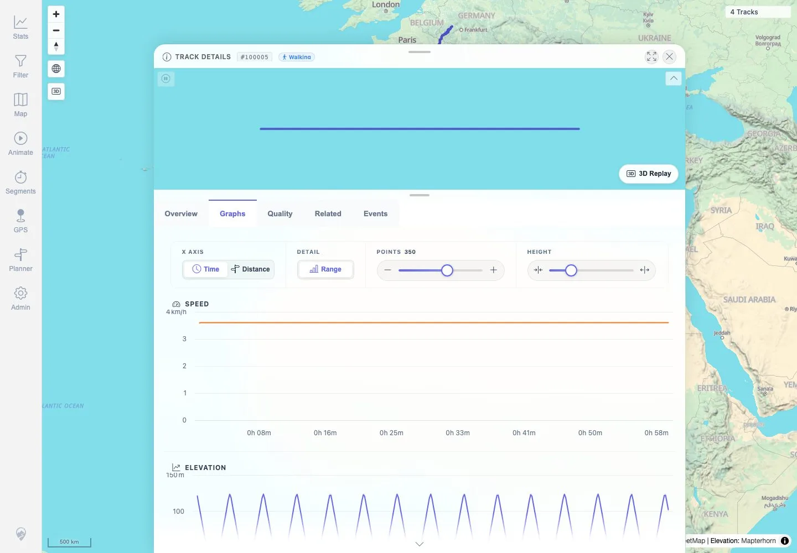
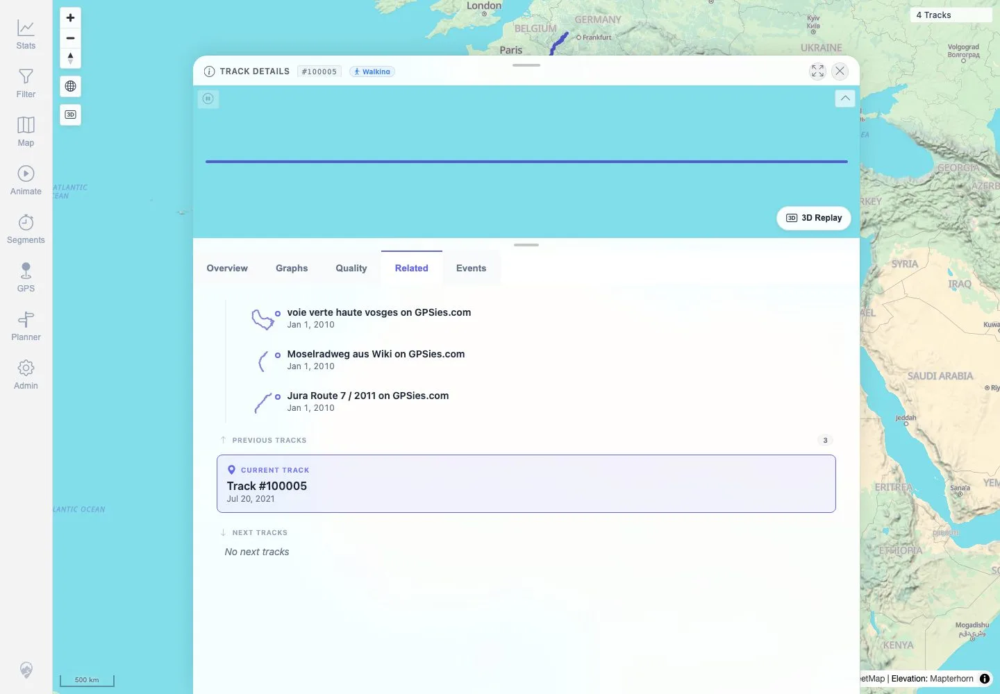
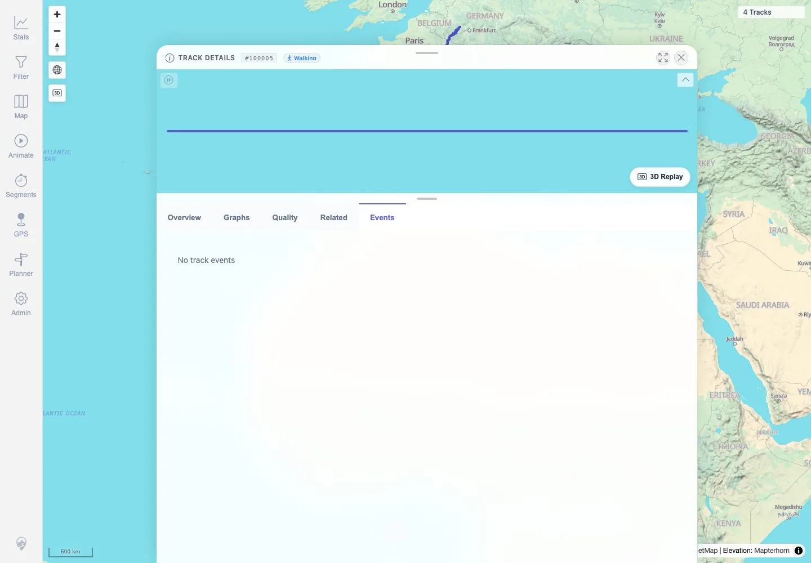
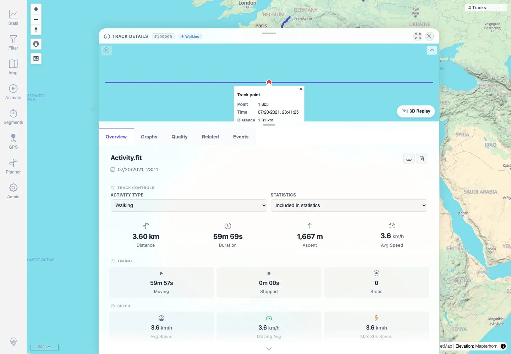

# Packet: FIT_03

## Scope

- Coverage source: `documentation/testing/frontend-regression-test-plan.md`
- Coverage ID or run packet: FIT_03
- In scope: Open the FIT-backed track details and verify Overview, Graphs, Quality, Related, Events, mini-map, and point popup rendering.
- Out of scope: Download original FIT and converted GPX; covered by FIT_04-FIT_05.

## Prerequisites

- Required previous coverage IDs or run packets: FIT_02.
- Required app/data state: FIT-backed track `100005` visible in the track browser.
- Required browser context: Clean authenticated desktop browser context.

## Allowed Mutations

- Allowed: Navigate to details through Stats Tracks, switch detail tabs, hover/click the mini-map.
- Not allowed: Add/delete/reindex files or change track metadata.

## Actions And Results

| Coverage ID | Action | Expected result | Actual result | Status | Evidence |
|---|---|---|---|---|---|
| FIT_03 | Searched Stats Tracks for `Activity.fit`, opened `Track 100005`, clicked Overview, Graphs, Quality, Related, and Events, then hovered/clicked the FIT mini-map track line. | FIT-backed detail surfaces render like GPX-backed tracks: overview metrics, graphs, quality/status, related/events tabs, mini-map, and point popups are usable. | Details opened at `/mtl/track/100005`. Overview showed `Activity.fit`, Walking, 3.60 km, 59m 59s, 1,667 m ascent, and the mini-map. Graphs showed Time/Distance axis controls, Range, Points, Height, Speed, Elevation, Elevation Gain Rate, and Distance over Time. Quality showed `SUCCESS`, `UNIQUE`, 3,600 total points, Walking, auto-guess classification, geo coverage, and File & Indexer section. Related showed current track `#100005` and no next tracks; Events rendered `No track events`. Mini-map point popup rendered point/time/distance/elevation/speed/elapsed data. | PASS | [assets/FIT_03-details-tabs-summary.txt](../assets/FIT_03-details-tabs-summary.txt), [assets/FIT_03-overview-minimap.webp](../assets/FIT_03-overview-minimap.webp), [assets/FIT_03-graphs.webp](../assets/FIT_03-graphs.webp), [assets/FIT_03-quality.webp](../assets/FIT_03-quality.webp), [assets/FIT_03-related.webp](../assets/FIT_03-related.webp), [assets/FIT_03-events.webp](../assets/FIT_03-events.webp), [assets/FIT_03-point-popup-check.webp](../assets/FIT_03-point-popup-check.webp) |

## Issues

| ID | Severity | Summary | Reproduction | Expected | Actual | Evidence | Release impact |
|---|---|---|---|---|---|---|---|
| MTL-FR-002 | P3 | Highcharts accessibility module warning appears when rendering detail graphs. | Open FIT-backed `Track 100005`, switch to Graphs, and observe browser console. | Detail graphs render without accessibility-related console warnings. | Browser emitted Highcharts warning recommending the `accessibility.js` module or explicit disabling. | [assets/FIT_03-details-tabs-summary.txt](../assets/FIT_03-details-tabs-summary.txt) | Low functional risk; may indicate reduced chart accessibility and noisy console output. |

## Evidence Files

| File | Purpose |
|---|---|
| [assets/FIT_03-details-tabs-summary.txt](../assets/FIT_03-details-tabs-summary.txt) | Compact tab text, assertions, point popup text, and browser warning summary. |
| [assets/FIT_03-overview-minimap.webp](../assets/FIT_03-overview-minimap.webp) | FIT detail Overview with mini-map and track metrics. |
| [assets/FIT_03-graphs.webp](../assets/FIT_03-graphs.webp) | FIT detail Graphs tab with chart controls and visible series. |
| [assets/FIT_03-quality.webp](../assets/FIT_03-quality.webp) | FIT detail Quality tab. |
| [assets/FIT_03-related.webp](../assets/FIT_03-related.webp) | FIT detail Related tab. |
| [assets/FIT_03-events.webp](../assets/FIT_03-events.webp) | FIT detail Events tab. |
| [assets/FIT_03-point-popup-check.webp](../assets/FIT_03-point-popup-check.webp) | FIT mini-map point popup evidence. |

## Screenshot Evidence

**FIT detail Overview with mini-map and track metrics.**

**FIT detail Graphs tab with chart controls and visible series.**

**FIT detail Quality tab.**

**FIT detail Related tab.**

**FIT detail Events tab.**

**FIT mini-map point popup evidence.**

## Timings

| Step | Timing |
|---|---:|
| Open FIT details from Stats Tracks | ~8 seconds |
| FIT detail tab and mini-map popup verification | ~12 seconds |

## Handoff Notes

- Completed: FIT_03 terminal as `PASS`.
- Remaining unfinished coverage: Continue with `FIT_04` original source download checksum for `Activity.fit`.
- Blocked or not applicable: None.
- State left for the next packet: Browser interactions were read-only; four tracks remain visible.
