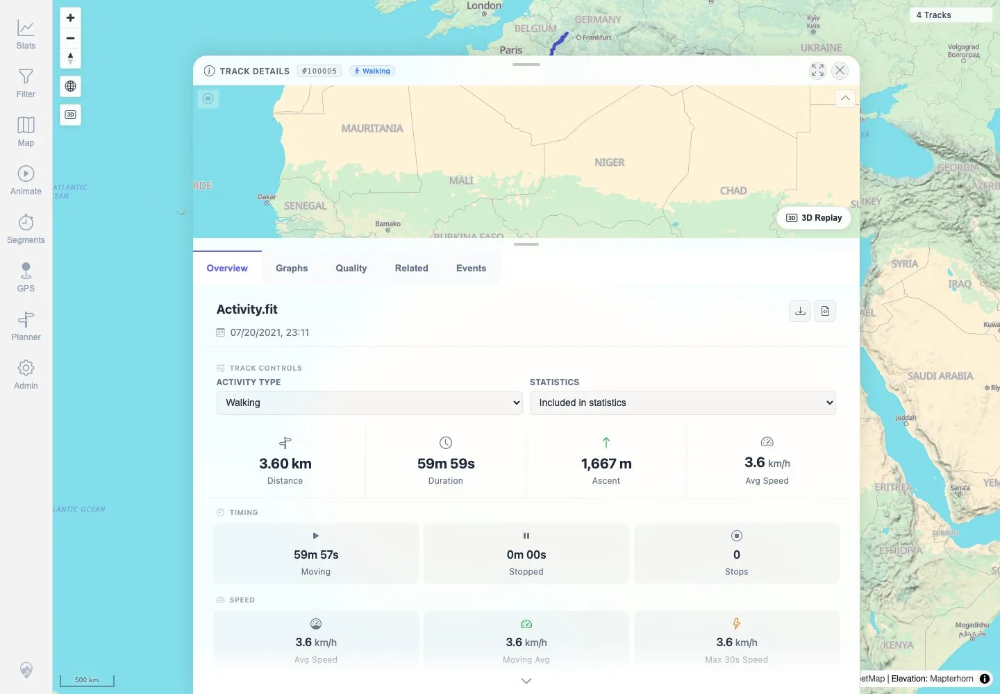

# Packet: FIT_04

## Scope

- Coverage source: `documentation/testing/frontend-regression-test-plan.md`
- Coverage ID or run packet: FIT_04
- In scope: Use **Download original source file** for the FIT-backed track and verify the downloaded file remains FIT and matches the uploaded checksum.
- Out of scope: Converted GPX download; covered by FIT_05.

## Prerequisites

- Required previous coverage IDs or run packets: FIT_03.
- Required app/data state: FIT-backed track `100005` details can be opened from user-facing navigation.
- Required browser context: Authenticated desktop browser context with downloads enabled.

## Allowed Mutations

- Allowed: Download the original FIT file to a temporary local path for checksum verification.
- Not allowed: Change source files, metadata, or import state.

## Actions And Results

| Coverage ID | Action | Expected result | Actual result | Status | Evidence |
|---|---|---|---|---|---|
| FIT_04 | Opened FIT-backed `Track 100005` details and clicked the visible **Download original** button. Calculated SHA-256 and checked the FIT header on the downloaded file. | Downloaded original remains a FIT file and matches the uploaded public sample checksum. | Download suggested filename `Activity.fit`, size `94,096` bytes, SHA-256 `949a238e1bb75c3684479785f76fa9a16888bb394518844248f488171d591387`, matching the DAT manifest. Header bytes 8-11 are `.FIT`. | PASS | [assets/FIT_04-download-original-checksum.txt](../assets/FIT_04-download-original-checksum.txt), [assets/FIT_04-download-original-control.webp](../assets/FIT_04-download-original-control.webp), [assets/DAT-public-data-manifest.json](../assets/DAT-public-data-manifest.json) |

## Issues

| ID | Severity | Summary | Reproduction | Expected | Actual | Evidence | Release impact |
|---|---|---|---|---|---|---|---|

## Evidence Files

| File | Purpose |
|---|---|
| [assets/FIT_04-download-original-checksum.txt](../assets/FIT_04-download-original-checksum.txt) | Download action, suggested filename, byte count, SHA-256 comparison, and FIT signature check. |
| [assets/FIT_04-download-original-control.webp](../assets/FIT_04-download-original-control.webp) | FIT detail screenshot showing the download controls used. |
| [assets/DAT-public-data-manifest.json](../assets/DAT-public-data-manifest.json) | Expected uploaded FIT checksum source. |

## Screenshot Evidence

**FIT detail screenshot showing the download controls used.**

## Timings

| Step | Timing |
|---|---:|
| Open details and download original FIT | ~10 seconds |

## Handoff Notes

- Completed: FIT_04 terminal as `PASS`.
- Remaining unfinished coverage: Continue with `FIT_05` converted GPX download and real `trkpt` verification.
- Blocked or not applicable: None.
- State left for the next packet: Downloaded public FIT copy exists only in `/tmp/mtl-playwright-regression/Activity.fit`; app state unchanged.
