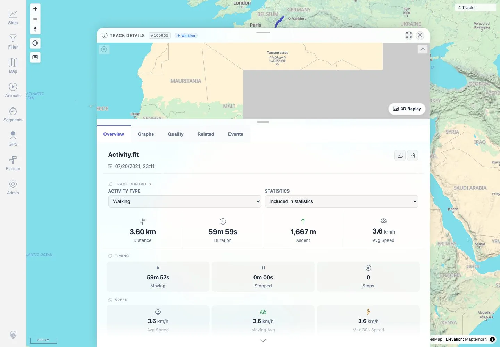

# Packet: FIT_05

## Scope

- Coverage source: `documentation/testing/frontend-regression-test-plan.md`
- Coverage ID or run packet: FIT_05
- In scope: Use **Download as GPX** for the FIT-backed track and verify the downloaded GPX contains real trackpoints.
- Out of scope: Original FIT checksum; covered by FIT_04.

## Prerequisites

- Required previous coverage IDs or run packets: FIT_04.
- Required app/data state: FIT-backed track `100005` details available.
- Required browser context: Authenticated desktop browser context with downloads enabled.

## Allowed Mutations

- Allowed: Download converted GPX to a temporary local path for XML/trackpoint validation.
- Not allowed: Change app data or import state.

## Actions And Results

| Coverage ID | Action | Expected result | Actual result | Status | Evidence |
|---|---|---|---|---|---|
| FIT_05 | Opened FIT-backed `Track 100005` details and clicked the visible **Download GPX** button. Parsed the downloaded XML for GPX root, track, segment, trackpoints, and waypoint count. | A valid GPX file downloads and contains real `trkpt` trackpoints, not only waypoints. | Download suggested filename `Activity.gpx`, size `479,844` bytes, XML/GPX root present, `trkCount=1`, `trksegCount=1`, `trkptCount=3601`, `wptCount=0`. First trackpoint includes lat/lon, elevation, and time. | PASS | [assets/FIT_05-download-gpx-validation.txt](../assets/FIT_05-download-gpx-validation.txt), [assets/FIT_05-download-gpx-control.webp](../assets/FIT_05-download-gpx-control.webp) |

## Issues

| ID | Severity | Summary | Reproduction | Expected | Actual | Evidence | Release impact |
|---|---|---|---|---|---|---|---|

## Evidence Files

| File | Purpose |
|---|---|
| [assets/FIT_05-download-gpx-validation.txt](../assets/FIT_05-download-gpx-validation.txt) | Downloaded GPX filename, byte count, SHA-256, XML/root checks, `trk`/`trkseg`/`trkpt`/`wpt` counts, and sample trackpoint. |
| [assets/FIT_05-download-gpx-control.webp](../assets/FIT_05-download-gpx-control.webp) | FIT detail screenshot showing the GPX download control used. |

## Screenshot Evidence

**FIT detail screenshot showing the GPX download control used.**

## Timings

| Step | Timing |
|---|---:|
| Open details and download converted GPX | ~9 seconds |

## Handoff Notes

- Completed: FIT_05 terminal as `PASS`.
- Remaining unfinished coverage: Continue with `FIT_06` conversion-unavailable handling.
- Blocked or not applicable: None.
- State left for the next packet: Downloaded GPX copy exists only in `/tmp/mtl-playwright-regression/Activity.gpx`; app state unchanged.
