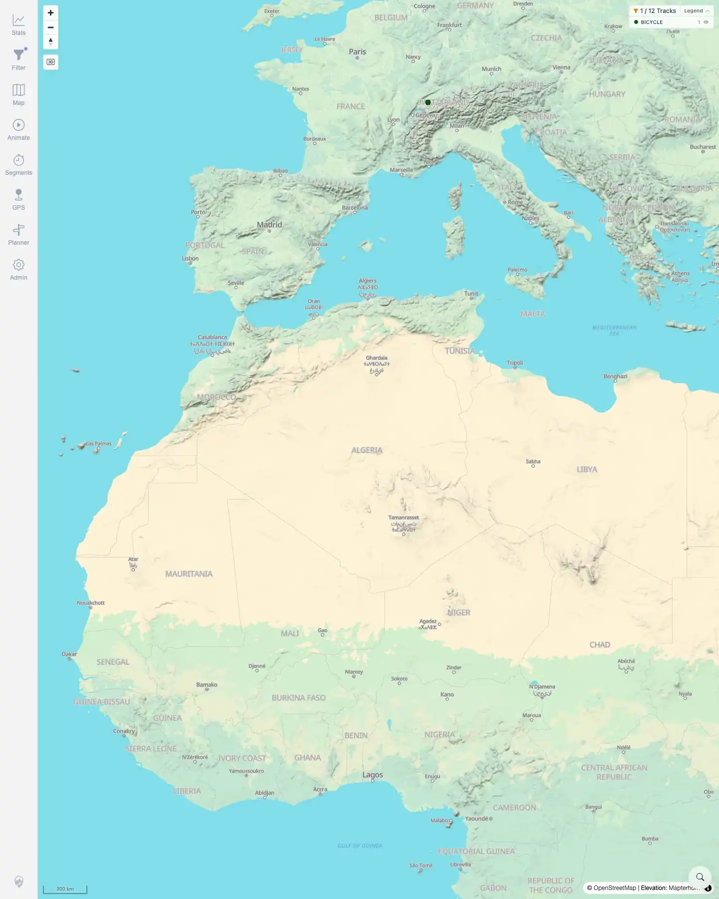
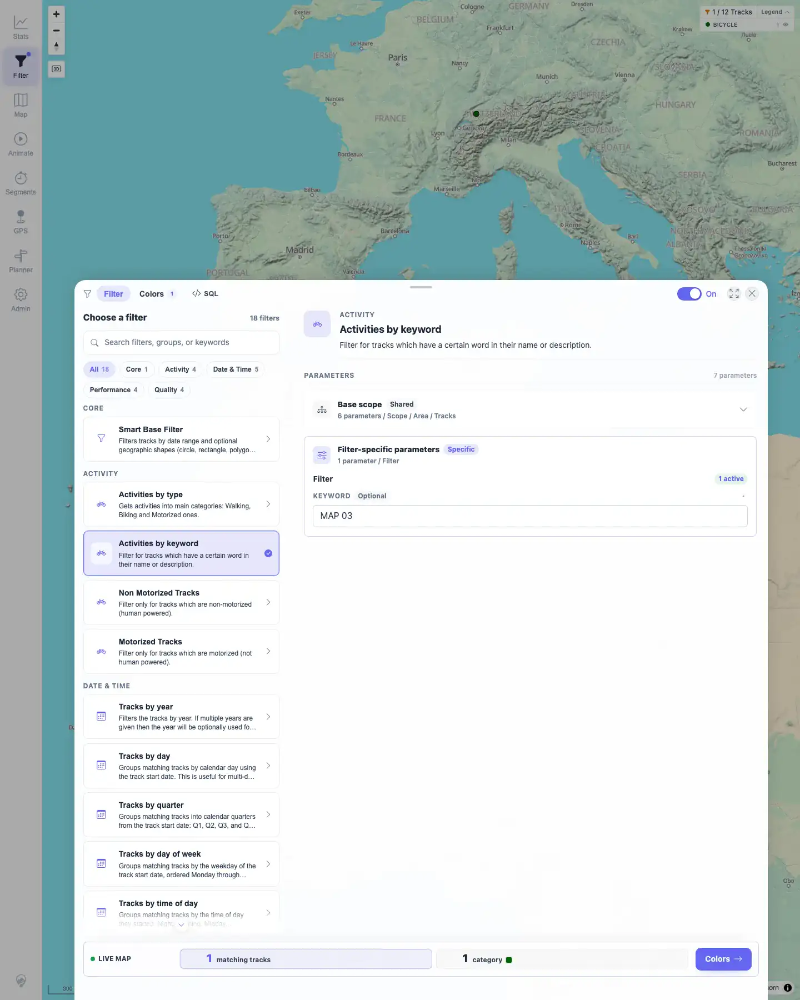
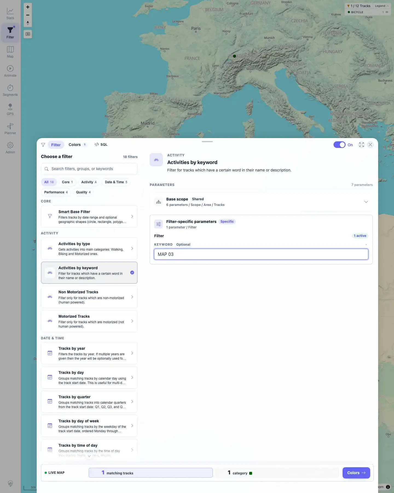

# Packet: FLT_01

## Scope

- Coverage source: `documentation/testing/frontend-regression-test-plan.md`
- Coverage ID or run packet: FLT_01
- In scope: Persisted active filter state, active map chip, and reopened filter panel.
- Out of scope: Filter catalog search, parameter edits, geo drawing, legend interactions, and clearing filters; covered by FLT_02+.

## Prerequisites

- Required previous coverage IDs or run packets: RUN_SETUP through TRD_14.
- Required app/data state: 12 visible tracks.
- Required browser context: Persistent desktop Chromium profile for filter-localStorage checks.

## Allowed Mutations

- Allowed: Persist a client-side filter in localStorage by using the filter UI.
- Not allowed: Change server data or import/delete tracks.

## Actions And Results

| Coverage ID | Action | Expected result | Actual result | Status | Evidence |
|---|---|---|---|---|---|
| FLT_01 | Enabled filtering, selected `Activities by keyword`, entered keyword `MAP 03`, navigated back to the root app URL, then reopened the Filter panel. | Previously saved filter remains active and is shown as a chip. | Root app showed active funnel chip `1 / 12 Tracks` with `BICYCLE 1` legend. Reopened Filter panel showed toggle `On`, active row `Activities by keyword`, keyword input `MAP 03`, and action bar `1 matching tracks`. API resolve returned only track `#100014` out of standard count 12. | PASS | [assets/FLT_01-saved-filter-active.txt](../assets/FLT_01-saved-filter-active.txt); [assets/FLT_01-active-chip.webp](../assets/FLT_01-active-chip.webp); [assets/FLT_01-reopened-filter.webp](../assets/FLT_01-reopened-filter.webp); [assets/FLT_01-prepared-filter.webp](../assets/FLT_01-prepared-filter.webp) |

## Issues

| ID | Severity | Summary | Reproduction | Expected | Actual | Evidence | Release impact |
|---|---|---|---|---|---|---|---|

## Evidence Files

| File | Purpose |
|---|---|
| [assets/FLT_01-saved-filter-active.txt](../assets/FLT_01-saved-filter-active.txt) | Compact setup, persistence, chip, reopened panel, and API resolve summary. |
| [assets/FLT_01-prepared-filter.webp](../assets/FLT_01-prepared-filter.webp) | Active keyword filter before root navigation. |
| [assets/FLT_01-active-chip.webp](../assets/FLT_01-active-chip.webp) | Root map showing active `1 / 12 Tracks` chip and legend. |
| [assets/FLT_01-reopened-filter.webp](../assets/FLT_01-reopened-filter.webp) | Reopened Filter panel showing active saved filter. |

## Screenshot Evidence

**Root map showing active 1 / 12 Tracks chip and legend.**

**Reopened Filter panel showing active saved filter.**

**Active keyword filter before root navigation.**

## Timings

| Step | Timing |
|---|---:|
| Persist and verify active filter | ~25 s |

## Handoff Notes

- Completed: FLT_01 terminal as `PASS`.
- Remaining unfinished coverage: Continue with FLT_02.
- Blocked or not applicable: None.
- State left for the next packet: The persistent filter test profile has `ActivitiesByKeyword` with keyword `MAP 03`; server track data unchanged.
