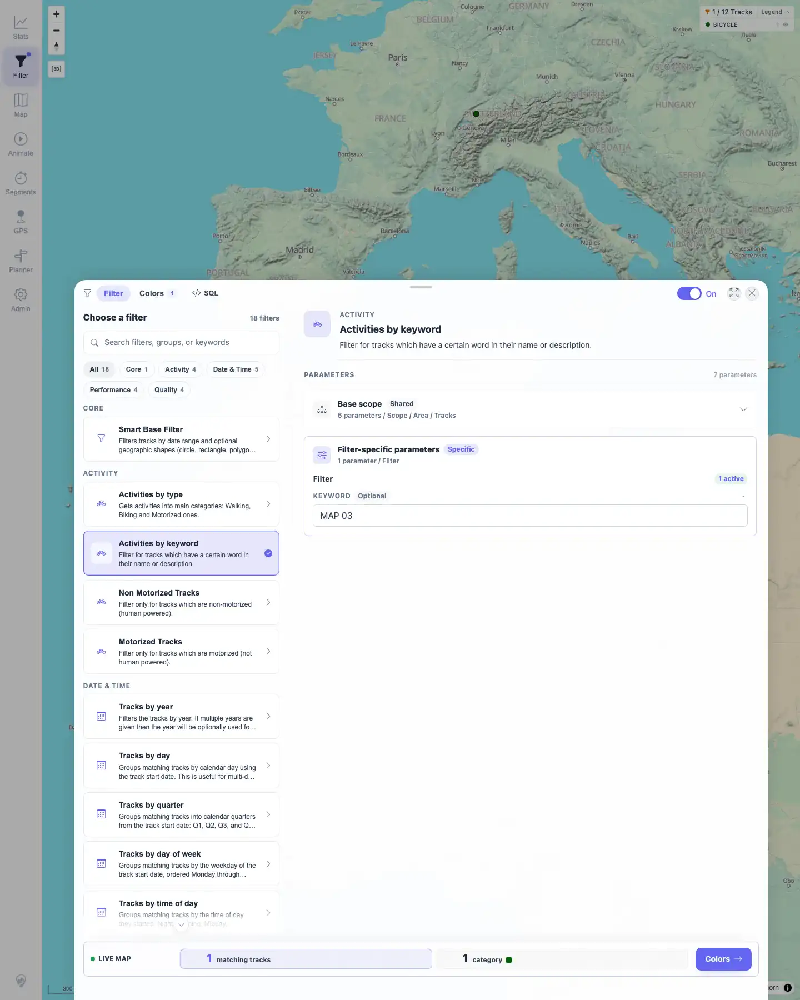
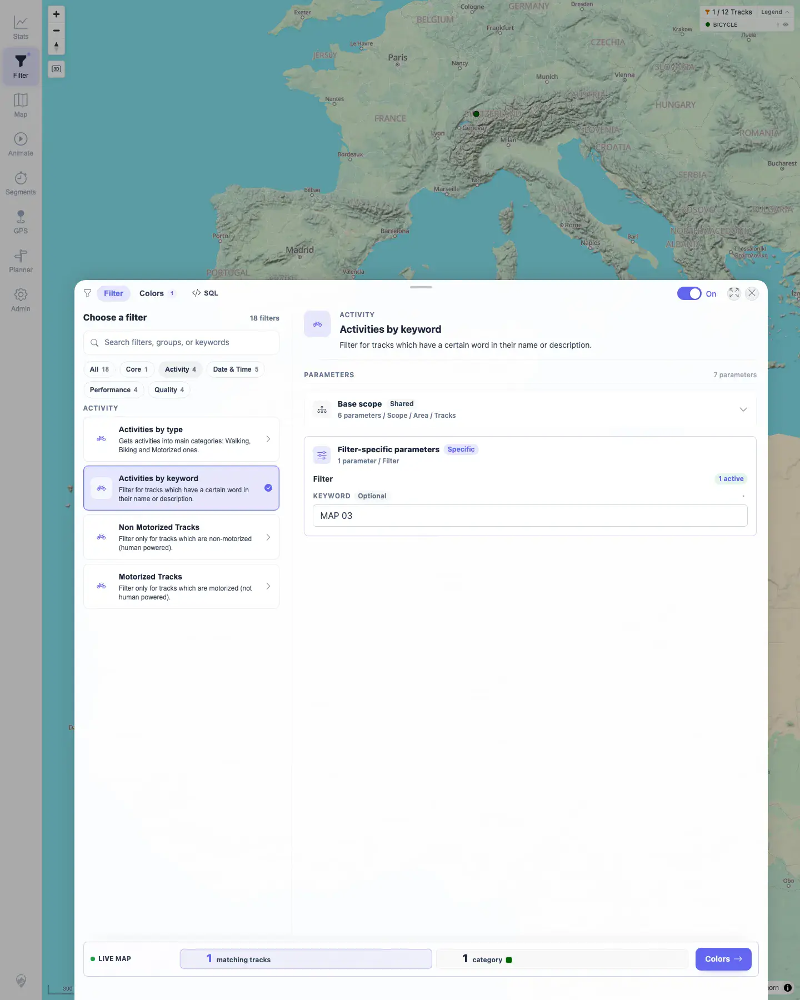
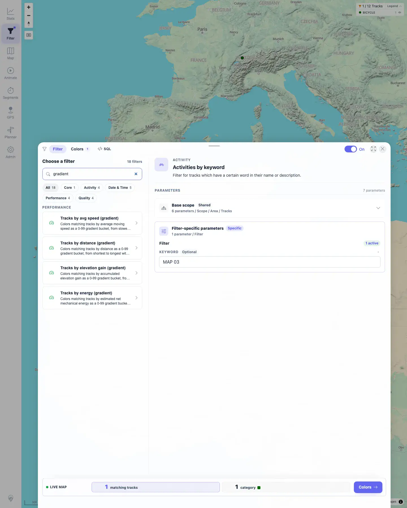
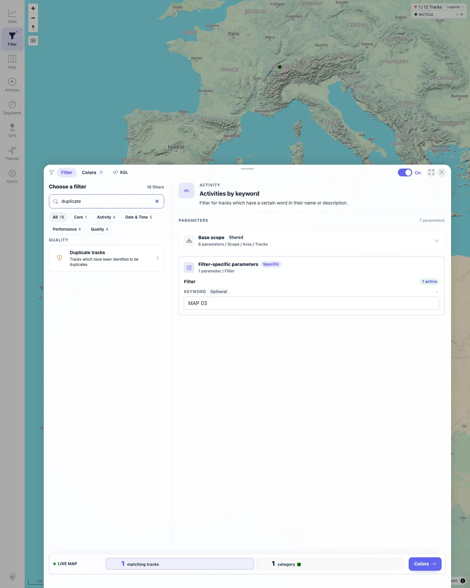

# Packet: FLT_02

## Scope

- Coverage source: `documentation/testing/frontend-regression-test-plan.md`
- Coverage ID or run packet: FLT_02
- In scope: Filter catalog browsing, group chips, and catalog search.
- Out of scope: Applying filter parameters and map/stat updates; covered by FLT_03+.

## Prerequisites

- Required previous coverage IDs or run packets: FLT_01.
- Required app/data state: 12 visible tracks; filter panel available.
- Required browser context: Persistent desktop Chromium profile from FLT_01.

## Allowed Mutations

- Allowed: Change catalog group/search UI state.
- Not allowed: Change server data or clear the active filter.

## Actions And Results

| Coverage ID | Action | Expected result | Actual result | Status | Evidence |
|---|---|---|---|---|---|
| FLT_02 | Opened Filter catalog, reviewed all group chips, selected Activity group, searched `gradient`, then searched `duplicate`. | Catalog grouping and search work. | Catalog showed 18 filters with chips `Core 1`, `Activity 4`, `Date & Time 5`, `Performance 4`, `Quality 4`. Activity chip narrowed list to 4 Activity filters. Search `gradient` returned the 4 Performance gradient filters. Search `duplicate` returned `Duplicate tracks`. | PASS | [assets/FLT_02-catalog-search-grouping.txt](../assets/FLT_02-catalog-search-grouping.txt); [assets/FLT_02-catalog-groups.webp](../assets/FLT_02-catalog-groups.webp); [assets/FLT_02-activity-group.webp](../assets/FLT_02-activity-group.webp); [assets/FLT_02-search-gradient.webp](../assets/FLT_02-search-gradient.webp); [assets/FLT_02-search-duplicate.webp](../assets/FLT_02-search-duplicate.webp) |

## Issues

| ID | Severity | Summary | Reproduction | Expected | Actual | Evidence | Release impact |
|---|---|---|---|---|---|---|---|

## Evidence Files

| File | Purpose |
|---|---|
| [assets/FLT_02-catalog-search-grouping.txt](../assets/FLT_02-catalog-search-grouping.txt) | Compact catalog counts, group-filtering, and search assertions. |
| [assets/FLT_02-catalog-groups.webp](../assets/FLT_02-catalog-groups.webp) | Full catalog with group chips. |
| [assets/FLT_02-activity-group.webp](../assets/FLT_02-activity-group.webp) | Activity chip narrowed to Activity filters. |
| [assets/FLT_02-search-gradient.webp](../assets/FLT_02-search-gradient.webp) | Search returning Performance gradient filters. |
| [assets/FLT_02-search-duplicate.webp](../assets/FLT_02-search-duplicate.webp) | Search returning Duplicate tracks. |

## Screenshot Evidence

**Full catalog with group chips.**

**Activity chip narrowed to Activity filters.**

**Search returning Performance gradient filters.**

**Search returning Duplicate tracks.**

## Timings

| Step | Timing |
|---|---:|
| Catalog grouping/search checks | ~12 s |

## Handoff Notes

- Completed: FLT_02 terminal as `PASS`.
- Remaining unfinished coverage: Continue with FLT_03.
- Blocked or not applicable: None.
- State left for the next packet: Filter profile still contains active `ActivitiesByKeyword` filter from FLT_01; catalog search UI may contain `duplicate`.
