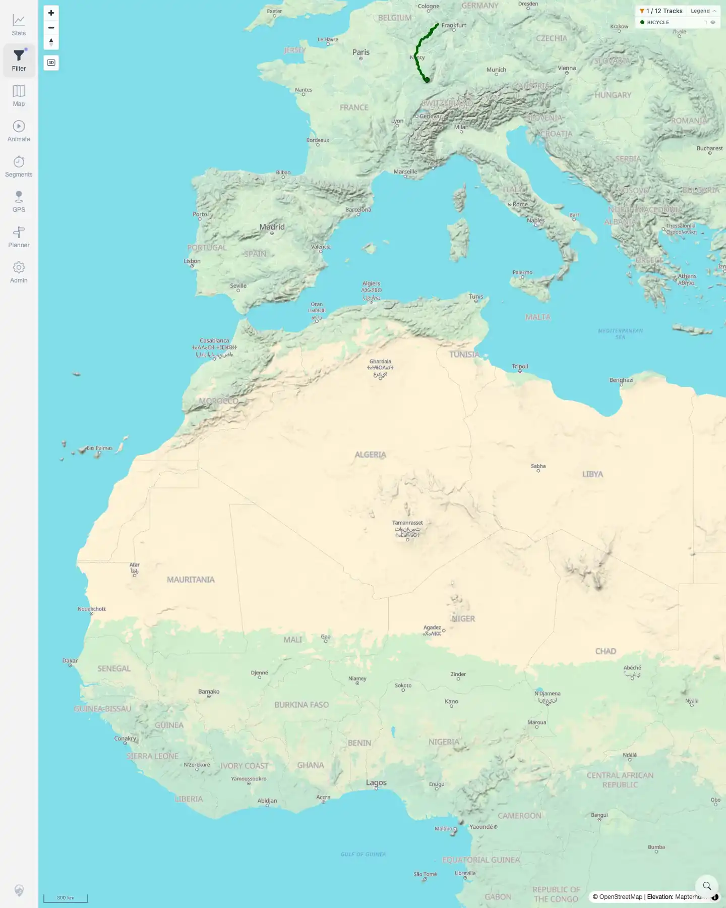
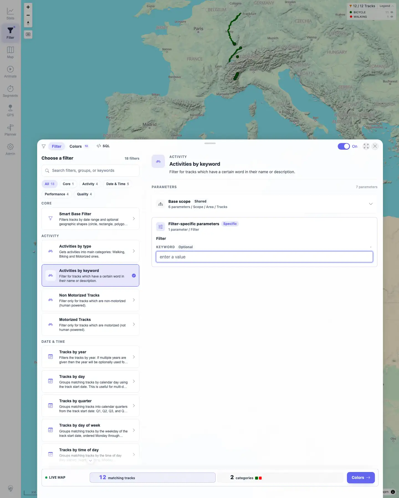

# Packet: FLT_03

## Scope

- Coverage source: `documentation/testing/frontend-regression-test-plan.md`
- Coverage ID or run packet: FLT_03
- In scope: Filter selection, parameter display, live parameter auto-apply, clearing/reset behavior, active chip, visible count, map, legend, and stats updates.
- Out of scope: Date/geo persistence and the full geo drawing tool matrix; covered by FLT_04 and FLT_05.

## Prerequisites

- Required previous coverage IDs or run packets: FLT_02.
- Required app/data state: 12 visible tracks; `Activities by keyword` available; filtering enabled from prior filter packets.
- Required browser context: Persistent desktop Chromium filter profile.

## Allowed Mutations

- Allowed: Edit and clear the `Activities by keyword` parameter.
- Not allowed: Mutate source files, server data, or persistent track metadata.

## Actions And Results

| Coverage ID | Action | Expected result | Actual result | Status | Evidence |
|---|---|---|---|---|---|
| FLT_03 | Opened Filter, used the existing `Activities by keyword` filter, changed `Keyword` from `MAP 03` to `Moselradweg`, opened Stats, then reopened Filter and cleared the keyword. | Parameter edits auto-apply immediately; clearing parameters resets their effect; active chips, visible count, map, legend, and stats reflect current state without stale pending UI. | The keyword parameter was visible and editing it live-filtered the map to `1 / 12 Tracks` with `BICYCLE 1` in the legend. Stats showed `Showing 1 of 12 tracks`, Moselradweg-only totals, and Moselradweg highlights. Clearing the keyword restored `12 / 12 Tracks`, `12 matching tracks`, and legend categories `BICYCLE 11` plus `WALKING 1`. | PASS | [assets/FLT_03-parameter-auto-apply.txt](../assets/FLT_03-parameter-auto-apply.txt); [assets/FLT_03-keyword-filtered-map.webp](../assets/FLT_03-keyword-filtered-map.webp); [assets/FLT_03-stats-filtered.webp](../assets/FLT_03-stats-filtered.webp); [assets/FLT_03-keyword-cleared.webp](../assets/FLT_03-keyword-cleared.webp) |

## Issues

| ID | Severity | Summary | Reproduction | Expected | Actual | Evidence | Release impact |
|---|---|---|---|---|---|---|---|

## Evidence Files

| File | Purpose |
|---|---|
| [assets/FLT_03-parameter-auto-apply.txt](../assets/FLT_03-parameter-auto-apply.txt) | Compact assertions for keyword edit, live map update, stats update, and reset. |
| [assets/FLT_03-keyword-filtered-map.webp](../assets/FLT_03-keyword-filtered-map.webp) | Map and legend filtered to one Bicycle track. |
| [assets/FLT_03-stats-filtered.webp](../assets/FLT_03-stats-filtered.webp) | Stats overview filtered to the Moselradweg track. |
| [assets/FLT_03-keyword-cleared.webp](../assets/FLT_03-keyword-cleared.webp) | Filter panel after clearing keyword, with all 12 tracks restored. |

## Screenshot Evidence

**Map and legend filtered to one Bicycle track.**

**Stats overview filtered to the Moselradweg track.**

**Filter panel after clearing keyword, with all 12 tracks restored.**

## Timings

| Step | Timing |
|---|---:|
| Keyword auto-apply and reset check | ~1 min |

## Handoff Notes

- Completed: FLT_03 terminal as `PASS`.
- Remaining unfinished coverage: Continue with FLT_04.
- Blocked or not applicable: None.
- State left for the next packet: Filtering remains enabled with `Activities by keyword` selected and the keyword field blank; all 12 tracks are visible.
