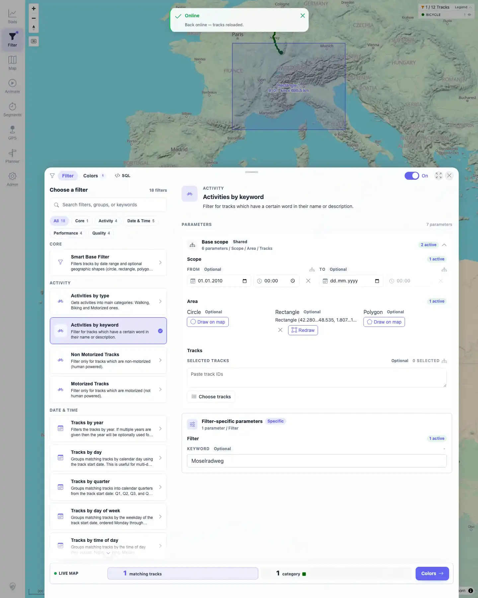
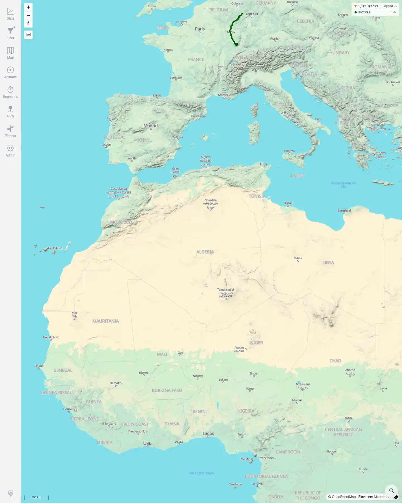
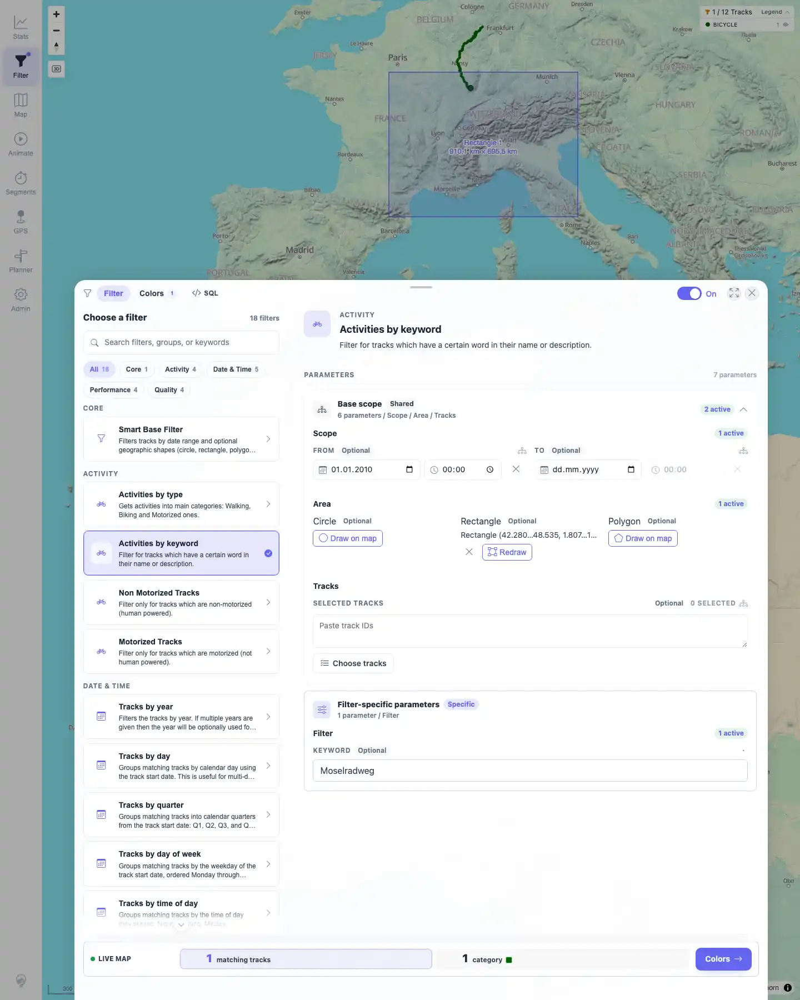

# Packet: FLT_04

## Scope

- Coverage source: `documentation/testing/frontend-regression-test-plan.md`
- Coverage ID or run packet: FLT_04
- In scope: Persistence and re-application after reload for text, date, and geo parameters.
- Out of scope: Full geo drawing control matrix; covered by FLT_05.

## Prerequisites

- Required previous coverage IDs or run packets: FLT_03.
- Required app/data state: 12 visible tracks; filtering enabled with `Activities by keyword` selected.
- Required browser context: Persistent desktop Chromium filter profile.

## Allowed Mutations

- Allowed: Set filter parameters and reload the app from the root `/mtl/` URL.
- Not allowed: Mutate source files or server-side track metadata.

## Actions And Results

| Coverage ID | Action | Expected result | Actual result | Status | Evidence |
|---|---|---|---|---|---|
| FLT_04 | Set keyword `Moselradweg`, From date `2010-01-01 00:00`, drew a rectangle geo area covering the Moselradweg track, then reloaded from `/mtl/` and reopened Filter/Base scope. | Date, text, and geo parameters all save and re-apply correctly after reload. | Before reload, Filter showed keyword `Moselradweg`, From date `2010-01-01`, rectangle summary `Rectangle (42.280...48.535, 1.807...13.475)`, and a `1 / 12 Tracks` chip. After root reload, the map re-applied to `1 / 12 Tracks`. Reopening Filter showed the same keyword, date, and rectangle summary, and local storage still contained `SEARCH_WORD`, `DATE_TIME_FROM`, and `GEO_RECTANGLE_1`. | PASS | [assets/FLT_04-date-text-geo-persistence.txt](../assets/FLT_04-date-text-geo-persistence.txt); [assets/FLT_04-date-text-geo-set.webp](../assets/FLT_04-date-text-geo-set.webp); [assets/FLT_04-after-reload-map.webp](../assets/FLT_04-after-reload-map.webp); [assets/FLT_04-after-reload-expanded.webp](../assets/FLT_04-after-reload-expanded.webp) |

## Issues

| ID | Severity | Summary | Reproduction | Expected | Actual | Evidence | Release impact |
|---|---|---|---|---|---|---|---|

## Evidence Files

| File | Purpose |
|---|---|
| [assets/FLT_04-date-text-geo-persistence.txt](../assets/FLT_04-date-text-geo-persistence.txt) | Compact assertions for text/date/geo parameter persistence. |
| [assets/FLT_04-date-text-geo-set.webp](../assets/FLT_04-date-text-geo-set.webp) | Filter panel with keyword, date, and rectangle set before reload. |
| [assets/FLT_04-after-reload-map.webp](../assets/FLT_04-after-reload-map.webp) | Root app after reload with the saved filter re-applied. |
| [assets/FLT_04-after-reload-expanded.webp](../assets/FLT_04-after-reload-expanded.webp) | Reopened Filter/Base scope after reload showing persisted rectangle. |

## Screenshot Evidence

**Filter panel with keyword, date, and rectangle set before reload.**

**Root app after reload with the saved filter re-applied.**

**Reopened Filter/Base scope after reload showing persisted rectangle.**

## Timings

| Step | Timing |
|---|---:|
| Date/text/geo persistence check | ~4 min |

## Handoff Notes

- Completed: FLT_04 terminal as `PASS`.
- Remaining unfinished coverage: Continue with FLT_05.
- Blocked or not applicable: None.
- State left for the next packet: Filtering enabled with keyword `Moselradweg`, From date `2010-01-01`, and one rectangle geo parameter active.
