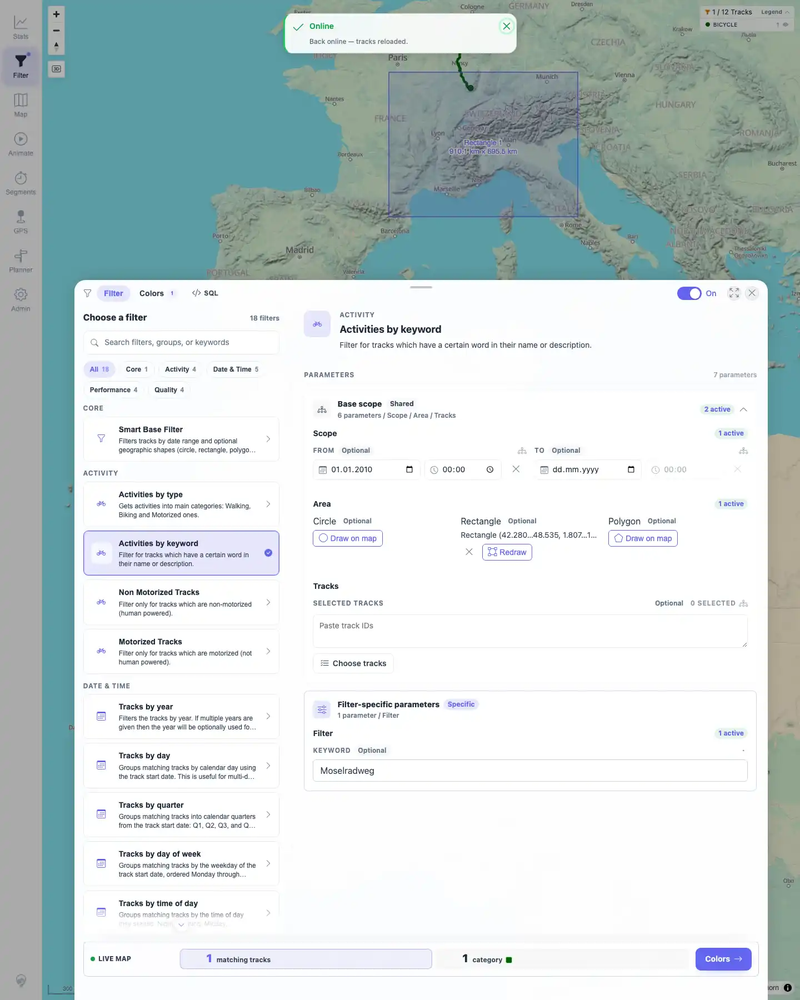
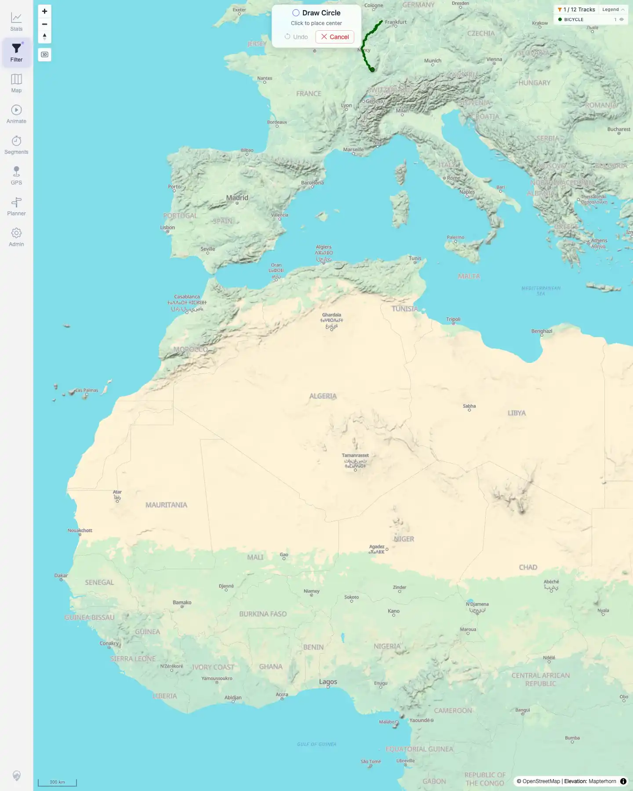
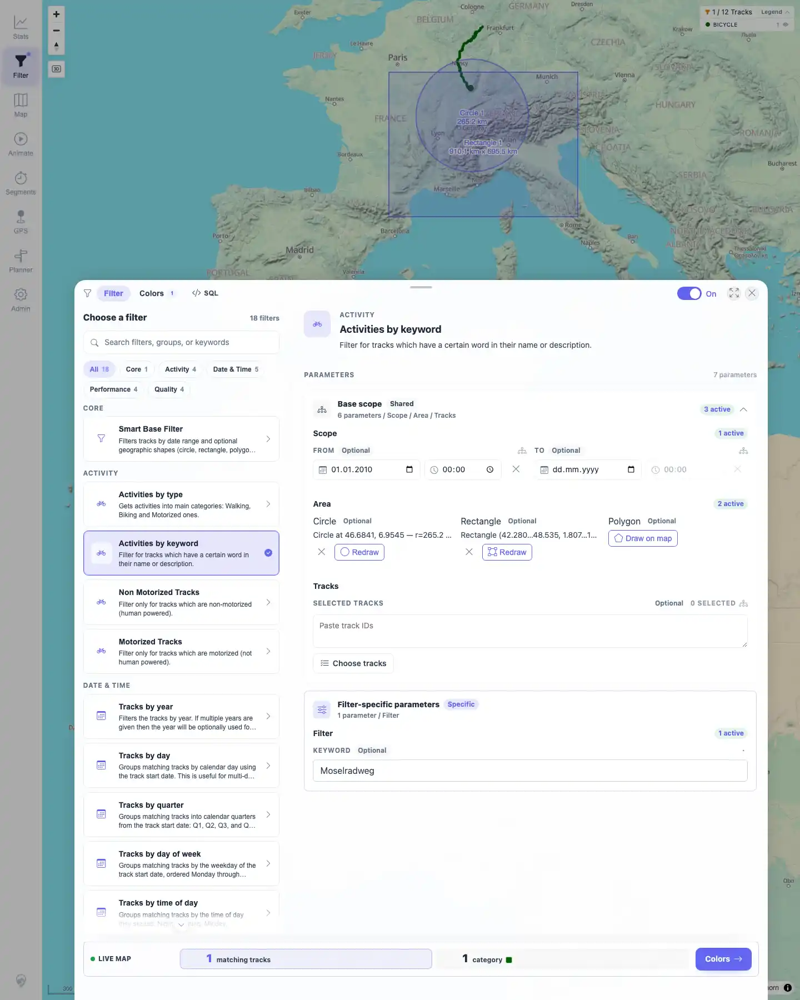
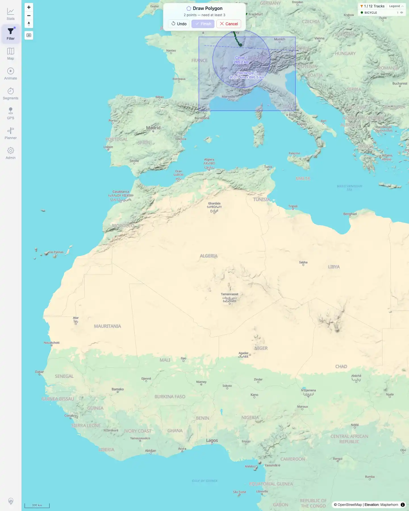
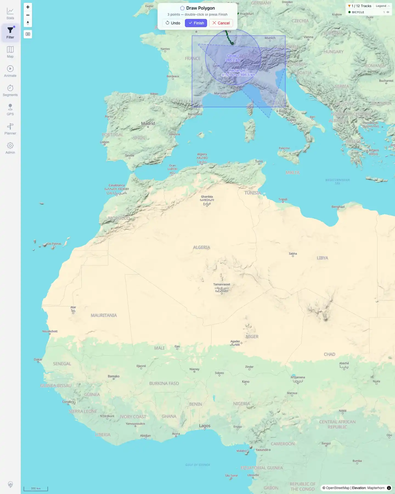
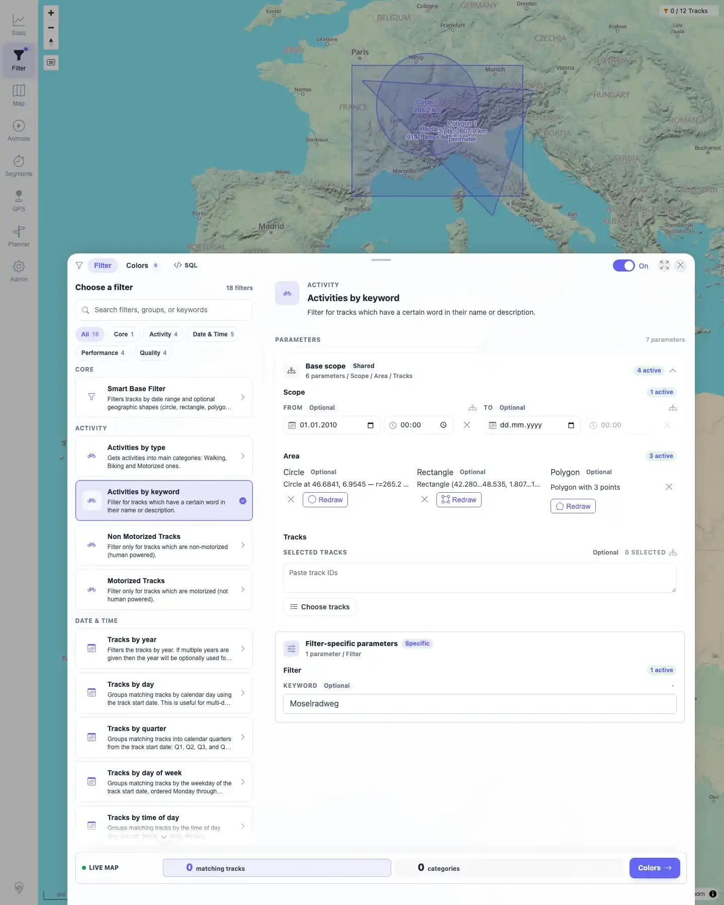
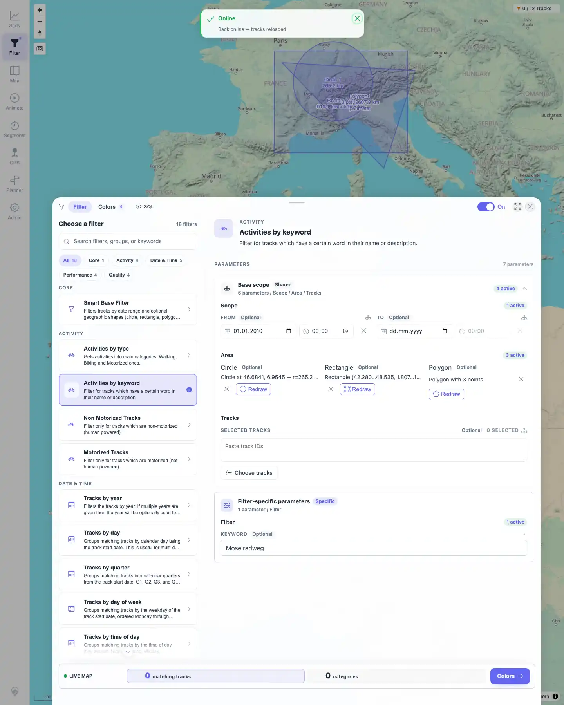
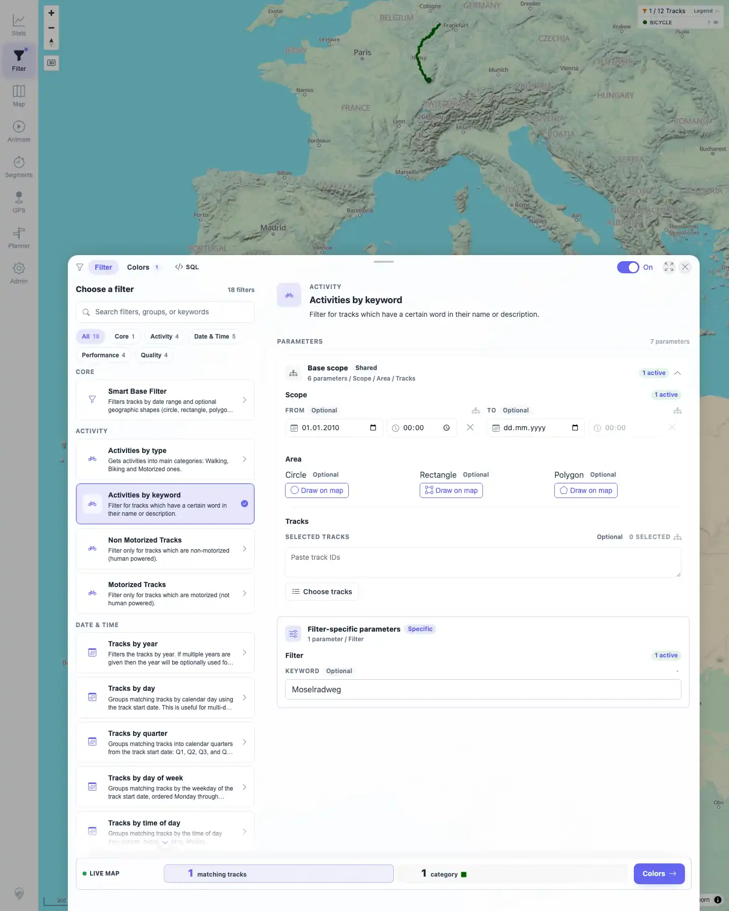
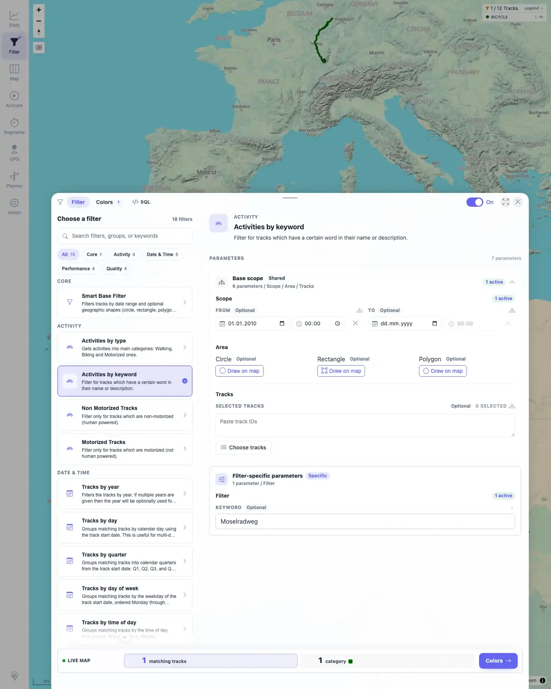

# Packet: FLT_05

## Scope

- Coverage source: `documentation/testing/frontend-regression-test-plan.md`
- Coverage ID or run packet: FLT_05
- In scope: Geo drawing for circle, rectangle, and polygon; undo, cancel, finish, clear, and saved-shape reload persistence.
- Out of scope: Exact geospatial inclusion math beyond visible filter updates and stored geo parameters.

## Prerequisites

- Required previous coverage IDs or run packets: FLT_04.
- Required app/data state: Filtering enabled with `Activities by keyword`; FLT_04 left a persisted rectangle geo parameter.
- Required browser context: Persistent desktop Chromium filter profile.

## Allowed Mutations

- Allowed: Draw, cancel, finish, reload, and clear client-side geo filter shapes.
- Not allowed: Mutate source files or server-side track metadata.

## Actions And Results

| Coverage ID | Action | Expected result | Actual result | Status | Evidence |
|---|---|---|---|---|---|
| FLT_05 | Verified the FLT_04 rectangle reappeared, cleared it, started circle drawing and canceled, drew a circle, drew a rectangle, started polygon drawing, used Undo and Cancel, drew a polygon again and finished with the visible Finish button, reloaded, then cleared all shapes. | Circle, rectangle, and polygon drawing work; undo, cancel, finish, and clear all work; saved shapes reappear next time. | Persisted rectangle was visible at packet start. Clearing removed all geo shapes. Circle cancel left no saved circle; circle and rectangle draw created their summaries and storage entries. Polygon Undo was enabled with two points, Cancel left no polygon, and Finish was enabled with three points and saved a polygon. After reload, circle, rectangle, and polygon summaries reappeared. Clear all removed every geo shape. | PASS | [assets/FLT_05-geo-drawing-controls.txt](../assets/FLT_05-geo-drawing-controls.txt); [assets/FLT_05-persisted-rectangle.webp](../assets/FLT_05-persisted-rectangle.webp); [assets/FLT_05-circle-start.webp](../assets/FLT_05-circle-start.webp); [assets/FLT_05-circle-drawn.webp](../assets/FLT_05-circle-drawn.webp); [assets/FLT_05-rectangle-drawn.webp](../assets/FLT_05-rectangle-drawn.webp); [assets/FLT_05-polygon-two-points.webp](../assets/FLT_05-polygon-two-points.webp); [assets/FLT_05-polygon-before-finish.webp](../assets/FLT_05-polygon-before-finish.webp); [assets/FLT_05-polygon-finished.webp](../assets/FLT_05-polygon-finished.webp); [assets/FLT_05-shapes-after-reload.webp](../assets/FLT_05-shapes-after-reload.webp); [assets/FLT_05-shapes-cleared.webp](../assets/FLT_05-shapes-cleared.webp) |

## Issues

| ID | Severity | Summary | Reproduction | Expected | Actual | Evidence | Release impact |
|---|---|---|---|---|---|---|---|

## Evidence Files

| File | Purpose |
|---|---|
| [assets/FLT_05-geo-drawing-controls.txt](../assets/FLT_05-geo-drawing-controls.txt) | Compact assertions for draw, cancel, undo, finish, reload persistence, and clear-all. |
| [assets/FLT_05-persisted-rectangle.webp](../assets/FLT_05-persisted-rectangle.webp) | Rectangle from FLT_04 reappeared at packet start. |
| [assets/FLT_05-shapes-initial-cleared.webp](../assets/FLT_05-shapes-initial-cleared.webp) | Geo rows after clearing the starting rectangle. |
| [assets/FLT_05-circle-start.webp](../assets/FLT_05-circle-start.webp) | Circle draw mode with Cancel available. |
| [assets/FLT_05-circle-drawn.webp](../assets/FLT_05-circle-drawn.webp) | Circle summary active after drawing. |
| [assets/FLT_05-rectangle-drawn.webp](../assets/FLT_05-rectangle-drawn.webp) | Rectangle summary active after drawing. |
| [assets/FLT_05-polygon-two-points.webp](../assets/FLT_05-polygon-two-points.webp) | Polygon drawing with Undo and Cancel controls. |
| [assets/FLT_05-polygon-before-finish.webp](../assets/FLT_05-polygon-before-finish.webp) | Polygon drawing with Finish enabled at three points. |
| [assets/FLT_05-polygon-finished.webp](../assets/FLT_05-polygon-finished.webp) | Polygon summary active after Finish. |
| [assets/FLT_05-shapes-after-reload.webp](../assets/FLT_05-shapes-after-reload.webp) | Circle, rectangle, and polygon summaries reappeared after reload. |
| [assets/FLT_05-shapes-cleared.webp](../assets/FLT_05-shapes-cleared.webp) | All geo shapes cleared at packet end. |

## Screenshot Evidence

**Rectangle from FLT04 reappeared at packet start.**

**Circle draw mode with Cancel available.**

**Circle summary active after drawing.**

**Rectangle summary active after drawing.**

**Polygon drawing with Undo and Cancel controls.**

**Polygon drawing with Finish enabled at three points.**

**Polygon summary active after Finish.**

**Circle, rectangle, and polygon summaries reappeared after reload.**

**All geo shapes cleared at packet end.**

**Geo rows after clearing the starting rectangle.**

## Timings

| Step | Timing |
|---|---:|
| Geo drawing control matrix | ~7 min |

## Handoff Notes

- Completed: FLT_05 terminal as `PASS`.
- Remaining unfinished coverage: Continue with FLT_06.
- Blocked or not applicable: None.
- State left for the next packet: Filtering remains enabled with `Activities by keyword`, keyword `Moselradweg`, From date `2010-01-01`; all geo shapes are cleared.
