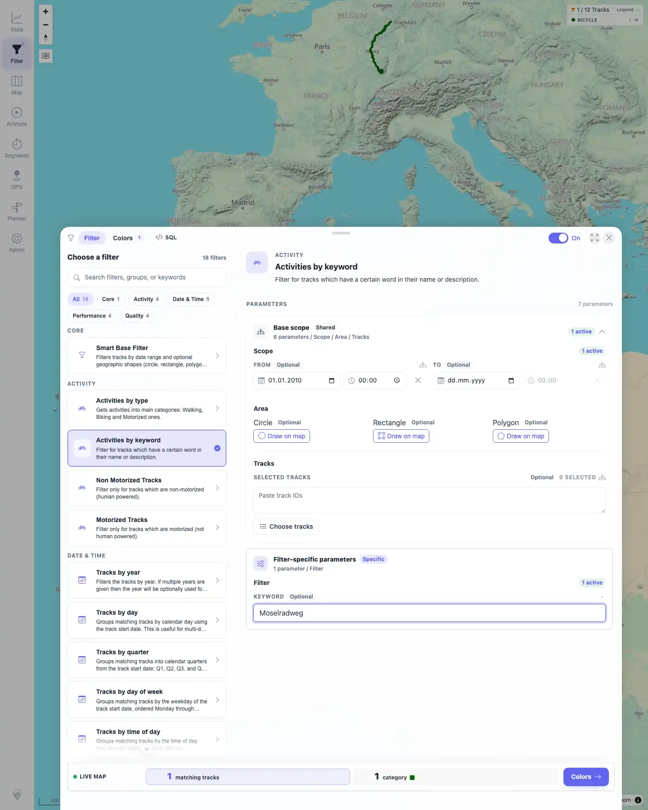
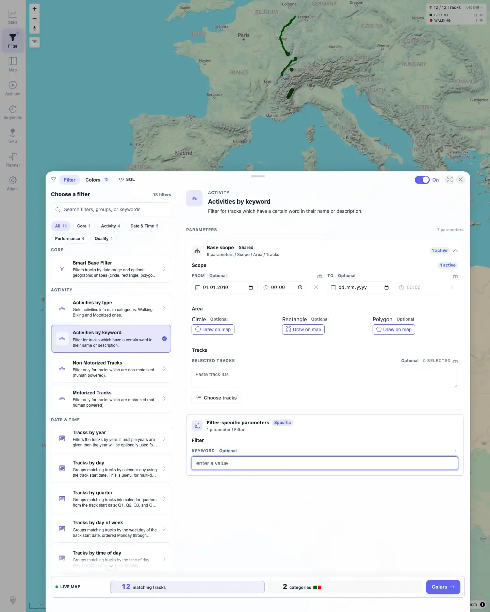
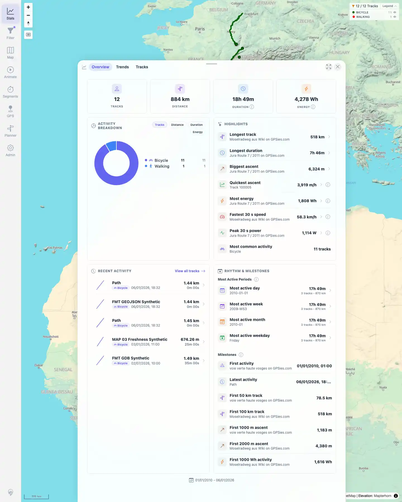

# Packet: FLT_06

## Scope

- Coverage source: `documentation/testing/frontend-regression-test-plan.md`
- Coverage ID or run packet: FLT_06
- In scope: Live filter updates to visible count, map colors, legend, and Stats without a full page reload.
- Out of scope: Reload persistence; covered by FLT_04 and FLT_05.

## Prerequisites

- Required previous coverage IDs or run packets: FLT_05.
- Required app/data state: Filtering enabled with `Activities by keyword`; keyword `Moselradweg` available as a one-track state.
- Required browser context: Persistent desktop Chromium filter profile.

## Allowed Mutations

- Allowed: Edit the keyword parameter and switch between Filter and Stats views.
- Not allowed: Full page reload during the live update check; server data mutations.

## Actions And Results

| Coverage ID | Action | Expected result | Actual result | Status | Evidence |
|---|---|---|---|---|---|
| FLT_06 | Started from `Activities by keyword` with `Moselradweg`, then cleared the keyword and opened Stats without reloading the page. | Applied filter updates visible track count, map colors, legend, and Stats without a full page reload. | The map started at `1 / 12 Tracks` with legend `BICYCLE 1`. Clearing the keyword live-updated the same page to `12 / 12 Tracks` with legend `BICYCLE 11` and `WALKING 1`. Stats then showed 12 tracks, 884 km, activity breakdown for Bicycle and Walking, and all-track highlights. Navigation entry count stayed `1`, confirming no full reload during the update. | PASS | [assets/FLT_06-live-filter-update.txt](../assets/FLT_06-live-filter-update.txt); [assets/FLT_06-filtered-map.webp](../assets/FLT_06-filtered-map.webp); [assets/FLT_06-keyword-cleared-map.webp](../assets/FLT_06-keyword-cleared-map.webp); [assets/FLT_06-stats-all-after-clear.webp](../assets/FLT_06-stats-all-after-clear.webp) |

## Issues

| ID | Severity | Summary | Reproduction | Expected | Actual | Evidence | Release impact |
|---|---|---|---|---|---|---|---|

## Evidence Files

| File | Purpose |
|---|---|
| [assets/FLT_06-live-filter-update.txt](../assets/FLT_06-live-filter-update.txt) | Compact assertions for map, legend, Stats, and no full reload. |
| [assets/FLT_06-filtered-map.webp](../assets/FLT_06-filtered-map.webp) | Starting one-track keyword filter state. |
| [assets/FLT_06-keyword-cleared-map.webp](../assets/FLT_06-keyword-cleared-map.webp) | Live-updated all-track map and legend after clearing keyword. |
| [assets/FLT_06-stats-all-after-clear.webp](../assets/FLT_06-stats-all-after-clear.webp) | Stats panel updated to all 12 tracks without reload. |

## Screenshot Evidence

**Starting one-track keyword filter state.**

**Live-updated all-track map and legend after clearing keyword.**

**Stats panel updated to all 12 tracks without reload.**

## Timings

| Step | Timing |
|---|---:|
| Live filter update check | ~2 min |

## Handoff Notes

- Completed: FLT_06 terminal as `PASS`.
- Remaining unfinished coverage: Continue with FLT_07.
- Blocked or not applicable: None.
- State left for the next packet: Filtering remains enabled with `Activities by keyword`, keyword blank, From date `2010-01-01`, all 12 tracks visible.
