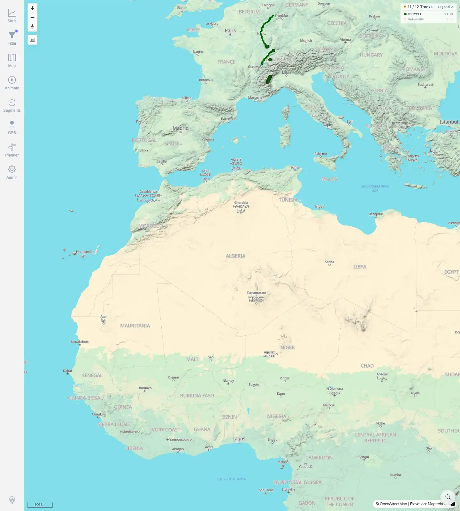
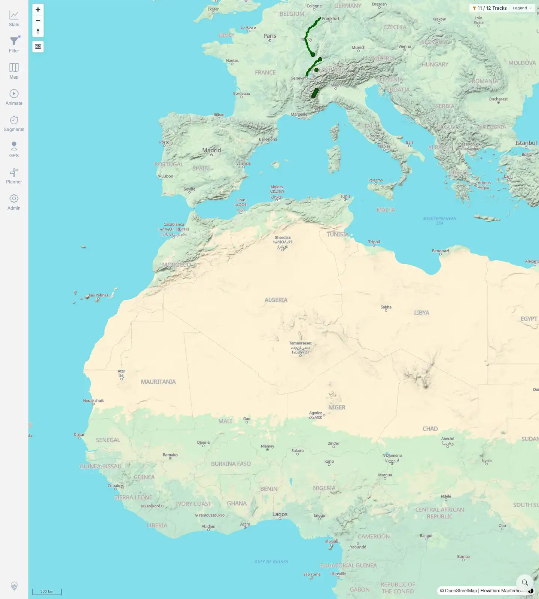
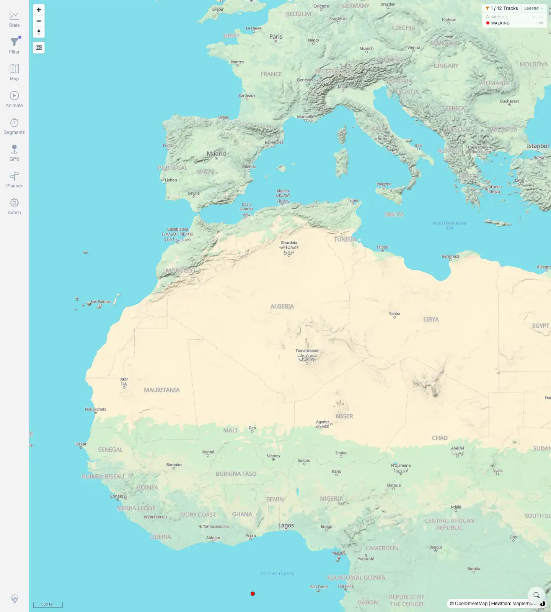
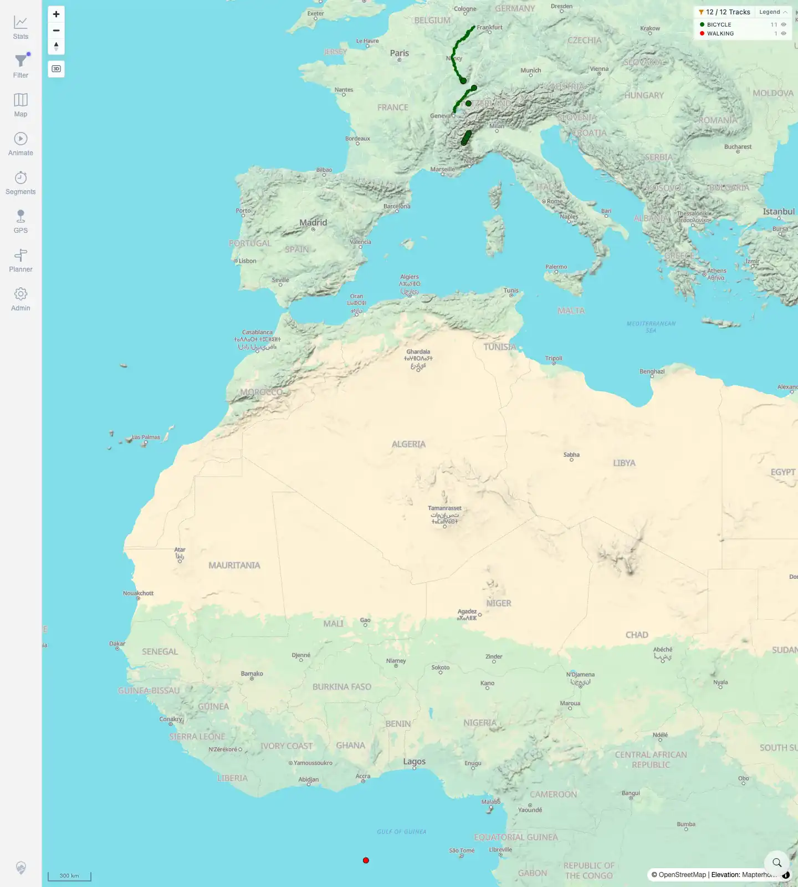

# Packet: FLT_07

## Scope

- Coverage source: `documentation/testing/frontend-regression-test-plan.md`
- Coverage ID or run packet: FLT_07
- In scope: Legend categories for the active filter, hide/show category behavior, visible count changes, and legend collapse/expand.
- Out of scope: Gradient legend bands; the current active filter exposes categorical Bicycle/Walking legend groups.

## Prerequisites

- Required previous coverage IDs or run packets: FLT_06.
- Required app/data state: Filtering enabled, keyword blank, From date `2010-01-01`, all 12 tracks visible.
- Required browser context: Persistent desktop Chromium filter profile.

## Allowed Mutations

- Allowed: Toggle legend category visibility and collapse/expand the legend.
- Not allowed: Change filter parameters, reload the page during the interaction, or mutate server data.

## Actions And Results

| Coverage ID | Action | Expected result | Actual result | Status | Evidence |
|---|---|---|---|---|---|
| FLT_07 | Started with Bicycle/Walking legend visible, hid Walking, collapsed the legend, expanded it and restored Walking, hid Bicycle, then restored Bicycle. | Legend reflects the active filter; collapsing/hiding groups updates the map immediately. | The legend showed `BICYCLE 11` and `WALKING 1`. Hiding Walking changed the chip to `11 / 12 Tracks` and disabled the Walking row. Collapsing hid the legend body while preserving the `11 / 12` filtered map state. Restoring Walking returned `12 / 12`. Hiding Bicycle changed the chip to `1 / 12 Tracks` with only Walking enabled. Restoring Bicycle returned `12 / 12` with no disabled rows. | PASS | [assets/FLT_07-legend-hide-collapse.txt](../assets/FLT_07-legend-hide-collapse.txt); [assets/FLT_07-legend-all-visible.webp](../assets/FLT_07-legend-all-visible.webp); [assets/FLT_07-walking-hidden.webp](../assets/FLT_07-walking-hidden.webp); [assets/FLT_07-legend-collapsed.webp](../assets/FLT_07-legend-collapsed.webp); [assets/FLT_07-walking-restored.webp](../assets/FLT_07-walking-restored.webp); [assets/FLT_07-bicycle-hidden.webp](../assets/FLT_07-bicycle-hidden.webp); [assets/FLT_07-all-restored.webp](../assets/FLT_07-all-restored.webp) |

## Issues

| ID | Severity | Summary | Reproduction | Expected | Actual | Evidence | Release impact |
|---|---|---|---|---|---|---|---|

## Evidence Files

| File | Purpose |
|---|---|
| [assets/FLT_07-legend-hide-collapse.txt](../assets/FLT_07-legend-hide-collapse.txt) | Compact assertions for category hide/show and collapse. |
| [assets/FLT_07-legend-all-visible.webp](../assets/FLT_07-legend-all-visible.webp) | Starting legend with Bicycle and Walking categories. |
| [assets/FLT_07-walking-hidden.webp](../assets/FLT_07-walking-hidden.webp) | Walking category hidden; count changed to 11/12. |
| [assets/FLT_07-legend-collapsed.webp](../assets/FLT_07-legend-collapsed.webp) | Legend body collapsed while hidden-group state persisted. |
| [assets/FLT_07-walking-restored.webp](../assets/FLT_07-walking-restored.webp) | Walking restored; count returned to 12/12. |
| [assets/FLT_07-bicycle-hidden.webp](../assets/FLT_07-bicycle-hidden.webp) | Bicycle category hidden; count changed to 1/12. |
| [assets/FLT_07-all-restored.webp](../assets/FLT_07-all-restored.webp) | Both legend categories restored for the next packet. |

## Screenshot Evidence

**Starting legend with Bicycle and Walking categories.**

**Walking category hidden; count changed to 11/12.**

**Legend body collapsed while hidden-group state persisted.**

**Walking restored; count returned to 12/12.**

**Bicycle category hidden; count changed to 1/12.**

**Both legend categories restored for the next packet.**

## Timings

| Step | Timing |
|---|---:|
| Legend hide/collapse check | ~2 min |

## Handoff Notes

- Completed: FLT_07 terminal as `PASS`.
- Remaining unfinished coverage: Continue with FLT_08.
- Blocked or not applicable: None.
- State left for the next packet: Filtering remains enabled with `Activities by keyword`, keyword blank, From date `2010-01-01`, all legend groups visible, all 12 tracks visible.
