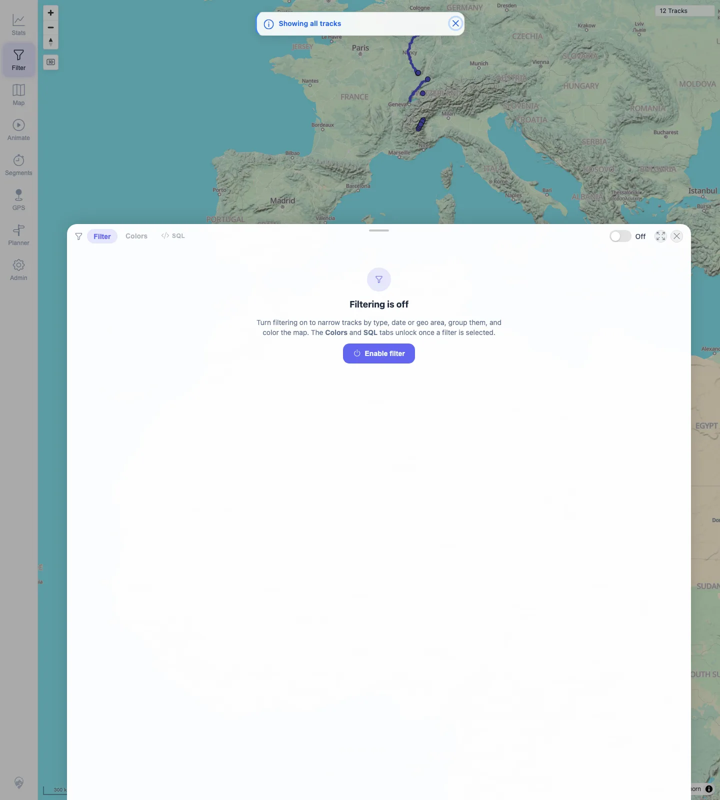
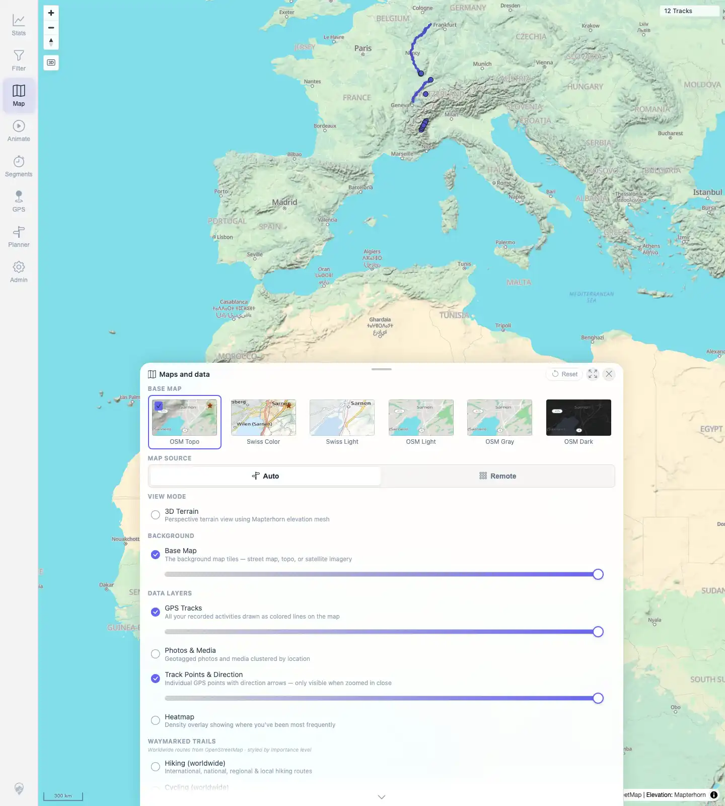
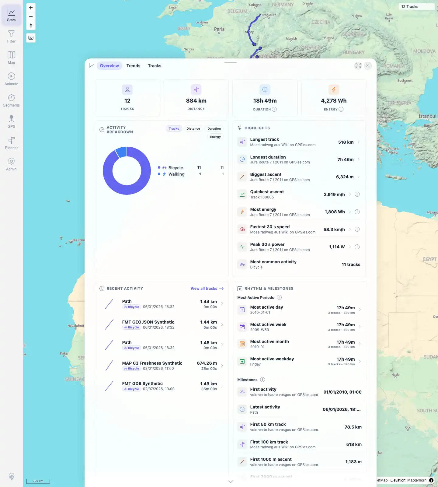

# Packet: FLT_08

## Scope

- Coverage source: `documentation/testing/frontend-regression-test-plan.md`
- Coverage ID or run packet: FLT_08
- In scope: Clearing/disabling the active filter and verifying all tracks return on map and Stats surfaces.
- Out of scope: Filter parameter persistence; covered by FLT_04.

## Prerequisites

- Required previous coverage IDs or run packets: FLT_07.
- Required app/data state: Filtering enabled, all 12 tracks visible with a filtered `12 / 12 Tracks` chip.
- Required browser context: Persistent desktop Chromium filter profile.

## Allowed Mutations

- Allowed: Disable the active filter from the Filter panel.
- Not allowed: Mutate source files, server data, or track metadata.

## Actions And Results

| Coverage ID | Action | Expected result | Actual result | Status | Evidence |
|---|---|---|---|---|---|
| FLT_08 | Opened Filter, toggled filtering from `On` to `Off`, returned to Map, then opened Stats. | Clearing the filter restores all tracks. | Before clearing, the map showed the filtered chip `12 / 12 Tracks` and Bicycle/Walking legend. Toggling Filter to `Off` showed the off-card. The map then showed the plain `12 Tracks` chip with no filter legend, and Stats showed 12 tracks, 884 km, Bicycle/Walking breakdown, and no filtered slash chip. | PASS | [assets/FLT_08-clear-filter-restores-all.txt](../assets/FLT_08-clear-filter-restores-all.txt); [assets/FLT_08-before-clear-filter.webp](../assets/FLT_08-before-clear-filter.webp); [assets/FLT_08-filter-off-panel.webp](../assets/FLT_08-filter-off-panel.webp); [assets/FLT_08-after-clear-map.webp](../assets/FLT_08-after-clear-map.webp); [assets/FLT_08-stats-after-clear.webp](../assets/FLT_08-stats-after-clear.webp) |

## Issues

| ID | Severity | Summary | Reproduction | Expected | Actual | Evidence | Release impact |
|---|---|---|---|---|---|---|---|

## Evidence Files

| File | Purpose |
|---|---|
| [assets/FLT_08-clear-filter-restores-all.txt](../assets/FLT_08-clear-filter-restores-all.txt) | Compact assertions for filter off, map, and Stats restore. |
| [assets/FLT_08-before-clear-filter.webp](../assets/FLT_08-before-clear-filter.webp) | Starting active filter chip and legend. |
| [assets/FLT_08-filter-off-panel.webp](../assets/FLT_08-filter-off-panel.webp) | Filter panel after toggling filtering off. |
| [assets/FLT_08-after-clear-map.webp](../assets/FLT_08-after-clear-map.webp) | Map with plain all-track chip after clearing filter. |
| [assets/FLT_08-stats-after-clear.webp](../assets/FLT_08-stats-after-clear.webp) | Stats with all 12 tracks after clearing filter. |

## Screenshot Evidence

**Starting active filter chip and legend.**

**Filter panel after toggling filtering off.**

**Map with plain all-track chip after clearing filter.**

**Stats with all 12 tracks after clearing filter.**

## Timings

| Step | Timing |
|---|---:|
| Clear filter check | ~2 min |

## Handoff Notes

- Completed: FLT_08 terminal as `PASS`.
- Remaining unfinished coverage: Continue with TBS_01.
- Blocked or not applicable: None.
- State left for the next packet: Filtering is off; map and Stats show all 12 tracks.
