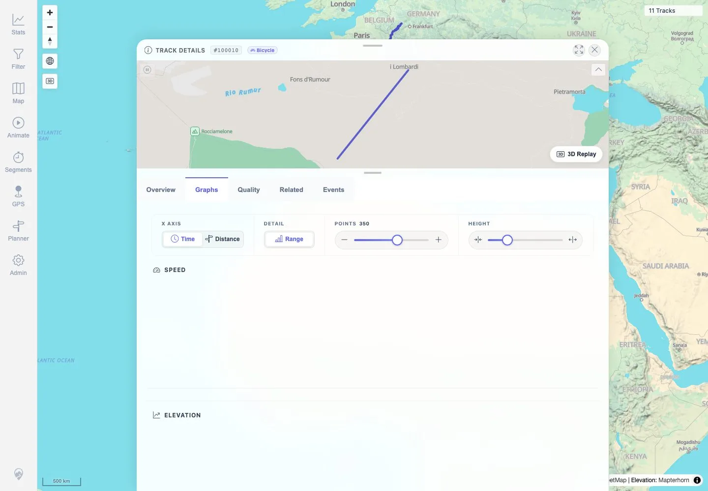

# Packet: FMT_02

## Scope

- Coverage source: `documentation/testing/frontend-regression-test-plan.md`
- Coverage ID or run packet: FMT_02
- In scope: For each non-GPX format tested in FMT_01, verify import acceptance/conversion, map display, details/charts, statistics inclusion, original download, and GPX download.
- Out of scope: GPX and FIT detailed flows; covered by IMP_* and FIT_*.

## Prerequisites

- Required previous coverage IDs or run packets: FMT_01.
- Required app/data state: Eleven visible tracks: three GPX, one FIT, and seven synthetic non-GPX format tracks.
- Required browser context: Fresh authenticated desktop browser contexts with downloads enabled.

## Allowed Mutations

- Allowed: Search/open non-GPX tracks, switch details tabs, and download original/GPX files to temporary local paths.
- Not allowed: Add/delete/reindex files or alter metadata.

## Actions And Results

| Coverage ID | Action | Expected result | Actual result | Status | Evidence |
|---|---|---|---|---|---|
| FMT_02 | For TCX, KML, IGC, NMEA, GeoJSON, GDB, and KMZ, searched Stats Tracks by filename, opened the result, checked details/Graphs/statistics inclusion, downloaded the original file, and downloaded GPX. | Each tested non-GPX format is accepted/converted, visible on map, included in statistics, opens details/charts, and supports original plus GPX downloads with real trackpoints. | Map showed `11 Tracks`. Each format search returned one Stats result; details opened; `Included in statistics` was present; Graphs tab rendered; original download checksum matched the generated sample; GPX download contained one `trkseg` and eight `trkpt` entries for every tested non-GPX format. | PASS | [assets/FMT_02-format-ui-download-matrix.txt](../assets/FMT_02-format-ui-download-matrix.txt), [assets/FMT_02-map-11-tracks.webp](../assets/FMT_02-map-11-tracks.webp), [assets/FMT_02-geojson-graphs.webp](../assets/FMT_02-geojson-graphs.webp), [assets/FMT_01-post-format-status-api.txt](../assets/FMT_01-post-format-status-api.txt), [assets/FMT_01-index-logs.txt](../assets/FMT_01-index-logs.txt), [assets/FMT_01-nmea-reindex-logs.txt](../assets/FMT_01-nmea-reindex-logs.txt) |

## Issues

| ID | Severity | Summary | Reproduction | Expected | Actual | Evidence | Release impact |
|---|---|---|---|---|---|---|---|

## Evidence Files

| File | Purpose |
|---|---|
| [assets/FMT_02-format-ui-download-matrix.txt](../assets/FMT_02-format-ui-download-matrix.txt) | Per-format matrix for search, details, stats inclusion, graphs, original checksum, and GPX trackpoint validation. |
| [assets/FMT_02-map-11-tracks.webp](../assets/FMT_02-map-11-tracks.webp) | Map screenshot showing eleven tracks after format imports. |
| [assets/FMT_02-geojson-graphs.webp](../assets/FMT_02-geojson-graphs.webp) | Representative non-GPX details Graphs screenshot. |
| [assets/FMT_01-post-format-status-api.txt](../assets/FMT_01-post-format-status-api.txt) | Indexer/job/track API summary for all format tracks. |
| [assets/FMT_01-index-logs.txt](../assets/FMT_01-index-logs.txt) | Conversion/index summary for non-GPX imports. |
| [assets/FMT_01-nmea-reindex-logs.txt](../assets/FMT_01-nmea-reindex-logs.txt) | NMEA correction/reindex success summary. |

## Screenshot Evidence

**Map screenshot showing eleven tracks after format imports.**

**Representative non-GPX details Graphs screenshot.**

## Timings

| Step | Timing |
|---|---:|
| Seven-format UI/details/download verification | ~1 minute |

## Handoff Notes

- Completed: FMT_02 terminal as `PASS`.
- Remaining unfinished coverage: Continue with `SGN_01`.
- Blocked or not applicable: None.
- State left for the next packet: Eleven tracks remain visible; temporary downloaded files only live in Playwright temp storage.
