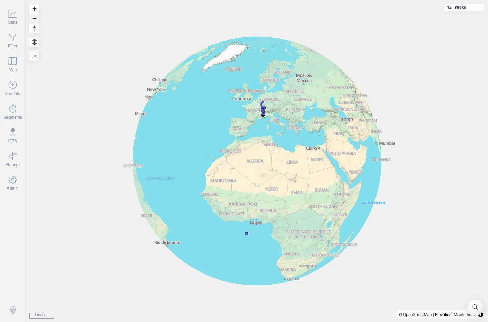

# Packet: GLB_01

## Scope

- Coverage source: `documentation/testing/frontend-regression-test-plan.md`
- Coverage ID or run packet: GLB_01
- In scope: Automatic globe projection at low zoom.
- Out of scope: Returning to flat projection, manual disable, and zoom-limit behavior; covered by GLB_02 through GLB_04.

## Prerequisites

- Required previous coverage IDs or run packets: SRC_04.
- Required app/data state: Root map loaded with 12 visible tracks.
- Required browser context: Fresh authenticated desktop Chromium context.

## Allowed Mutations

- Allowed: Use map zoom controls.
- Not allowed: Change server data.

## Actions And Results

| Coverage ID | Action | Expected result | Actual result | Status | Evidence |
|---|---|---|---|---|---|
| GLB_01 | Zoomed out from the root map until globe mode became active. | Globe view engages automatically at sufficiently low zoom. | Scale changed from `500 km` to `1000 km`; globe control class changed to `mtl-globe-active`; console logged `[zoom] 2.360 - globe`; 12-track map remained visible. | PASS | [assets/GLB_globe-mode.txt](../assets/GLB_globe-mode.txt); [assets/GLB_01-globe-active.webp](../assets/GLB_01-globe-active.webp) |

## Issues

| ID | Severity | Summary | Reproduction | Expected | Actual | Evidence | Release impact |
|---|---|---|---|---|---|---|---|

## Evidence Files

| File | Purpose |
|---|---|
| [assets/GLB_globe-mode.txt](../assets/GLB_globe-mode.txt) | Globe active state, scale, and zoom console log summary. |
| [assets/GLB_01-globe-active.webp](../assets/GLB_01-globe-active.webp) | Low-zoom globe-active map state. |

## Screenshot Evidence

**Low-zoom globe-active map state.**

## Timings

| Step | Timing |
|---|---:|
| Zoom out to globe | ~3 s |

## Handoff Notes

- Completed: GLB_01 terminal as `PASS`.
- Remaining unfinished coverage: Continue with GLB_02.
- Blocked or not applicable: None.
- State left for the next packet: Same browser session continued into GLB_02.
