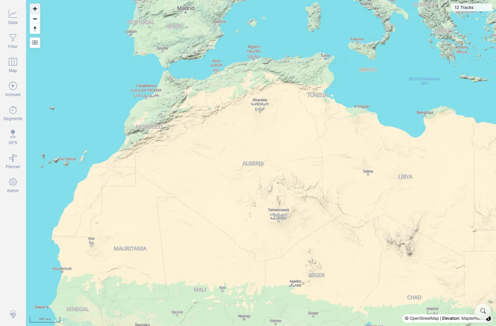

# Packet: GLB_02

## Scope

- Coverage source: `documentation/testing/frontend-regression-test-plan.md`
- Coverage ID or run packet: GLB_02
- In scope: Leaving globe projection when zooming back in.
- Out of scope: Manual disable and zoom-limit behavior; covered by GLB_03 and GLB_04.

## Prerequisites

- Required previous coverage IDs or run packets: GLB_01.
- Required app/data state: Globe mode active at low zoom.
- Required browser context: Same authenticated desktop Chromium session.

## Allowed Mutations

- Allowed: Use map zoom controls.
- Not allowed: Change server data.

## Actions And Results

| Coverage ID | Action | Expected result | Actual result | Status | Evidence |
|---|---|---|---|---|---|
| GLB_02 | Zoomed in from active globe mode. | Map returns to flat/mercator view. | Scale stepped from `1000 km` to `300 km`; globe control became inactive/hidden; console logged `[zoom] 4.360 - mercator`; 12-track map remained visible. | PASS | [assets/GLB_globe-mode.txt](../assets/GLB_globe-mode.txt); [assets/GLB_02-flat-active.webp](../assets/GLB_02-flat-active.webp) |

## Issues

| ID | Severity | Summary | Reproduction | Expected | Actual | Evidence | Release impact |
|---|---|---|---|---|---|---|---|

## Evidence Files

| File | Purpose |
|---|---|
| [assets/GLB_globe-mode.txt](../assets/GLB_globe-mode.txt) | Globe-to-mercator state and zoom log summary. |
| [assets/GLB_02-flat-active.webp](../assets/GLB_02-flat-active.webp) | Flat/mercator map state after zooming in. |

## Screenshot Evidence

**Flat/mercator map state after zooming in.**

## Timings

| Step | Timing |
|---|---:|
| Zoom in to mercator | ~4 s |

## Handoff Notes

- Completed: GLB_02 terminal as `PASS`.
- Remaining unfinished coverage: Continue with GLB_03.
- Blocked or not applicable: None.
- State left for the next packet: Same browser session continued into GLB_03.
