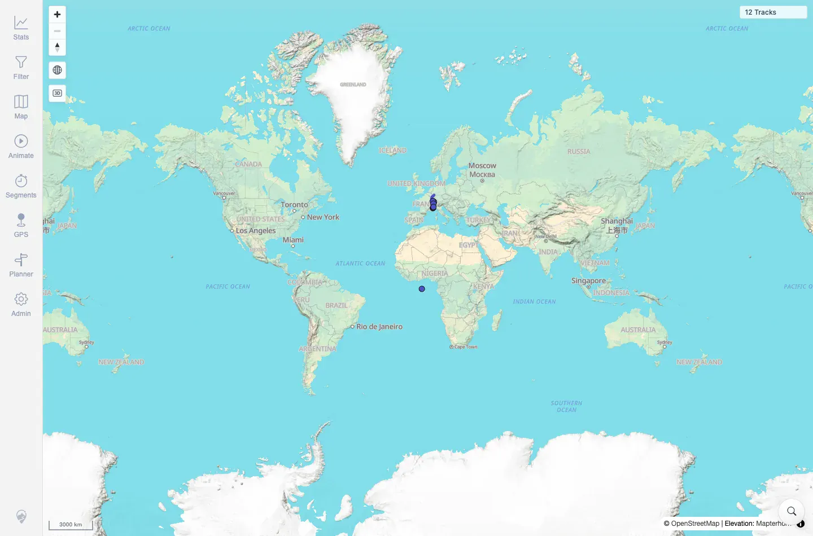

# Packet: GLB_03

## Scope

- Coverage source: `documentation/testing/frontend-regression-test-plan.md`
- Coverage ID or run packet: GLB_03
- In scope: Manual globe disable behavior at low zoom.
- Out of scope: Automatic enter/exit and zoom-limit behavior; covered by GLB_01, GLB_02, and GLB_04.

## Prerequisites

- Required previous coverage IDs or run packets: GLB_02.
- Required app/data state: Map can be returned to low-zoom globe zone.
- Required browser context: Same authenticated desktop Chromium session.

## Allowed Mutations

- Allowed: Toggle the Globe mode control and use zoom controls.
- Not allowed: Change server data.

## Actions And Results

| Coverage ID | Action | Expected result | Actual result | Status | Evidence |
|---|---|---|---|---|---|
| GLB_03 | Re-entered globe mode, clicked the Globe mode control to disable it manually, then zoomed farther out while staying in the low-zoom zone. | Manual disable is respected and globe does not auto-re-enable until the user re-enables it. | At `1000 km`, globe was active. After clicking Globe mode, the control became inactive. Further low-zoom zoom-out reached `3000 km` with globe still inactive; console logs showed mercator after the manual disable. | PASS | [assets/GLB_globe-mode.txt](../assets/GLB_globe-mode.txt); [assets/GLB_03-manual-disabled.webp](../assets/GLB_03-manual-disabled.webp) |

## Issues

| ID | Severity | Summary | Reproduction | Expected | Actual | Evidence | Release impact |
|---|---|---|---|---|---|---|---|

## Evidence Files

| File | Purpose |
|---|---|
| [assets/GLB_globe-mode.txt](../assets/GLB_globe-mode.txt) | Manual disable and low-zoom persistence summary. |
| [assets/GLB_03-manual-disabled.webp](../assets/GLB_03-manual-disabled.webp) | Low-zoom map with globe control inactive after manual disable. |

## Screenshot Evidence

**Low-zoom map with globe control inactive after manual disable.**

## Timings

| Step | Timing |
|---|---:|
| Manual disable and low-zoom check | ~8 s |

## Handoff Notes

- Completed: GLB_03 terminal as `PASS`.
- Remaining unfinished coverage: Continue with GLB_04.
- Blocked or not applicable: None.
- State left for the next packet: Globe re-enabled for GLB_04 cleanup/zoom-limit check.
