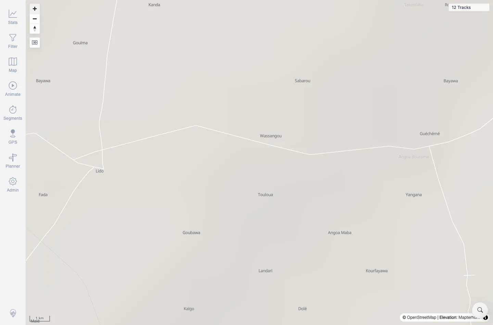

# Packet: GLB_04

## Scope

- Coverage source: `documentation/testing/frontend-regression-test-plan.md`
- Coverage ID or run packet: GLB_04
- In scope: Repeated zoom controls at globe/mercator limits.
- Out of scope: Automatic globe thresholds and manual disable semantics; covered by GLB_01 through GLB_03.

## Prerequisites

- Required previous coverage IDs or run packets: GLB_03.
- Required app/data state: Root map remains interactive.
- Required browser context: Same authenticated desktop Chromium session.

## Allowed Mutations

- Allowed: Repeated map zoom in/out.
- Not allowed: Change server data.

## Actions And Results

| Coverage ID | Action | Expected result | Actual result | Status | Evidence |
|---|---|---|---|---|---|
| GLB_04 | Re-enabled globe, clicked zoom out repeatedly, then zoomed in repeatedly. | Zoom limits do not trap the map at edges; controls remain responsive. | Repeated zoom-out remained interactive with 12 tracks visible and globe active at low zoom. Repeated zoom-in reached `1 km` scale, globe inactive/hidden, with no console warnings/errors. | PASS | [assets/GLB_globe-mode.txt](../assets/GLB_globe-mode.txt); [assets/GLB_04-zoom-limits.webp](../assets/GLB_04-zoom-limits.webp) |

## Issues

| ID | Severity | Summary | Reproduction | Expected | Actual | Evidence | Release impact |
|---|---|---|---|---|---|---|---|

## Evidence Files

| File | Purpose |
|---|---|
| [assets/GLB_globe-mode.txt](../assets/GLB_globe-mode.txt) | Repeated zoom-out/in state and console summary. |
| [assets/GLB_04-zoom-limits.webp](../assets/GLB_04-zoom-limits.webp) | Final high-zoom, non-trapped map state. |

## Screenshot Evidence

**Final high-zoom, non-trapped map state.**

## Timings

| Step | Timing |
|---|---:|
| Repeated zoom limit check | ~8 s |

## Handoff Notes

- Completed: GLB_04 terminal as `PASS`.
- Remaining unfinished coverage: Continue with ADM_01.
- Blocked or not applicable: None.
- State left for the next packet: Server data unchanged; map left zoomed in within disposable browser context.
