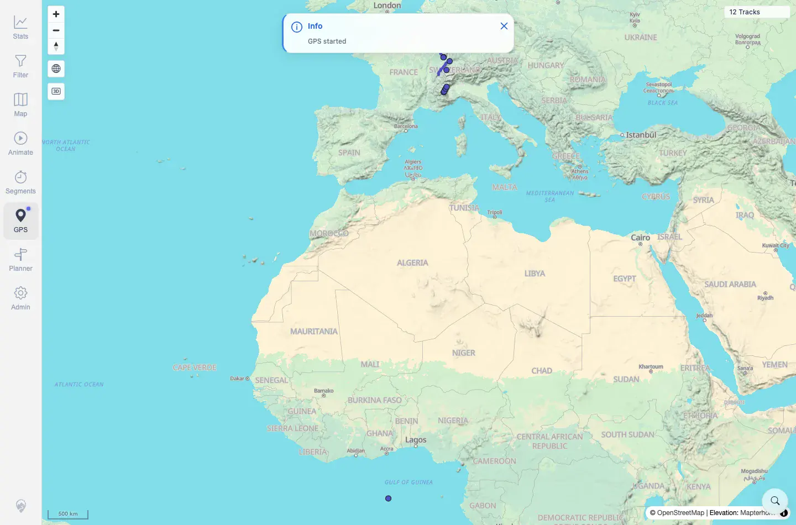

# Packet: GPS_02

## Scope

- Coverage source: `documentation/testing/frontend-regression-test-plan.md`
- Coverage ID or run packet: GPS_02
- In scope: Applicability of browser permission prompt and locate marker on this run.
- Out of scope: Secure-origin proof; covered by GPS_01.

## Prerequisites

- Required previous coverage IDs or run packets: GPS_01.
- Required app/data state: Remote plain-HTTP quick-install target.
- Required browser context: Desktop Chromium.

## Allowed Mutations

- Allowed: None beyond GPS_01 evidence reuse.
- Not allowed: Change server data.

## Actions And Results

| Coverage ID | Action | Expected result | Actual result | Status | Evidence |
|---|---|---|---|---|---|
| GPS_02 | Evaluated whether the permission-prompt and locate-marker check can run on this target after GPS_01 secure-origin proof. | On remote plain HTTP, live GPS permission and marker checks are not applicable. | Chrome rejected geolocation before a usable position/marker flow with `Only secure origins are allowed`; no live locate marker can be validated on this target origin. | NOT APPLICABLE | [assets/GPS_01-insecure-origin.txt](../assets/GPS_01-insecure-origin.txt); [assets/GPS_01-insecure-origin-gps-panel.webp](../assets/GPS_01-insecure-origin-gps-panel.webp) |

## Issues

| ID | Severity | Summary | Reproduction | Expected | Actual | Evidence | Release impact |
|---|---|---|---|---|---|---|---|

## Evidence Files

| File | Purpose |
|---|---|
| [assets/GPS_01-insecure-origin.txt](../assets/GPS_01-insecure-origin.txt) | Shared secure-origin limitation evidence. |
| [assets/GPS_01-insecure-origin-gps-panel.webp](../assets/GPS_01-insecure-origin-gps-panel.webp) | Shared GPS click screenshot on insecure origin. |

## Screenshot Evidence

**Shared GPS click screenshot on insecure origin.**

## Timings

| Step | Timing |
|---|---:|
| Applicability classification | ~1 s |

## Handoff Notes

- Completed: GPS_02 terminal as `NOT APPLICABLE`.
- Remaining unfinished coverage: Continue with GPS_03.
- Blocked or not applicable: Requires localhost or HTTPS for live permission/marker behavior.
- State left for the next packet: Server data unchanged.
