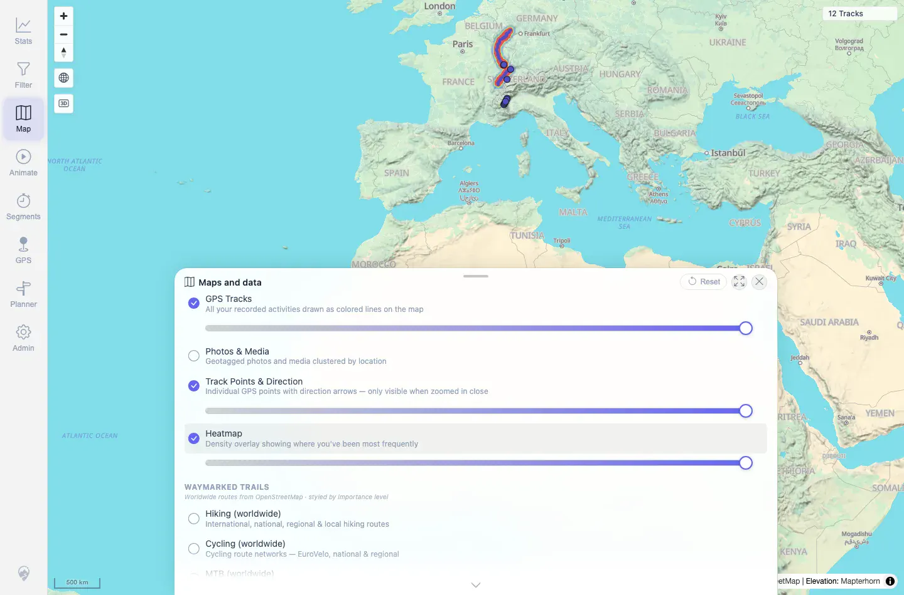

# Packet: HMO_01

## Scope

- Coverage source: `documentation/testing/frontend-regression-test-plan.md`
- Coverage ID or run packet: HMO_01
- In scope: Heatmap layer toggle, visual coexistence with GPS tracks, and heatmap opacity control.
- Out of scope: Other map overlays and filter-driven heatmap changes; covered by HMO_02 and HMO_03.

## Prerequisites

- Required previous coverage IDs or run packets: RUN_SETUP through MED_05.
- Required app/data state: 12 visible tracks; no active filter.
- Required browser context: Fresh authenticated desktop Chromium context.

## Allowed Mutations

- Allowed: Toggle the Heatmap layer and change its opacity.
- Not allowed: Change server data or persistent filters.

## Actions And Results

| Coverage ID | Action | Expected result | Actual result | Status | Evidence |
|---|---|---|---|---|---|
| HMO_01 | Opened Maps and data, enabled Heatmap, then changed the heatmap opacity from 100 to 40 using the ARIA slider keyboard controls. | Heatmap draws over the map, does not hide GPS tracks, and respects opacity changes. | Heatmap toggled from off to on, exposed its opacity slider, persisted `heatmapVisible=true`, and updated opacity to `40`. GPS Tracks stayed enabled at opacity `100`; screenshots show colored tracks still visible with the heatmap enabled. | PASS | [assets/HMO_01-heatmap.txt](../assets/HMO_01-heatmap.txt); [assets/HMO_01-heatmap-on.webp](../assets/HMO_01-heatmap-on.webp); [assets/HMO_01-heatmap-opacity.webp](../assets/HMO_01-heatmap-opacity.webp) |

## Issues

| ID | Severity | Summary | Reproduction | Expected | Actual | Evidence | Release impact |
|---|---|---|---|---|---|---|---|

## Evidence Files

| File | Purpose |
|---|---|
| [assets/HMO_01-heatmap.txt](../assets/HMO_01-heatmap.txt) | Toggle, opacity, GPS Tracks state, and request summary. |
| [assets/HMO_01-heatmap-on.webp](../assets/HMO_01-heatmap-on.webp) | Heatmap enabled with tracks still visible. |
| [assets/HMO_01-heatmap-opacity.webp](../assets/HMO_01-heatmap-opacity.webp) | Heatmap opacity reduced to 40 while tracks remain visible. |

## Screenshot Evidence

**Heatmap enabled with tracks still visible.**

**Heatmap opacity reduced to 40 while tracks remain visible.**

## Timings

| Step | Timing |
|---|---:|
| Heatmap toggle and opacity check | ~20 s |

## Handoff Notes

- Completed: HMO_01 terminal as `PASS`.
- Remaining unfinished coverage: Continue with HMO_02.
- Blocked or not applicable: None.
- State left for the next packet: Browser test context was disposable; shared server data unchanged.
