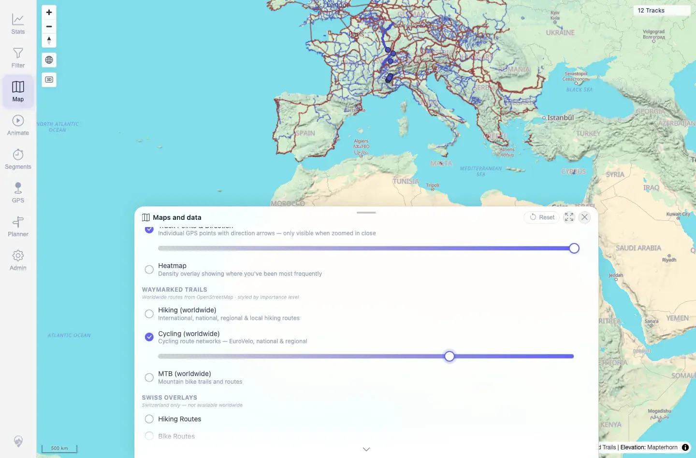
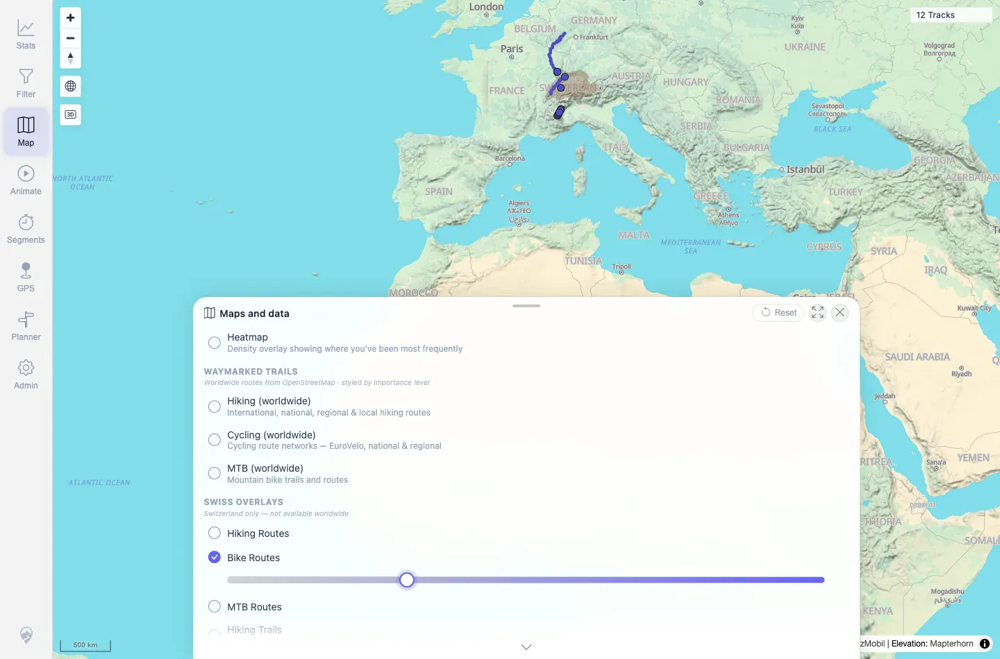

# Packet: HMO_02

## Scope

- Coverage source: `documentation/testing/frontend-regression-test-plan.md`
- Coverage ID or run packet: HMO_02
- In scope: Independent toggle and opacity behavior for every map overlay exposed in Maps and data.
- Out of scope: Heatmap-specific behavior and filter updates; covered by HMO_01 and HMO_03.

## Prerequisites

- Required previous coverage IDs or run packets: HMO_01.
- Required app/data state: 12 visible tracks; map settings reset between overlay checks.
- Required browser context: Fresh authenticated desktop Chromium contexts.

## Allowed Mutations

- Allowed: Toggle individual map overlays and change overlay opacity sliders.
- Not allowed: Change server data or leave map overlays enabled for following packets.

## Actions And Results

| Coverage ID | Action | Expected result | Actual result | Status | Evidence |
|---|---|---|---|---|---|
| HMO_02 | In seven fresh contexts, opened Maps and data, toggled exactly one overlay on, changed its row-scoped opacity slider, verified GPS Tracks stayed enabled, then toggled that overlay off before the next overlay. Covered `Hiking (worldwide)`, `Cycling (worldwide)`, `MTB (worldwide)`, `Hiking Routes`, `Bike Routes`, `MTB Routes`, and `Hiking Trails`. | Each map overlay toggles independently; opacity sliders work; overlay behavior does not disable or hide GPS tracks. | Every overlay toggled from off to on, accepted a distinct opacity target, then toggled back off. GPS Tracks remained enabled in all seven checks. Worldwide overlays requested `tile.waymarkedtrails.org`; Swiss overlays requested `wmts.geo.admin.ch`. Representative screenshots captured cycling and bike-route overlay states. | PASS | [assets/HMO_02-overlays.txt](../assets/HMO_02-overlays.txt); [assets/HMO_02-cycling-overlay.webp](../assets/HMO_02-cycling-overlay.webp); [assets/HMO_02-bike-routes-overlay.webp](../assets/HMO_02-bike-routes-overlay.webp) |

## Issues

| ID | Severity | Summary | Reproduction | Expected | Actual | Evidence | Release impact |
|---|---|---|---|---|---|---|---|

## Evidence Files

| File | Purpose |
|---|---|
| [assets/HMO_02-overlays.txt](../assets/HMO_02-overlays.txt) | Compact per-overlay toggle, opacity, request-domain, and GPS Tracks summary. |
| [assets/HMO_02-cycling-overlay.webp](../assets/HMO_02-cycling-overlay.webp) | Representative worldwide overlay enabled with adjusted opacity. |
| [assets/HMO_02-bike-routes-overlay.webp](../assets/HMO_02-bike-routes-overlay.webp) | Representative Swiss overlay enabled with adjusted opacity. |

## Screenshot Evidence

**Representative worldwide overlay enabled with adjusted opacity.**

**Representative Swiss overlay enabled with adjusted opacity.**

## Timings

| Step | Timing |
|---|---:|
| Seven independent overlay contexts | ~2 min |

## Handoff Notes

- Completed: HMO_02 terminal as `PASS`.
- Remaining unfinished coverage: Continue with HMO_03.
- Blocked or not applicable: None.
- State left for the next packet: Each overlay check used a disposable browser context; no overlay was left enabled in shared state.
