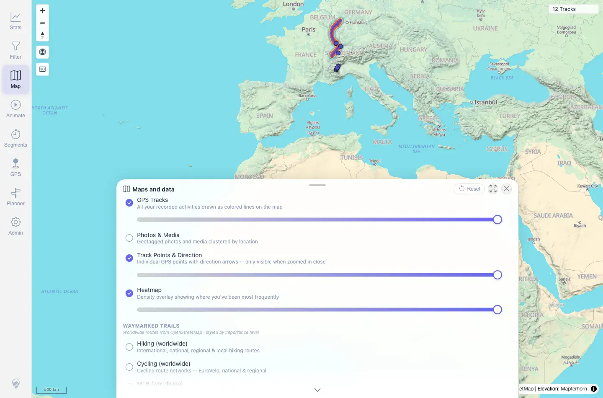
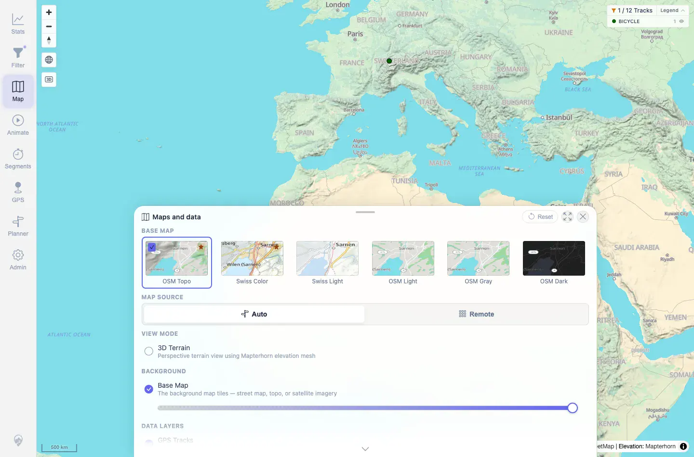

# Packet: HMO_03

## Scope

- Coverage source: `documentation/testing/frontend-regression-test-plan.md`
- Coverage ID or run packet: HMO_03
- In scope: Heatmap behavior after changing the active track filter.
- Out of scope: General filter UI behavior; covered by FLT_01 through FLT_08.

## Prerequisites

- Required previous coverage IDs or run packets: HMO_02.
- Required app/data state: 12 visible tracks; `MAP 03 Freshness Synthetic` track present as `#100014`.
- Required browser context: Fresh authenticated desktop Chromium context.

## Allowed Mutations

- Allowed: Enable heatmap and apply the previously validated `ActivitiesByKeyword` filter with keyword `MAP 03`.
- Not allowed: Change server data or leave filter/heatmap state active after the packet.

## Actions And Results

| Coverage ID | Action | Expected result | Actual result | Status | Evidence |
|---|---|---|---|---|---|
| HMO_03 | Enabled Heatmap on the unfiltered 12-track map, applied the `ActivitiesByKeyword` filter with keyword `MAP 03`, reloaded the root map, reopened Maps and data, then cleared filter state and reset map settings. | After changing filters, the heatmap updates to the filtered track set. | The unfiltered map showed `12 Tracks` with Heatmap enabled. After applying `ActivitiesByKeyword` / `MAP 03`, the root map and Maps and data panel both showed `1 / 12 Tracks`, Heatmap remained enabled, and track requests used `filterName=ActivitiesByKeyword`. Valid filter resolve returned result id `100014` with `standardFilterCount=12`. Cleanup restored root map to `12 Tracks` and `heatmapVisible=false`. | PASS | [assets/HMO_03-filtered-heatmap.txt](../assets/HMO_03-filtered-heatmap.txt); [assets/HMO_03-heatmap-all-tracks.webp](../assets/HMO_03-heatmap-all-tracks.webp); [assets/HMO_03-filtered-heatmap.webp](../assets/HMO_03-filtered-heatmap.webp) |

## Issues

| ID | Severity | Summary | Reproduction | Expected | Actual | Evidence | Release impact |
|---|---|---|---|---|---|---|---|

## Evidence Files

| File | Purpose |
|---|---|
| [assets/HMO_03-filtered-heatmap.txt](../assets/HMO_03-filtered-heatmap.txt) | Before/after filter state, heatmap state, valid filter resolve, request, and cleanup summary. |
| [assets/HMO_03-heatmap-all-tracks.webp](../assets/HMO_03-heatmap-all-tracks.webp) | Heatmap enabled on the full 12-track set. |
| [assets/HMO_03-filtered-heatmap.webp](../assets/HMO_03-filtered-heatmap.webp) | Heatmap enabled after filter changed map to `1 / 12 Tracks`. |

## Screenshot Evidence

**Heatmap enabled on the full 12-track set.**

**Heatmap enabled after filter changed map to 1 / 12 Tracks.**

## Timings

| Step | Timing |
|---|---:|
| Heatmap filter-update and restore | ~40 s |

## Handoff Notes

- Completed: HMO_03 terminal as `PASS`.
- Remaining unfinished coverage: Continue with GPS_01.
- Blocked or not applicable: None.
- State left for the next packet: Filter cleared; map settings reset; root map reload verified `12 Tracks` with `heatmapVisible=false`.
