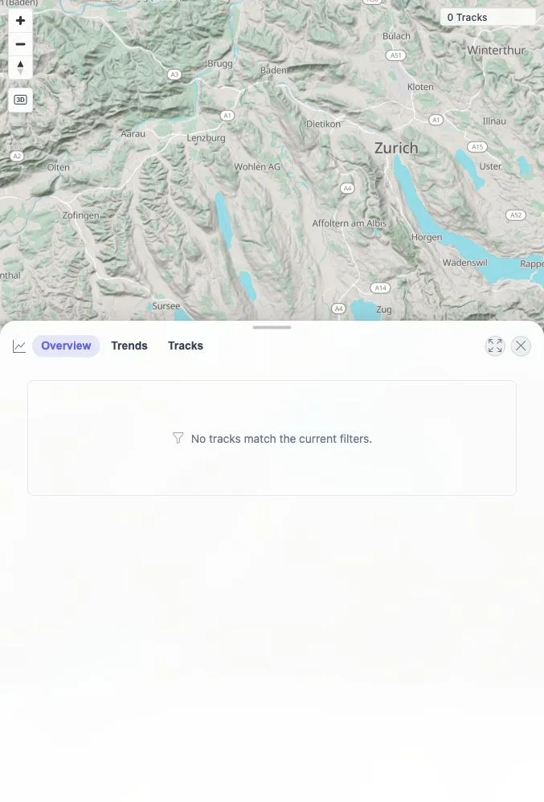
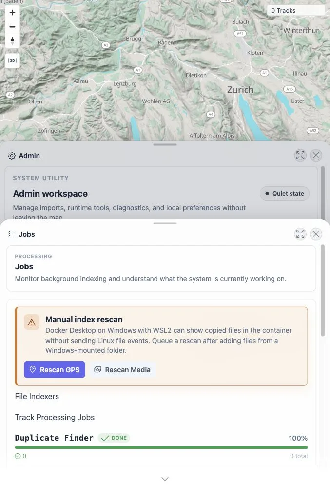
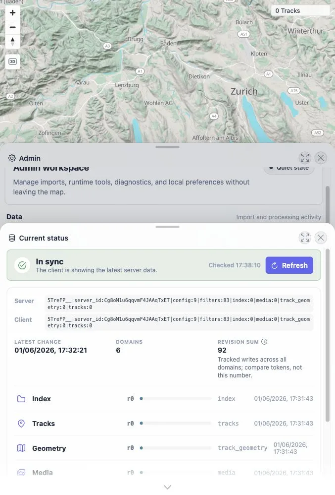
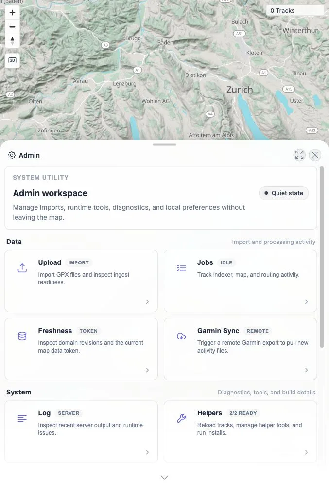

# Packet: IMP_01

## Scope

- Coverage source: `documentation/testing/frontend-regression-test-plan.md`
- Coverage ID or run packet: IMP_01
- In scope: Baseline map count, track-browser/statistics count, data-freshness token, and GPS/indexer status before importing public samples.
- Out of scope: Importing files or post-import verification.

## Prerequisites

- Required previous coverage IDs or run packets: RUN_SETUP, ACC_01-ACC_05, DAT_01-DAT_06.
- Required app/data state: Quick-install app running; watched import folder still empty.
- Required browser context: Logged-in desktop browser.

## Allowed Mutations

- Allowed: Navigate UI panels and refresh/read admin status.
- Not allowed: Add, delete, or modify track files.

## Actions And Results

| Coverage ID | Action | Expected result | Actual result | Status | Evidence |
|---|---|---|---|---|---|
| IMP_01 | Captured baseline map, stats, admin jobs, and freshness UI before adding files. | Empty install has known baseline counts and ready/idle indexer state before import. | Map displayed `0 Tracks`; stats panel showed no tracks match current filters; Admin Jobs showed Duplicate Finder, Activity Classifier, Exploration Score done/100% with `0 total`, hosted vector map service done, location search done, routing ready; Freshness showed client/server in sync with token `index:0`, `media:0`, `track_geometry:0`, `tracks:0`; browser console warning/error capture was empty. | PASS | [assets/IMP_01-baseline-stats.webp](../assets/IMP_01-baseline-stats.webp), [assets/IMP_01-baseline-jobs.webp](../assets/IMP_01-baseline-jobs.webp), [assets/IMP_01-baseline-freshness.webp](../assets/IMP_01-baseline-freshness.webp), [assets/IMP_01-baseline-dom.txt](../assets/IMP_01-baseline-dom.txt), `assets/IMP_01-baseline-status-dom.txt`, [assets/IMP_01-console.txt](../assets/IMP_01-console.txt) |

## Issues

| ID | Severity | Summary | Reproduction | Expected | Actual | Evidence | Release impact |
|---|---|---|---|---|---|---|---|

## Evidence Files

| File | Purpose |
|---|---|
| [assets/IMP_01-baseline-stats.webp](../assets/IMP_01-baseline-stats.webp) | Baseline stats panel showing no tracks. |
| [assets/IMP_01-baseline-admin.webp](../assets/IMP_01-baseline-admin.webp) | Admin workspace baseline. |
| [assets/IMP_01-baseline-jobs.webp](../assets/IMP_01-baseline-jobs.webp) | Baseline jobs/indexer status. |
| [assets/IMP_01-baseline-freshness.webp](../assets/IMP_01-baseline-freshness.webp) | Baseline freshness token and sync status. |
| [assets/IMP_01-baseline-dom.txt](../assets/IMP_01-baseline-dom.txt) | Cropped map/stats/admin DOM evidence. |
| [assets/IMP_01-baseline-admin-dom.txt](../assets/IMP_01-baseline-admin-dom.txt) | Cropped admin workspace DOM evidence. |
| [assets/IMP_01-baseline-freshness-dom.txt](../assets/IMP_01-baseline-freshness-dom.txt) | Cropped freshness token DOM evidence. |
| [assets/IMP_01-console.txt](../assets/IMP_01-console.txt) | Captured browser console warnings/errors; empty JSON array. |

## Screenshot Evidence

**Baseline stats panel showing no tracks.**

**Baseline jobs/indexer status.**

**Baseline freshness token and sync status.**

**Admin workspace baseline.**

## Timings

| Step | Timing |
|---|---:|
| Baseline UI capture | ~20 seconds |

## Handoff Notes

- Completed: IMP_01 terminal as `PASS`.
- Remaining unfinished coverage: Continue with `IMP_02` by copying public samples into the watched import folder.
- Blocked or not applicable: None.
- State left for the next packet: App baseline is empty and in sync; public samples are staged but not imported.
