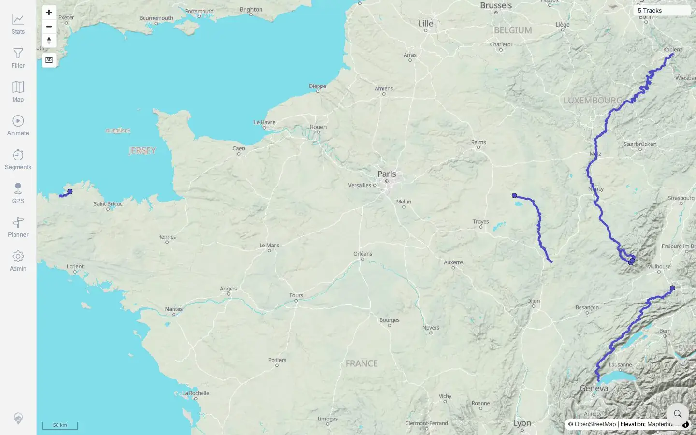
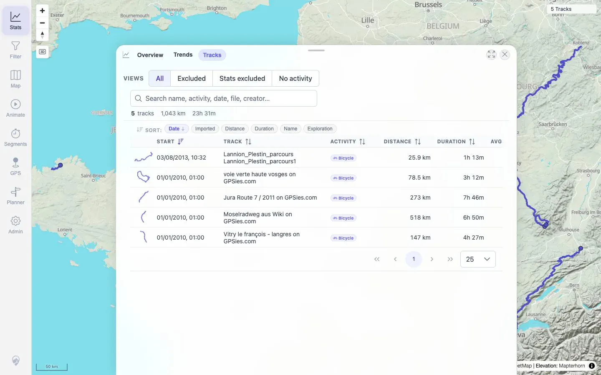
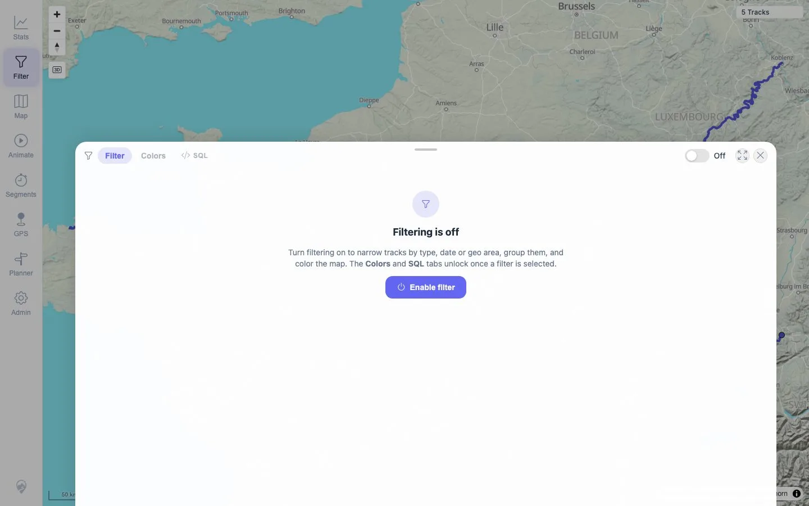

# Packet: IMP_05

## Scope

- Coverage source: `documentation/testing/frontend-regression-test-plan.md`
- Coverage ID or run packet: IMP_05
- In scope: Reload after GPX import and verify map, track browser/list, filters, and statistics show the imported data.
- Out of scope: Per-file map clicks/details; covered by IMP_06 and IMP_07.

## Prerequisites

- Required previous coverage IDs or run packets: IMP_04.
- Required app/data state: Five GPX tracks indexed and background jobs settled.
- Required browser context: Clean desktop browser context plus helper-reload action.

## Allowed Mutations

- Allowed: Use Admin Helpers `Reload Tracks`, open Stats/Filter panels.
- Not allowed: Add/delete files.

## Actions And Results

| Coverage ID | Action | Expected result | Actual result | Status | Evidence |
|---|---|---|---|---|---|
| IMP_05 | Loaded the app in a clean desktop context, used Admin Helpers → Reload Tracks, then checked map, Stats → Tracks, and Filter. | Reload/cache refresh makes the map, track browser, filters, and statistics show the newly indexed GPX data. | Helper reload returned `Done`; map displayed `5 Tracks`; Stats → Tracks showed `5 tracks`, `1,043 km`, `23h 31m`, and all five imported GPX names; Filter panel opened with filtering off while the global visible count remained `5 Tracks`. | PASS | [assets/IMP_05-helper-reload-clicked.txt](../assets/IMP_05-helper-reload-clicked.txt), [assets/IMP_05-surfaces-after-reload.txt](../assets/IMP_05-surfaces-after-reload.txt), [assets/IMP_05-map-5-tracks.webp](../assets/IMP_05-map-5-tracks.webp), [assets/IMP_05-stats-tracks.webp](../assets/IMP_05-stats-tracks.webp), [assets/IMP_05-filter-5-tracks.webp](../assets/IMP_05-filter-5-tracks.webp) |

## Issues

| ID | Severity | Summary | Reproduction | Expected | Actual | Evidence | Release impact |
|---|---|---|---|---|---|---|---|
| MTL-FR-001 | P2 | Admin subroute hard-load returns Spring Whitelabel 404. | See `IMP_04`. | SPA route reload should recover. | Existing in-app browser context remained stuck at splash/`0 Tracks` after the 404 recovery, while a clean context loaded `5 Tracks`. | [assets/IMP_04-admin-route-404-dom.txt](../assets/IMP_04-admin-route-404-dom.txt), [assets/IMP_04-root-after-import-dom.txt](../assets/IMP_04-root-after-import-dom.txt), [assets/IMP_05-clean-context-post-import.txt](../assets/IMP_05-clean-context-post-import.txt) | Reinforces impact of the admin route reload failure. |

## Evidence Files

| File | Purpose |
|---|---|
| [assets/IMP_05-helper-panel-probe.txt](../assets/IMP_05-helper-panel-probe.txt) | Admin Helpers panel text showing Reload Tracks control. |
| [assets/IMP_05-helper-reload-clicked.txt](../assets/IMP_05-helper-reload-clicked.txt) | Helper reload before/after text showing `Done`. |
| [assets/IMP_05-clean-context-post-import.txt](../assets/IMP_05-clean-context-post-import.txt) | Clean context root-load text showing `5 Tracks` and captured warnings/failed requests. |
| [assets/IMP_05-surfaces-after-reload.txt](../assets/IMP_05-surfaces-after-reload.txt) | Map, stats track list, and filter text after reload. |
| [assets/IMP_05-map-5-tracks.webp](../assets/IMP_05-map-5-tracks.webp) | Map after post-import reload. |
| [assets/IMP_05-stats-tracks.webp](../assets/IMP_05-stats-tracks.webp) | Stats track list after post-import reload. |
| [assets/IMP_05-filter-5-tracks.webp](../assets/IMP_05-filter-5-tracks.webp) | Filter panel after post-import reload. |

## Screenshot Evidence

**Map after post-import reload.**

**Stats track list after post-import reload.**

**Filter panel after post-import reload.**

## Timings

| Step | Timing |
|---|---:|
| Clean context root load to `5 Tracks` | <1 second after login wait loop began |
| Helper reload click to `Done` | ~5 seconds |
| Surface verification | ~10 seconds |

## Handoff Notes

- Completed: IMP_05 terminal as `PASS`.
- Remaining unfinished coverage: Continue with `IMP_06` per-file verification by name.
- Blocked or not applicable: None.
- State left for the next packet: Five GPX tracks are visible after reload; no data mutation after import.
