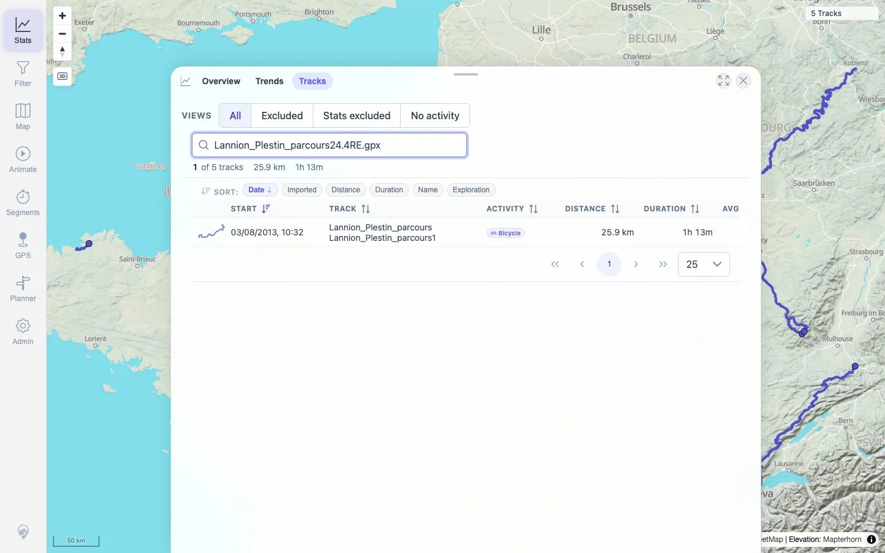

# Packet: IMP_06

## Scope

- Coverage source: `documentation/testing/frontend-regression-test-plan.md`
- Coverage ID or run packet: IMP_06
- In scope: Verify each imported GPX file by name/search across track browser/list, map-visible count, statistics, and filter-visible state.
- Out of scope: Clicking each track on the map and opening details; covered by IMP_07 and TRD packets.

## Prerequisites

- Required previous coverage IDs or run packets: IMP_05.
- Required app/data state: Five imported GPX tracks visible after reload.
- Required browser context: Clean desktop browser.

## Allowed Mutations

- Allowed: Use track-list search and open map/stats/filter surfaces.
- Not allowed: Add/delete files or change persistent track metadata.

## Actions And Results

| Coverage ID | Action | Expected result | Actual result | Status | Evidence |
|---|---|---|---|---|---|
| IMP_06 | Searched the Stats → Tracks browser for each imported GPX filename and compared results with imported track mapping, map count, stats summary, and filter panel state. | Each imported file appears by name/search in the track browser, is represented on the map, appears in statistics summaries, and is included in at least one filter result. | Each filename query returned `1 of 5 tracks` with the corresponding imported track name; Stats summary listed all five names and totals; map/global visible count stayed `5 Tracks`; filter panel opened with filtering off and global count `5 Tracks`; imported mapping shows all five tracks have `loadStatus=SUCCESS` and simplified geometry data. | PASS | [assets/IMP_06-track-browser-search-results.txt](../assets/IMP_06-track-browser-search-results.txt), [assets/IMP_04-imported-track-mapping.txt](../assets/IMP_04-imported-track-mapping.txt), [assets/IMP_05-surfaces-after-reload.txt](../assets/IMP_05-surfaces-after-reload.txt), [assets/IMP_06-last-search-result.webp](../assets/IMP_06-last-search-result.webp) |

## Issues

| ID | Severity | Summary | Reproduction | Expected | Actual | Evidence | Release impact |
|---|---|---|---|---|---|---|---|

## Evidence Files

| File | Purpose |
|---|---|
| [assets/IMP_06-track-list-controls.txt](../assets/IMP_06-track-list-controls.txt) | Track-list controls, including the search field. |
| [assets/IMP_06-track-browser-search-results.txt](../assets/IMP_06-track-browser-search-results.txt) | Per-filename search results returning one matching imported row each. |
| [assets/IMP_06-last-search-result.webp](../assets/IMP_06-last-search-result.webp) | Screenshot of the final per-file search result. |
| [assets/IMP_04-imported-track-mapping.txt](../assets/IMP_04-imported-track-mapping.txt) | Imported file-to-track id/name/status mapping. |
| [assets/IMP_05-surfaces-after-reload.txt](../assets/IMP_05-surfaces-after-reload.txt) | Map/stats/filter aggregate evidence after reload. |

## Screenshot Evidence

**Screenshot of the final per-file search result.**

## Timings

| Step | Timing |
|---|---:|
| Per-file track-browser searches | ~7 seconds |

## Handoff Notes

- Completed: IMP_06 terminal as `PASS`.
- Remaining unfinished coverage: Continue with `IMP_07` map zoom/click verification for each imported track.
- Blocked or not applicable: None.
- State left for the next packet: Five GPX tracks remain imported; no data mutation.
