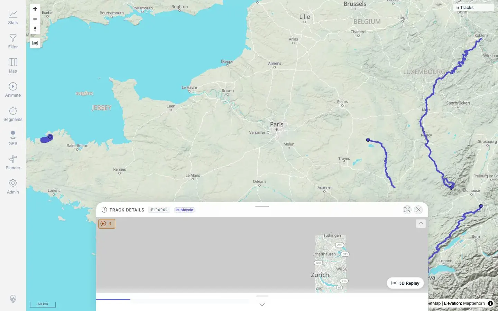
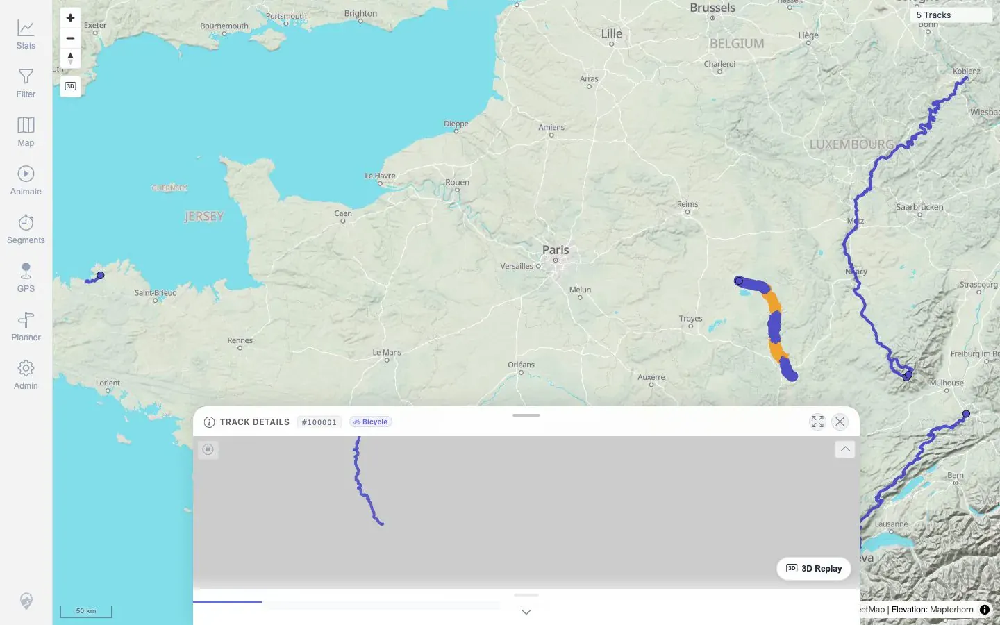
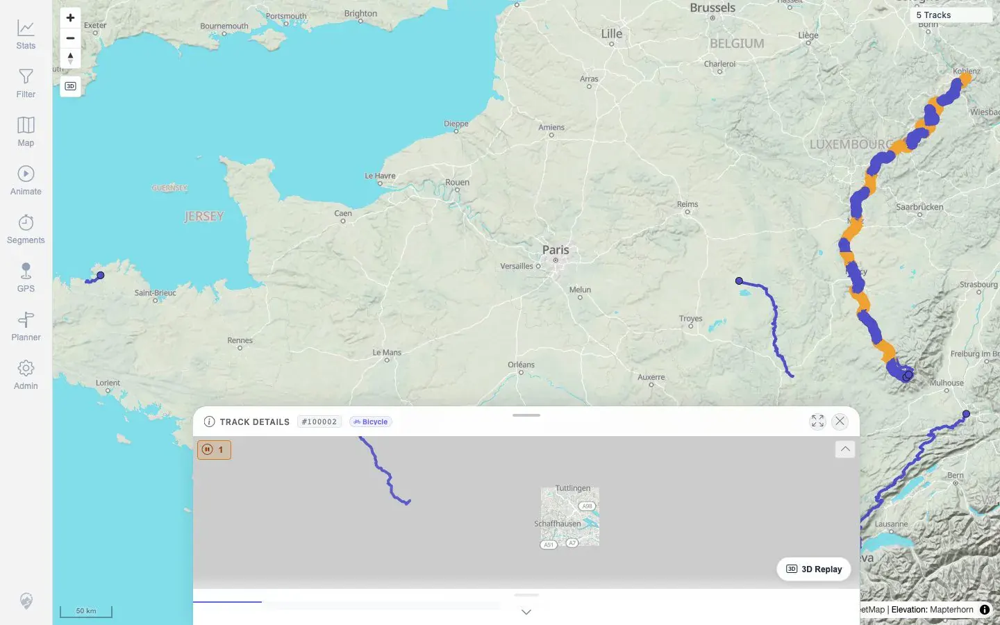
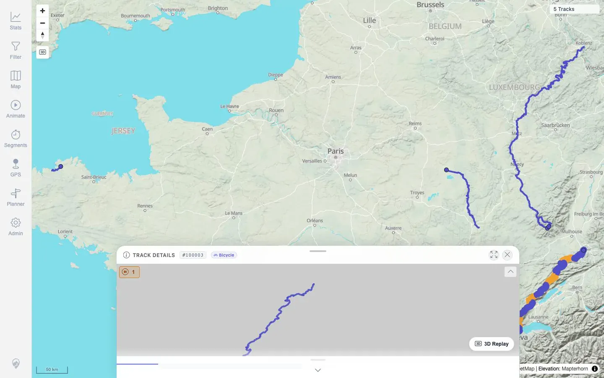
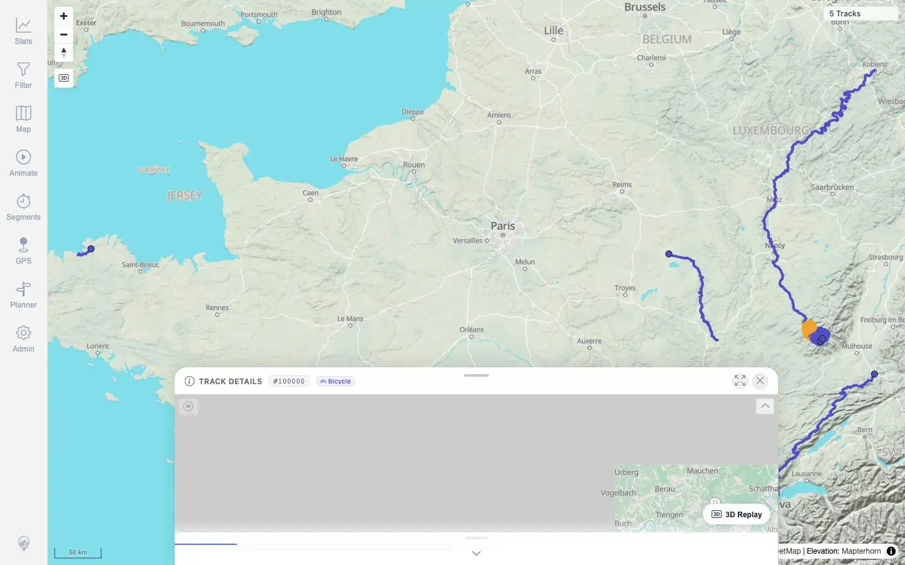
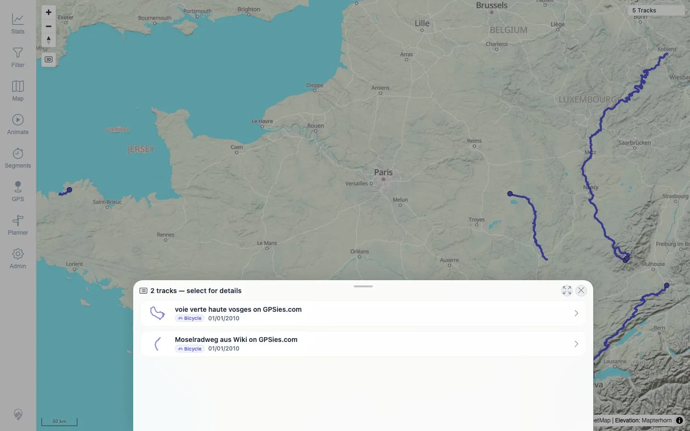

# Packet: IMP_07

## Scope

- Coverage source: `documentation/testing/frontend-regression-test-plan.md`
- Coverage ID or run packet: IMP_07
- In scope: Map-visible imported track geometry, map clicks on each imported track, selection/detail opening, and stale/duplicate line check.
- Out of scope: Dedicated high-zoom track-point marker popup behavior; that remains covered by `MAP_11`.

## Prerequisites

- Required previous coverage IDs or run packets: IMP_06.
- Required app/data state: Five imported GPX tracks visible on the map.
- Required browser context: Clean desktop browser.

## Allowed Mutations

- Allowed: Pan/zoom/click map and select tracks from overlap list.
- Not allowed: Add/delete files or change track metadata.

## Actions And Results

| Coverage ID | Action | Expected result | Actual result | Status | Evidence |
|---|---|---|---|---|---|
| IMP_07 | Used the visible map overview and clicked each imported track line; for the overlapping Vosges/Mosel click, selected the intended track from the map selection list. | Imported track geometry is visible; clicking each track opens selection/details; no stale or duplicated lines are observed. | The map rendered five visible imported geometries. Clicks opened details for `#100004`, `#100001`, `#100002`, and `#100003` directly. The `#100000` click produced a two-track overlap selector (`voie verte` and `Moselradweg`), and selecting `voie verte` opened `#100000` details. Screenshots show one visible line per imported geometry/cluster without stale duplicate copies. | PASS | [assets/IMP_07-map-click-results.txt](../assets/IMP_07-map-click-results.txt), [assets/IMP_07-map-click-100000-selected.txt](../assets/IMP_07-map-click-100000-selected.txt), [assets/IMP_07-map-click-100004.webp](../assets/IMP_07-map-click-100004.webp), [assets/IMP_07-map-click-100001.webp](../assets/IMP_07-map-click-100001.webp), [assets/IMP_07-map-click-100002.webp](../assets/IMP_07-map-click-100002.webp), [assets/IMP_07-map-click-100003.webp](../assets/IMP_07-map-click-100003.webp), [assets/IMP_07-map-click-100000-selected.webp](../assets/IMP_07-map-click-100000-selected.webp) |

## Issues

| ID | Severity | Summary | Reproduction | Expected | Actual | Evidence | Release impact |
|---|---|---|---|---|---|---|---|

## Evidence Files

| File | Purpose |
|---|---|
| [assets/IMP_07-map-click-results.txt](../assets/IMP_07-map-click-results.txt) | Summary of map click coordinates and observed detail/selection result for each imported track. |
| [assets/IMP_07-map-click-100000-selected.txt](../assets/IMP_07-map-click-100000-selected.txt) | Follow-up overlap selection evidence for track `#100000`. |
| [assets/IMP_07-map-click-100000.webp](../assets/IMP_07-map-click-100000.webp) | Initial overlap selection list screenshot. |
| [assets/IMP_07-map-click-100000-selected.webp](../assets/IMP_07-map-click-100000-selected.webp) | Opened details after selecting `#100000` from overlap list. |
| [assets/IMP_07-map-click-100001.webp](../assets/IMP_07-map-click-100001.webp) | Opened details after clicking `#100001` map line. |
| [assets/IMP_07-map-click-100002.webp](../assets/IMP_07-map-click-100002.webp) | Opened details after clicking `#100002` map line. |
| [assets/IMP_07-map-click-100003.webp](../assets/IMP_07-map-click-100003.webp) | Opened details after clicking `#100003` map line. |
| [assets/IMP_07-map-click-100004.webp](../assets/IMP_07-map-click-100004.webp) | Opened details after clicking `#100004` map line. |

## Screenshot Evidence

**Opened details after clicking #100004 map line.**

**Opened details after clicking #100001 map line.**

**Opened details after clicking #100002 map line.**

**Opened details after clicking #100003 map line.**

**Opened details after selecting #100000 from overlap list.**

**Initial overlap selection list screenshot.**

## Timings

| Step | Timing |
|---|---:|
| Five map line click pass | ~22 seconds |
| Overlap selection follow-up | ~4 seconds |

## Handoff Notes

- Completed: IMP_07 terminal as `PASS` for line geometry, selection, and detail opening.
- Remaining unfinished coverage: Continue with `IMP_08` statistics count increase; dedicated point-marker popup behavior remains queued under `MAP_11`.
- Blocked or not applicable: None.
- State left for the next packet: Five GPX tracks remain imported; no data mutation.
