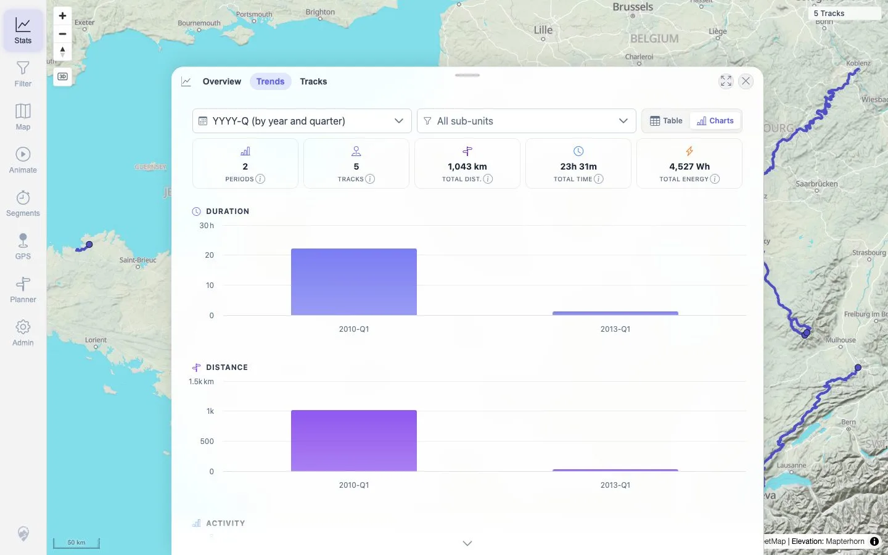

# Packet: IMP_09

## Scope

- Coverage source: `documentation/testing/frontend-regression-test-plan.md`
- Coverage ID or run packet: IMP_09
- In scope: Verify imported totals changed in the correct direction: distance, duration, ascent/descent, activity breakdown, period charts, rankings, heatmap density, and track-browser summary row.
- Out of scope: Deletion delta verification; covered by DEL/TBS/SYN packets.

## Prerequisites

- Required previous coverage IDs or run packets: IMP_08.
- Required app/data state: Five GPX tracks imported and visible.
- Required browser context: Clean desktop browser.

## Allowed Mutations

- Allowed: Open stats and map layer panels; enable heatmap overlay.
- Not allowed: Add/delete files or change track metadata.

## Actions And Results

| Coverage ID | Action | Expected result | Actual result | Status | Evidence |
|---|---|---|---|---|---|
| IMP_09 | Opened Stats Overview/Trends/Tracks, queried overview/statistics APIs, and enabled Heatmap in Maps and data. | Totals increase from empty baseline in the correct direction and heatmap density reflects imported tracks. | Stats showed `5 TRACKS`, `1,043 km`, `23h 31m`, `4,527 Wh`; API summary showed `trackCount=5`, `distanceM=1042712.01`, `durationMs=84660000`, `BICYCLE tracks=5`, positive rankings for distance/duration/ascent/energy, and two period buckets; Stats → Tracks summary matched `5 tracks · 1,043 km · 23h 31m`; Heatmap toggled on and rendered density over imported lines. | PASS | [assets/IMP_09-stats-overview-trends.txt](../assets/IMP_09-stats-overview-trends.txt), [assets/IMP_09-stats-api-summary.txt](../assets/IMP_09-stats-api-summary.txt), [assets/IMP_05-surfaces-after-reload.txt](../assets/IMP_05-surfaces-after-reload.txt), [assets/IMP_09-heatmap-enabled.webp](../assets/IMP_09-heatmap-enabled.webp), [assets/IMP_09-map-panel-probe.txt](../assets/IMP_09-map-panel-probe.txt) |

## Issues

| ID | Severity | Summary | Reproduction | Expected | Actual | Evidence | Release impact |
|---|---|---|---|---|---|---|---|

## Evidence Files

| File | Purpose |
|---|---|
| [assets/IMP_09-stats-overview-trends.txt](../assets/IMP_09-stats-overview-trends.txt) | UI text from Stats Overview and Trends charts after import. |
| [assets/IMP_09-stats-overview.webp](../assets/IMP_09-stats-overview.webp) | Stats overview screenshot after import. |
| [assets/IMP_09-stats-trends.webp](../assets/IMP_09-stats-trends.webp) | Stats trends/period charts screenshot after import. |
| [assets/IMP_09-stats-api-summary.txt](../assets/IMP_09-stats-api-summary.txt) | Concise API summary for totals, activity breakdown, rankings, and periods. |
| [assets/IMP_09-map-panel-probe.txt](../assets/IMP_09-map-panel-probe.txt) | Maps and data panel showing Heatmap control. |
| [assets/IMP_09-heatmap-enabled.txt](../assets/IMP_09-heatmap-enabled.txt) | Heatmap toggle text and captured non-blocking browser warnings. |
| [assets/IMP_09-heatmap-enabled.webp](../assets/IMP_09-heatmap-enabled.webp) | Screenshot with Heatmap density overlay enabled. |
| [assets/IMP_05-surfaces-after-reload.txt](../assets/IMP_05-surfaces-after-reload.txt) | Track-browser summary row after import. |

## Screenshot Evidence

**Screenshot with Heatmap density overlay enabled.**

**Stats overview screenshot after import.**

**Stats trends/period charts screenshot after import.**

## Timings

| Step | Timing |
|---|---:|
| Stats overview/trends capture | ~5 seconds |
| Heatmap enable/capture | ~4 seconds |
| API summary query | <1 second |

## Handoff Notes

- Completed: IMP_09 terminal as `PASS`.
- Remaining unfinished coverage: Continue with `DEL_01` delete-two-track flow.
- Blocked or not applicable: None.
- State left for the next packet: Five GPX tracks remain imported; heatmap may be enabled only in the verification browser context, not a required persisted state.
