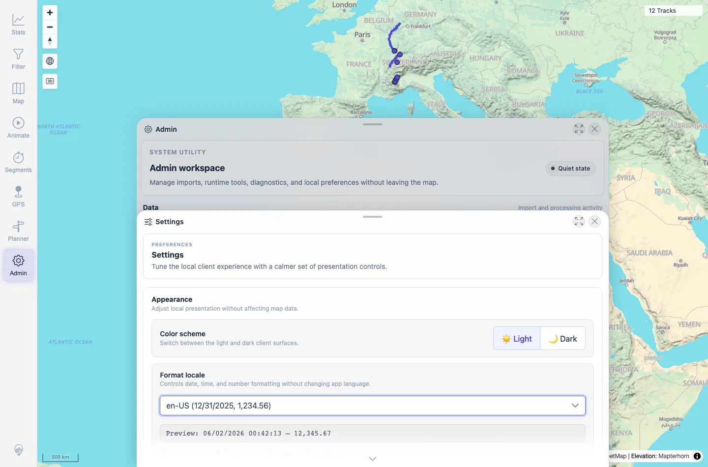
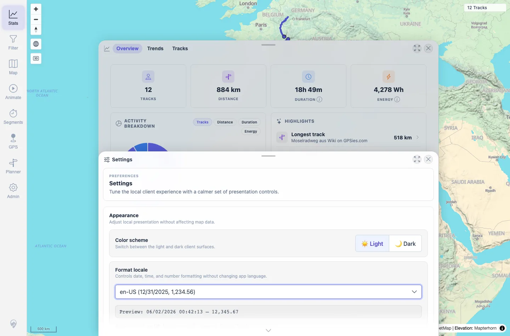

# Packet: LOC_01

## Scope

- Coverage source: `documentation/testing/frontend-regression-test-plan.md`
- Coverage ID or run packet: LOC_01
- In scope: Browser-default number, distance, duration, and date formatting across Settings and Stats.
- Out of scope: Manual locale switching; covered by LOC_02.

## Prerequisites

- Required previous coverage IDs or run packets: APP_08.
- Required app/data state: Authenticated 12-track map after APP cleanup.
- Required browser context: Desktop Chromium context with browser locale `en-US`.

## Allowed Mutations

- Allowed: Open Settings and Stats.
- Not allowed: Change server data.

## Actions And Results

| Coverage ID | Action | Expected result | Actual result | Status | Evidence |
|---|---|---|---|---|---|
| LOC_01 | Opened Admin Settings and Stats in a fresh browser-default locale context. | Numbers, distances, durations, and dates render in the expected locale format. | Settings showed auto-detected `en-US` with preview `12,345.67`; Stats used en-US-style dates and decimal/group separators, including `06/01/2026`, `1.44 km`, and `4,278 Wh`. No `NaN` or `undefined` appeared. | PASS | [assets/LOC_01-locale-baseline.txt](../assets/LOC_01-locale-baseline.txt); [assets/LOC_01-settings-en-gb.webp](../assets/LOC_01-settings-en-gb.webp); [assets/LOC_01-stats-en-gb.webp](../assets/LOC_01-stats-en-gb.webp) |

## Issues

| ID | Severity | Summary | Reproduction | Expected | Actual | Evidence | Release impact |
|---|---|---|---|---|---|---|---|

## Evidence Files

| File | Purpose |
|---|---|
| [assets/LOC_01-locale-baseline.txt](../assets/LOC_01-locale-baseline.txt) | Browser-default Settings and Stats excerpts plus stored locale state. |
| [assets/LOC_01-settings-en-gb.webp](../assets/LOC_01-settings-en-gb.webp) | Settings locale preview in the default locale context. |
| [assets/LOC_01-stats-en-gb.webp](../assets/LOC_01-stats-en-gb.webp) | Stats overview in the default locale context. |

## Screenshot Evidence

**Settings locale preview in the default locale context.**

**Stats overview in the default locale context.**

## Timings

| Step | Timing |
|---|---:|
| Default locale check | ~1 min |

## Handoff Notes

- Completed: LOC_01 terminal as `PASS`.
- Remaining unfinished coverage: Continue with LOC_02.
- Blocked or not applicable: None.
- State left for the next packet: No server data changed.
