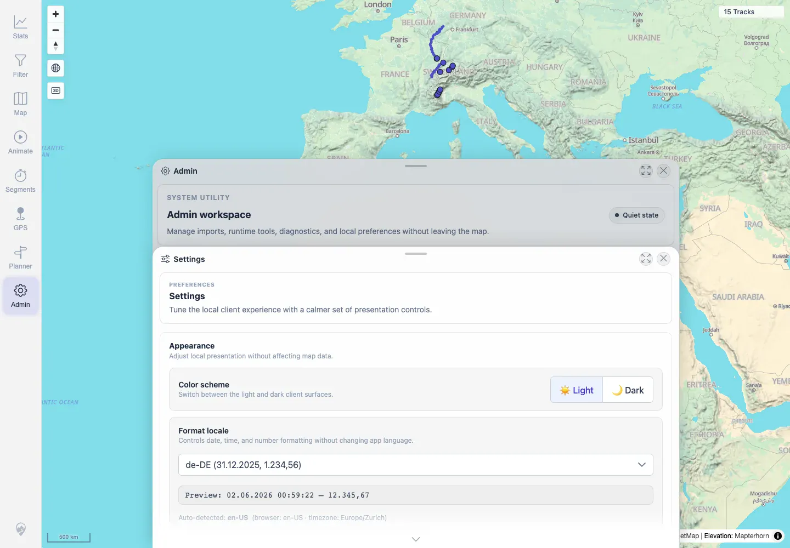
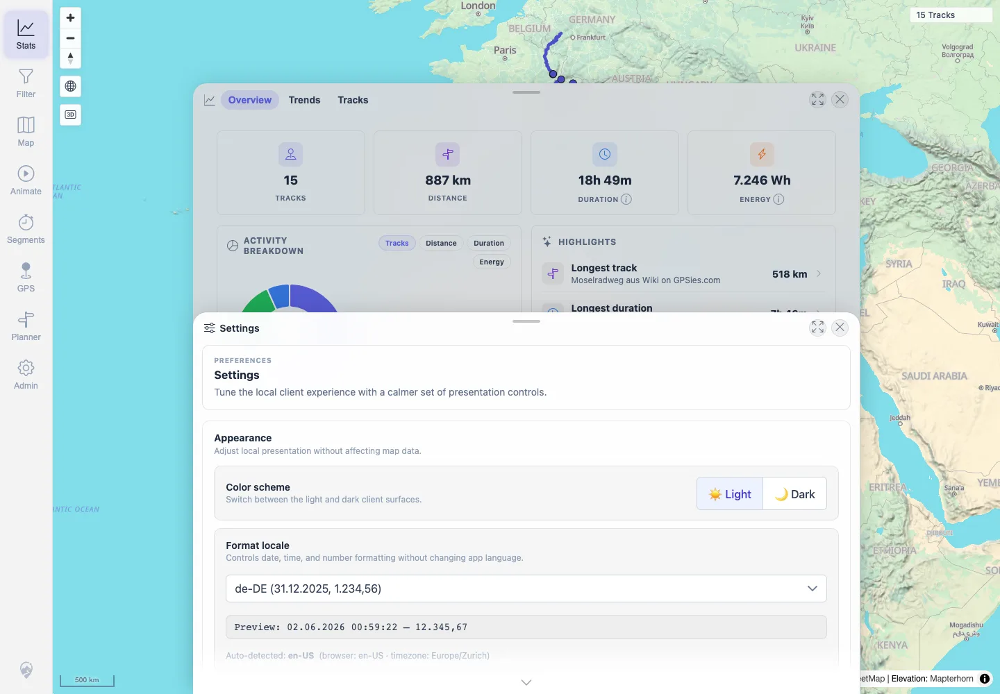

# Packet: LOC_02

## Scope

- Coverage source: `documentation/testing/frontend-regression-test-plan.md`
- Coverage ID or run packet: LOC_02
- In scope: Changing the Format locale control to `de-DE` and verifying formatting updates across Settings and Stats.
- Out of scope: Reload persistence; covered by LOC_03.

## Prerequisites

- Required previous coverage IDs or run packets: LOC_01.
- Required app/data state: Authenticated map; LOC_04 synthetic boundary files were present during the final verification pass.
- Required browser context: Desktop Chromium context.

## Allowed Mutations

- Allowed: Change local `mtl.locale` preference to `de-DE`.
- Not allowed: Leave local preference as a shared server mutation.

## Actions And Results

| Coverage ID | Action | Expected result | Actual result | Status | Evidence |
|---|---|---|---|---|---|
| LOC_02 | Opened Admin Settings, selected `de-DE` from the custom locale combobox, then opened Stats in the same session. | Changing locale updates formatting across the app without reload artifacts. | The preview changed to `02.06.2026 ... 12.345,67`, `mtl.locale` became `de-DE`, and Stats used German decimal/date formatting such as `58,3 km/h`, `1.114 W`, `06.07.2026`, and `672,30 m`. No `NaN`, `undefined`, or `Infinity` appeared. | PASS | [assets/LOC_02-locale-switch.txt](../assets/LOC_02-locale-switch.txt); [assets/LOC_02-settings-de-de.webp](../assets/LOC_02-settings-de-de.webp); [assets/LOC_02-stats-de-de.webp](../assets/LOC_02-stats-de-de.webp) |

## Issues

| ID | Severity | Summary | Reproduction | Expected | Actual | Evidence | Release impact |
|---|---|---|---|---|---|---|---|

## Evidence Files

| File | Purpose |
|---|---|
| [assets/LOC_02-locale-switch.txt](../assets/LOC_02-locale-switch.txt) | Locale options, stored preference, Settings preview, and Stats excerpt after switching to `de-DE`. |
| [assets/LOC_02-settings-de-de.webp](../assets/LOC_02-settings-de-de.webp) | Settings panel after selecting `de-DE`. |
| [assets/LOC_02-stats-de-de.webp](../assets/LOC_02-stats-de-de.webp) | Stats panel after selecting `de-DE`. |

## Screenshot Evidence

**Settings panel after selecting de-DE.**

**Stats panel after selecting de-DE.**

## Timings

| Step | Timing |
|---|---:|
| Locale switch and Stats check | ~2 min |

## Handoff Notes

- Completed: LOC_02 terminal as `PASS`.
- Remaining unfinished coverage: Continue with LOC_03.
- Blocked or not applicable: None.
- State left for the next packet: Local browser context had `mtl.locale=de-DE` for persistence verification.
