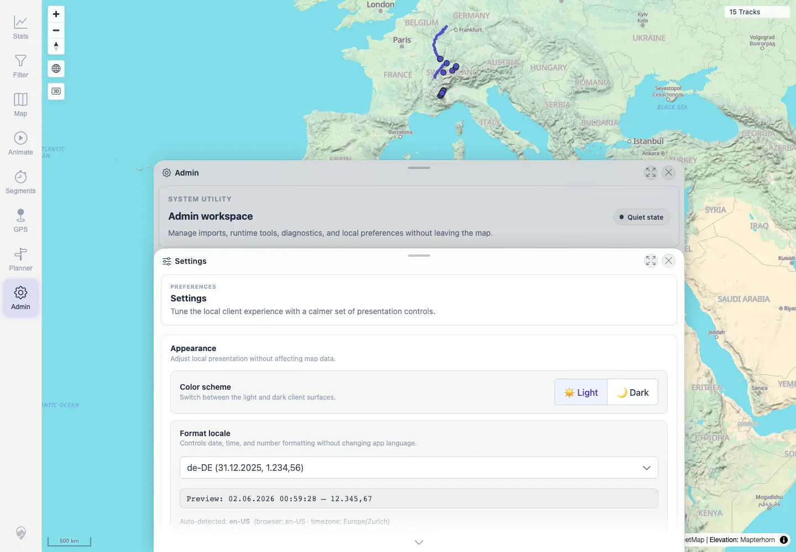

# Packet: LOC_03

## Scope

- Coverage source: `documentation/testing/frontend-regression-test-plan.md`
- Coverage ID or run packet: LOC_03
- In scope: Locale persistence after app reload.
- Out of scope: Initial locale switch behavior; covered by LOC_02.

## Prerequisites

- Required previous coverage IDs or run packets: LOC_02.
- Required app/data state: Authenticated browser context with `mtl.locale=de-DE`.
- Required browser context: Same desktop Chromium context used for LOC_02.

## Allowed Mutations

- Allowed: Reload the app and inspect local preference state.
- Not allowed: Change server data.

## Actions And Results

| Coverage ID | Action | Expected result | Actual result | Status | Evidence |
|---|---|---|---|---|---|
| LOC_03 | Reloaded the app, reopened Admin Settings, and checked the locale control and preview. | Locale persists across reload. | After reload, `mtl.locale` was still `de-DE`; Settings still showed `de-DE` and preview `02.06.2026 ... 12.345,67`. | PASS | [assets/LOC_03-locale-persistence.txt](../assets/LOC_03-locale-persistence.txt); [assets/LOC_03-locale-persisted.webp](../assets/LOC_03-locale-persisted.webp) |

## Issues

| ID | Severity | Summary | Reproduction | Expected | Actual | Evidence | Release impact |
|---|---|---|---|---|---|---|---|

## Evidence Files

| File | Purpose |
|---|---|
| [assets/LOC_03-locale-persistence.txt](../assets/LOC_03-locale-persistence.txt) | Stored `mtl.locale` and Settings preview after reload. |
| [assets/LOC_03-locale-persisted.webp](../assets/LOC_03-locale-persisted.webp) | Settings panel after reload with `de-DE` still selected. |

## Screenshot Evidence

**Settings panel after reload with de-DE still selected.**

## Timings

| Step | Timing |
|---|---:|
| Reload persistence check | ~1 min |

## Handoff Notes

- Completed: LOC_03 terminal as `PASS`.
- Remaining unfinished coverage: Continue with LOC_04.
- Blocked or not applicable: None.
- State left for the next packet: Same local browser context remained in `de-DE`; no server data changed by this packet.
